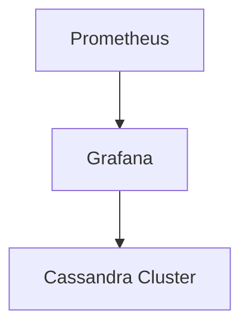

## 介绍

Apache Cassandra是一个高度可扩展的分布式NoSQL数据库，广泛应用于需要处理大量数据的场景。然而，随着数据量的增加，数据安全变得尤为重要。本文将介绍如何在Cassandra中实施安全最佳实践，以确保您的数据安全。

## 1. 认证与授权

### 1.1 启用认证

Cassandra默认情况下不启用认证，这意味着任何人都可以访问数据库。为了增强安全性，您应该启用认证。

```bash
# 在cassandra.yaml中启用认证
authenticator: PasswordAuthenticator
```

### 1.2 创建用户

启用认证后，您需要创建用户并分配适当的权限。

```sql
-- 创建用户
CREATE USER 'admin' WITH PASSWORD 'securepassword' SUPERUSER;

-- 授予权限
GRANT ALL PERMISSIONS ON ALL KEYSPACES TO 'admin';
```

### 1.3 角色管理

Cassandra支持角色管理，您可以通过角色来简化权限管理。

```sql
-- 创建角色
CREATE ROLE 'developer';

-- 授予角色权限
GRANT SELECT ON KEYSPACE 'my_keyspace' TO 'developer';

-- 将角色分配给用户
GRANT 'developer' TO 'user1';
```

## 2. 数据加密

### 2.1 传输层加密

为了防止数据在传输过程中被窃听，您应该启用传输层加密（TLS）。

```bash
# 在cassandra.yaml中配置TLS
server_encryption_options:
    internode_encryption: all
    keystore: /path/to/keystore
    keystore_password: keystore_password
    truststore: /path/to/truststore
    truststore_password: truststore_password
```

### 2.2 数据存储加密

Cassandra还支持对存储在磁盘上的数据进行加密。

```bash
# 在cassandra.yaml中配置数据存储加密
transparent_data_encryption_options:
    enabled: true
    chunk_length_kb: 64
    cipher: AES/CBC/PKCS5Padding
    key_alias: my_key_alias
    key_provider:
      - class_name: org.apache.cassandra.security.JKSKeyProvider
        parameters:
          - keystore: /path/to/keystore
            keystore_password: keystore_password
            store_type: JCEKS
            key_password: key_password
```

## 3. 审计与监控

### 3.1 启用审计日志

审计日志可以帮助您跟踪谁在何时访问了哪些数据。

```bash
# 在cassandra.yaml中启用审计日志
audit_logging_options:
    enabled: true
    logger: BinAuditLogger
    included_keyspaces: my_keyspace
    excluded_categories: QUERY, DML
```

### 3.2 监控工具

使用监控工具（如Prometheus和Grafana）来实时监控Cassandra集群的健康状况和安全事件。



## 4. 实际案例

### 4.1 金融行业

在金融行业中，数据安全至关重要。通过启用认证、授权和数据加密，金融机构可以确保客户数据的安全。

### 4.2 医疗行业

医疗行业需要保护患者的敏感信息。通过实施Cassandra的安全最佳实践，医疗机构可以确保患者数据的隐私和合规性。

## 总结

通过实施Cassandra的安全最佳实践，您可以显著提高数据的安全性。本文介绍了认证与授权、数据加密、审计与监控等方面的最佳实践，并提供了实际案例。希望这些内容能帮助您在Cassandra中构建一个安全的数据库环境。

## 附加资源

- [Cassandra官方文档](https://cassandra.apache.org/doc/latest/)
- [Cassandra安全指南](https://cassandra.apache.org/doc/latest/operating/security.html)
- [Prometheus与Grafana集成指南](https://prometheus.io/docs/visualization/grafana/)

## 练习

1. 在您的Cassandra集群中启用认证，并创建一个新用户。
2. 配置TLS加密，确保数据在传输过程中的安全。
3. 启用审计日志，并尝试查询日志以查看访问记录。
