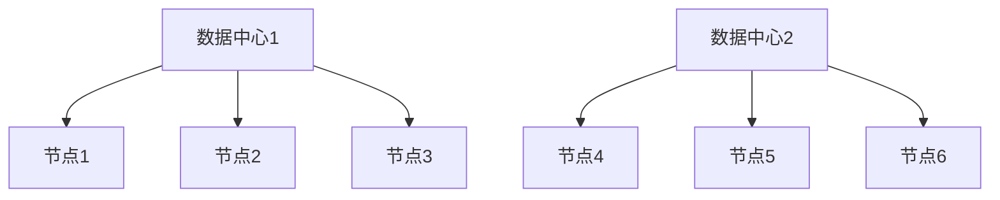

# Cassandra 容量规划

在构建和管理Cassandra集群时，容量规划是一个至关重要的步骤。它帮助您确定集群所需的资源，以确保系统能够高效运行并满足未来的扩展需求。本文将逐步介绍Cassandra容量规划的核心概念、方法和实际应用场景。

## 什么是容量规划？

容量规划是指通过分析当前和未来的需求，确定系统所需的硬件资源（如存储、内存、CPU和网络带宽）的过程。对于Cassandra这样的分布式数据库系统，容量规划尤为重要，因为它直接影响系统的性能、可扩展性和成本。

:::note
容量规划不仅仅是估算存储空间，还包括计算资源、网络带宽和集群拓扑结构的设计。
:::

## 容量规划的关键因素

在进行Cassandra容量规划时，需要考虑以下几个关键因素：

1. **数据量**：估算当前和未来的数据量。
2. **读写吞吐量**：确定系统的读写需求。
3. **复制因子**：Cassandra通过复制因子（Replication Factor）来保证数据的冗余和可用性。
4. **硬件资源**：包括存储、内存、CPU和网络带宽。
5. **集群拓扑**：节点数量、数据中心分布和网络延迟。

### 1. 数据量估算

首先，您需要估算当前和未来的数据量。假设您的应用程序每天生成100GB的数据，并且您希望保留一年的数据。那么，总数据量可以计算为：

```
总数据量 = 每日数据量 × 保留天数
总数据量 = 100GB × 365 = 36.5TB
```

### 2. 读写吞吐量

读写吞吐量是指系统每秒处理的读写操作数量。假设您的应用程序每秒需要处理1000次读操作和500次写操作，您需要确保Cassandra集群能够处理这些负载。

### 3. 复制因子

Cassandra通过复制因子来保证数据的冗余和可用性。假设您设置复制因子为3，那么每份数据将在集群中存储3次。因此，总存储需求将增加：

```
总存储需求 = 总数据量 × 复制因子
总存储需求 = 36.5TB × 3 = 109.5TB
```

### 4. 硬件资源

根据数据量和吞吐量，您可以估算所需的硬件资源。例如，每个节点可能需要：

- **存储**：10TB
- **内存**：64GB
- **CPU**：16核
- **网络带宽**：10Gbps

### 5. 集群拓扑

Cassandra集群的拓扑结构包括节点数量和数据中心分布。假设您需要支持高可用性和低延迟，您可以在多个数据中心部署Cassandra节点。



## 实际案例

假设您正在为一个电商平台设计Cassandra集群。该平台每天生成50GB的数据，需要保留两年的数据，并且每秒需要处理2000次读操作和1000次写操作。复制因子设置为3。

1. **数据量估算**：
   ```
   总数据量 = 50GB × 730 = 36.5TB
   ```

2. **总存储需求**：
   ```
   总存储需求 = 36.5TB × 3 = 109.5TB
   ```

3. **硬件资源**：
   - 每个节点：10TB存储，64GB内存，16核CPU，10Gbps网络带宽。
   - 节点数量：`109.5TB / 10TB ≈ 11个节点`。

4. **集群拓扑**：
   - 在两个数据中心部署11个节点，确保高可用性和低延迟。

## 总结

Cassandra容量规划是确保系统性能和可扩展性的关键步骤。通过估算数据量、读写吞吐量、复制因子和硬件资源，您可以设计一个高效且可扩展的Cassandra集群。在实际应用中，容量规划需要根据具体需求进行调整和优化。

## 附加资源

- [Cassandra官方文档](https://cassandra.apache.org/doc/latest/)
- [Cassandra性能调优指南](https://cassandra.apache.org/doc/latest/operating/performance_tuning.html)
- [分布式系统设计模式](https://www.amazon.com/Designing-Data-Intensive-Applications-Reliable-Maintainable/dp/1449373321)

## 练习

1. 假设您的应用程序每天生成200GB的数据，需要保留三年的数据，复制因子为2。请计算总存储需求。
2. 如果每个节点的存储容量为20TB，您需要多少个节点来支持上述需求？
3. 设计一个Cassandra集群拓扑，支持两个数据中心的高可用性。

:::tip
在进行容量规划时，建议定期监控系统性能，并根据实际负载进行调整。
:::