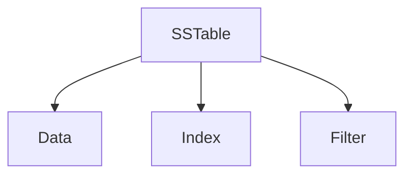

# Cassandra 数据文件结构

Cassandra是一个分布式的NoSQL数据库，以其高可用性和可扩展性著称。为了支持这些特性，Cassandra采用了独特的数据存储结构。本文将深入探讨Cassandra的数据文件结构，帮助你理解其内部工作原理。

## 介绍

Cassandra的数据存储结构主要由以下几个核心组件组成：

- **SSTable（Sorted String Table）**：用于存储实际数据的文件。
- **CommitLog**：用于记录所有写入操作的日志文件。
- **MemTable**：内存中的数据结构，用于临时存储写入的数据。
- **Bloom Filter**：用于快速判断某个数据是否存在于SSTable中。

这些组件共同协作，确保Cassandra能够高效地存储和检索数据。

## SSTable

SSTable是Cassandra中用于存储实际数据的文件。每个SSTable文件都是不可变的，这意味着一旦写入，就不能再修改。SSTable文件通常包含以下几个部分：

- **Data**：存储实际的数据。
- **Index**：用于快速定位数据。
- **Filter**：通常是Bloom Filter，用于快速判断某个数据是否存在于SSTable中。



### 示例

假设我们有一个SSTable文件，其中包含以下数据：

```plaintext
Key: user1, Value: {name: "Alice", age: 30}
Key: user2, Value: {name: "Bob", age: 25}
```

当我们查询`user1`时，Cassandra会首先使用Bloom Filter判断`user1`是否存在于SSTable中。如果存在，Cassandra会使用Index快速定位到`user1`的数据。

## CommitLog

CommitLog是Cassandra中用于记录所有写入操作的日志文件。每次写入操作都会首先写入CommitLog，然后再写入MemTable。这样做的目的是确保在系统崩溃时，可以通过CommitLog恢复未写入SSTable的数据。

:::note
CommitLog是顺序写入的，因此写入性能非常高。
:::

## MemTable

MemTable是内存中的数据结构，用于临时存储写入的数据。当MemTable达到一定大小时，Cassandra会将其刷新到磁盘，形成一个新的SSTable文件。

:::tip
MemTable的大小可以通过配置文件进行调整，以平衡内存使用和写入性能。
:::

## Bloom Filter

Bloom Filter是一种空间效率极高的概率数据结构，用于快速判断某个数据是否存在于SSTable中。Bloom Filter可能会产生误报（即判断某个数据存在，但实际上不存在），但不会产生漏报（即判断某个数据不存在，但实际上存在）。

:::caution
Bloom Filter的误报率可以通过调整其大小来控制，但误报率越低，所需的内存空间越大。
:::

## 实际案例

假设我们有一个电商网站，使用Cassandra存储用户订单数据。每次用户下单时，订单数据会首先写入CommitLog，然后写入MemTable。当MemTable达到一定大小时，Cassandra会将其刷新到磁盘，形成一个新的SSTable文件。

在查询某个用户的订单时，Cassandra会首先使用Bloom Filter判断该用户的订单是否存在于SSTable中。如果存在，Cassandra会使用Index快速定位到该用户的订单数据。

## 总结

Cassandra的数据文件结构是其高性能和高可用性的基础。通过理解SSTable、CommitLog、MemTable和Bloom Filter的工作原理，你可以更好地优化Cassandra的性能和存储。

## 附加资源

- [Cassandra官方文档](https://cassandra.apache.org/doc/latest/)
- [Cassandra数据存储机制详解](https://www.datastax.com/blog/how-cassandra-stores-data)

## 练习

1. 尝试在本地安装Cassandra，并创建一个简单的表，观察SSTable文件的生成过程。
2. 修改Cassandra的配置文件，调整MemTable的大小，观察其对写入性能的影响。
