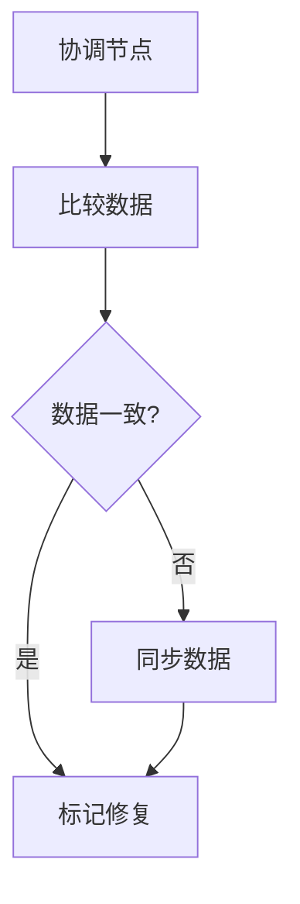
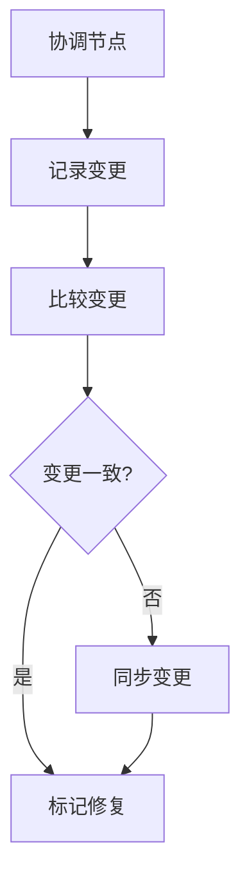

# Cassandra 修复机制详解

Apache Cassandra是一个高度可扩展的分布式数据库，设计用于处理大量数据跨多个数据中心。由于其分布式特性，数据的一致性和可用性是Cassandra的核心挑战之一。为了解决这些问题，Cassandra引入了**修复机制**（Repair Mechanism）。本文将详细介绍Cassandra的修复机制，帮助初学者理解其工作原理和应用场景。

## 什么是Cassandra修复机制？

Cassandra修复机制是一种用于确保数据一致性的过程。在分布式系统中，由于网络分区、节点故障或其他原因，数据副本之间可能会出现不一致。修复机制通过比较和同步不同节点上的数据副本，确保所有副本最终达到一致状态。

### 修复机制的类型

Cassandra支持两种主要的修复机制：

1. **全量修复（Full Repair）**：比较所有数据副本，并修复所有不一致的数据。
2. **增量修复（Incremental Repair）**：只修复自上次修复以来发生变化的数据。

## 修复机制的工作原理

### 1. 全量修复

全量修复是Cassandra中最常用的修复方式。它通过以下步骤工作：

1. **数据比较**：Cassandra会选择一个协调节点（Coordinator Node），该节点负责比较不同副本节点上的数据。
2. **数据同步**：如果发现不一致的数据，协调节点会将最新的数据复制到其他副本节点上。
3. **标记修复**：修复完成后，Cassandra会标记这些数据为已修复，以避免重复修复。



### 2. 增量修复

增量修复是一种更高效的修复方式，它只处理自上次修复以来发生变化的数据。增量修复的工作流程如下：

1. **记录变更**：Cassandra会记录每个数据副本的变更历史。
2. **比较变更**：协调节点会比较不同副本的变更历史，找出不一致的部分。
3. **同步变更**：将不一致的变更同步到其他副本节点上。



## 实际应用场景

### 场景1：节点故障恢复

假设一个Cassandra集群中有三个节点：Node A、Node B和Node C。由于Node A发生故障，导致部分数据未能及时复制到Node B和Node C。当Node A恢复后，可以通过全量修复机制来同步数据，确保所有节点上的数据一致。

### 场景2：数据一致性维护

在一个多数据中心的环境中，数据可能会因为网络延迟或分区而出现不一致。通过定期运行增量修复，可以确保不同数据中心之间的数据一致性，而无需进行全量修复，从而减少网络带宽和计算资源的消耗。

## 代码示例

以下是一个使用`nodetool`工具手动触发修复的示例：

```bash
# 触发全量修复
nodetool repair -full

# 触发增量修复
nodetool repair -inc
```

:::note
在实际生产环境中，建议定期运行修复操作，以确保数据的一致性。具体的修复频率应根据数据变更的频率和集群规模来确定。
:::

## 总结

Cassandra的修复机制是确保数据一致性的关键工具。通过全量修复和增量修复，Cassandra能够在分布式环境中有效地处理数据不一致问题。理解并正确使用修复机制，可以帮助你构建更加可靠和高效的Cassandra集群。

## 附加资源

- [Cassandra官方文档](https://cassandra.apache.org/doc/latest/)
- [Cassandra修复机制深入解析](https://example.com/cassandra-repair-mechanism)
- [分布式系统中的一致性模型](https://example.com/consistency-models)

## 练习

1. 在一个测试Cassandra集群中，尝试手动触发全量修复和增量修复，观察修复过程。
2. 模拟一个节点故障场景，观察修复机制如何恢复数据一致性。
3. 研究Cassandra的`nodetool`工具，了解其他与修复相关的命令。

:::tip
修复操作可能会占用大量系统资源，建议在非高峰期进行。
:::