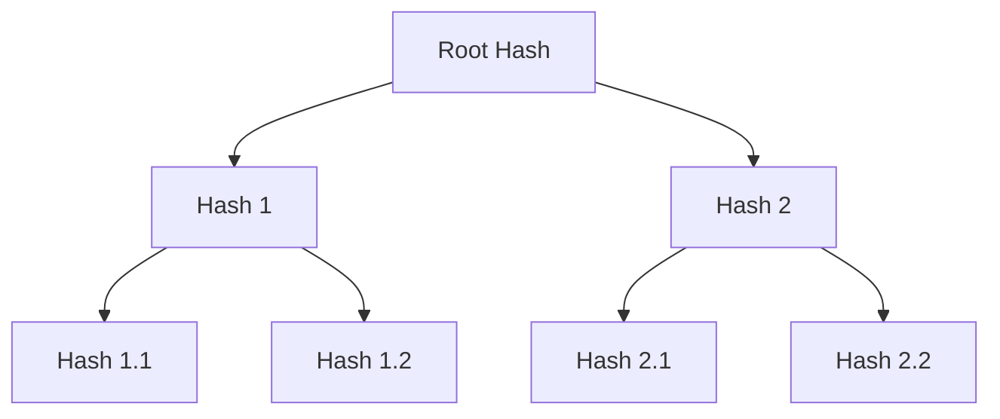

# Cassandra 反熵过程

## 介绍

在分布式系统中，数据一致性是一个重要的挑战。Cassandra作为一个分布式数据库，通过多种机制来确保数据的一致性，其中之一就是**反熵过程（Anti-Entropy Process）**。反熵过程是Cassandra用来检测和修复节点之间数据不一致的一种机制。本文将详细介绍反熵过程的工作原理、实现方式以及实际应用场景。

## 什么是反熵过程？

反熵过程是Cassandra用来确保数据一致性的机制之一。在分布式系统中，由于网络延迟、节点故障等原因，不同节点之间的数据可能会出现不一致。反熵过程通过定期比较和修复节点之间的数据差异，来确保数据的一致性。

### 反熵过程的核心概念

1. **Merkle Tree**：Cassandra使用Merkle Tree来高效地比较节点之间的数据差异。Merkle Tree是一种哈希树，能够快速检测出数据的不一致性。
2. **Gossip协议**：Cassandra使用Gossip协议来传播节点之间的状态信息，包括数据的一致性状态。
3. **修复过程**：当检测到数据不一致时，Cassandra会启动修复过程，将数据从一致性较高的节点复制到一致性较低的节点。

## 反熵过程的工作原理

### 1. Merkle Tree的构建

Cassandra在每个节点上为每个表构建一个Merkle Tree。Merkle Tree的叶子节点是数据分片的哈希值，父节点是其子节点哈希值的组合。通过比较不同节点的Merkle Tree，可以快速检测出数据的不一致性。

### 2. Gossip协议的传播

Cassandra节点之间通过Gossip协议定期交换状态信息，包括Merkle Tree的根哈希值。通过比较根哈希值，节点可以快速判断是否存在数据不一致。

### 3. 数据修复

当检测到数据不一致时，Cassandra会启动修复过程。修复过程包括以下步骤：

1. **识别不一致的分片**：通过比较Merkle Tree，识别出不一致的数据分片。
2. **数据复制**：将一致性较高的节点上的数据复制到一致性较低的节点。
3. **更新Merkle Tree**：修复完成后，更新Merkle Tree以反映最新的数据状态。

## 实际应用场景

### 场景1：节点故障恢复

假设一个Cassandra集群中有三个节点：A、B和C。由于网络故障，节点A与其他节点失去了连接。在网络恢复后，节点A的数据可能与其他节点不一致。通过反熵过程，Cassandra可以检测并修复节点A与其他节点之间的数据差异。

### 场景2：数据写入冲突

在分布式系统中，多个节点可能同时写入相同的数据，导致数据冲突。通过反熵过程，Cassandra可以检测并解决这些冲突，确保数据的一致性。

## 总结

反熵过程是Cassandra确保数据一致性的重要机制。通过Merkle Tree和Gossip协议，Cassandra能够高效地检测和修复节点之间的数据不一致。理解反熵过程的工作原理，有助于更好地管理和优化Cassandra集群。

## 附加资源

- [Cassandra官方文档](https://cassandra.apache.org/doc/latest/)
- [分布式系统中的一致性模型](https://en.wikipedia.org/wiki/Consistency_model)
- [Merkle Tree详解](https://en.wikipedia.org/wiki/Merkle_tree)

## 练习

1. 在一个模拟的Cassandra集群中，手动触发反熵过程，并观察数据修复的效果。
2. 研究Cassandra的Gossip协议，了解其如何传播节点状态信息。
3. 尝试构建一个简单的Merkle Tree，并比较不同数据分片的哈希值。

:::tip
在实际生产环境中，定期运行反熵过程是确保数据一致性的重要步骤。建议在低峰时段运行反熵过程，以减少对系统性能的影响。
:::