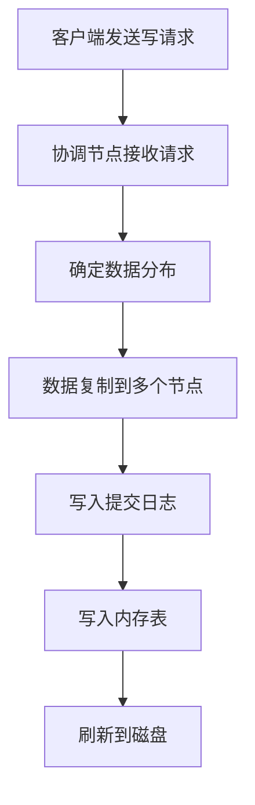
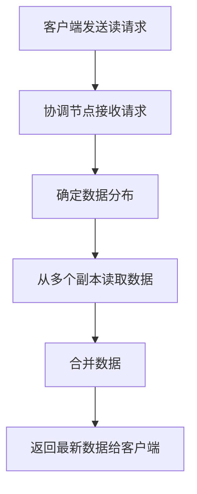

## 介绍

Apache Cassandra 是一个高度可扩展的分布式 NoSQL 数据库，设计用于处理大量数据跨多个数据中心和云平台。Cassandra 的读写过程是其核心功能之一，理解这些过程对于优化数据库性能至关重要。本文将详细介绍 Cassandra 的读写过程，并通过实际案例帮助初学者更好地理解。

## Cassandra 架构概述

Cassandra 采用分布式架构，数据分布在多个节点上。每个节点都负责存储一部分数据，并且可以处理读写请求。Cassandra 使用一致性哈希算法来确定数据在集群中的分布位置。

## 写过程详解

### 写请求流程

当一个客户端向 Cassandra 发送写请求时，请求会经历以下步骤：

1. **客户端发送请求**：客户端将写请求发送到集群中的任意一个节点。
2. **协调节点**：接收请求的节点成为协调节点（Coordinator Node），负责协调写操作。
3. **数据分布**：协调节点根据一致性哈希算法确定数据应该存储在哪些节点上。
4. **数据复制**：Cassandra 会将数据复制到多个节点（副本）以确保高可用性和容错性。
5. **写入日志**：数据首先写入提交日志（Commit Log）以确保持久性。
6. **写入内存表**：数据随后写入内存中的 Memtable。
7. **刷新到磁盘**：当 Memtable 达到一定大小时，数据会被刷新到磁盘上的 SSTable。

### 写一致性级别

Cassandra 提供了多种写一致性级别，用户可以根据需求选择不同的级别：

- **ONE**：只需一个副本确认写操作。
- **QUORUM**：需要大多数副本确认写操作。
- **ALL**：需要所有副本确认写操作。

:::tip
选择合适的一致性级别可以在性能和可靠性之间找到平衡。
:::

## 读过程详解

### 读请求流程

当一个客户端向 Cassandra 发送读请求时，请求会经历以下步骤：

1. **客户端发送请求**：客户端将读请求发送到集群中的任意一个节点。
2. **协调节点**：接收请求的节点成为协调节点，负责协调读操作。
3. **数据分布**：协调节点根据一致性哈希算法确定数据存储在哪些节点上。
4. **读取数据**：协调节点从多个副本中读取数据。
5. **数据合并**：协调节点合并从不同副本读取的数据，并返回最新版本的数据给客户端。

### 读一致性级别

Cassandra 也提供了多种读一致性级别，用户可以根据需求选择不同的级别：

- **ONE**：只需从一个副本读取数据。
- **QUORUM**：需要从大多数副本读取数据。
- **ALL**：需要从所有副本读取数据。

:::caution
选择较低的一致性级别可能会读取到过时的数据。
:::

## 实际案例

### 案例：电商网站的订单系统

假设我们有一个电商网站，使用 Cassandra 存储订单数据。当用户下单时，系统需要快速写入订单数据，并在用户查询订单时快速读取数据。

1. **写过程**：当用户下单时，系统将订单数据写入 Cassandra。由于订单数据非常重要，我们选择 `QUORUM` 一致性级别，以确保数据的高可用性。
2. **读过程**：当用户查询订单时，系统从 Cassandra 读取订单数据。为了快速响应，我们选择 `ONE` 一致性级别，以降低读取延迟。

:::note
在实际应用中，选择一致性级别时需要权衡性能和可靠性。
:::

## 总结

Cassandra 的读写过程是其分布式架构的核心部分。通过理解这些过程，我们可以更好地优化数据库性能，并根据应用需求选择合适的一致性级别。希望本文能帮助初学者深入理解 Cassandra 的读写过程。

## 附加资源

- [Cassandra 官方文档](https://cassandra.apache.org/doc/latest/)
- [Cassandra 一致性级别详解](https://docs.datastax.com/en/cassandra-oss/3.x/cassandra/dml/dmlConfigConsistency.html)
- [Cassandra 读写性能优化](https://www.datastax.com/blog/2015/03/cassandra-performance-tuning)

## 练习

1. 尝试在本地搭建一个 Cassandra 集群，并模拟读写操作。
2. 修改一致性级别，观察读写性能的变化。
3. 设计一个简单的应用场景，使用 Cassandra 存储和查询数据。
