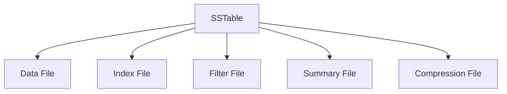

# Cassandra SSTable详解

## 介绍

在Cassandra中，SSTable（Sorted String Table）是数据存储的核心组件之一。SSTable是一种不可变的、有序的、持久化的数据结构，用于存储Cassandra中的数据。理解SSTable的工作原理对于掌握Cassandra的存储机制至关重要。

## SSTable的基本概念

SSTable是Cassandra中用于存储数据的文件格式。每个SSTable文件都包含一系列有序的键值对，这些键值对按照键的顺序进行排序。SSTable是不可变的，这意味着一旦写入数据，就不能再对其进行修改。这种不可变性使得SSTable在读取操作中非常高效，因为数据在磁盘上是连续存储的。

### SSTable的结构

一个SSTable文件通常由以下几个部分组成：

1. **Data File**：存储实际的数据行。
2. **Index File**：存储数据文件中每个键的偏移量，以便快速查找。
3. **Filter File**：使用Bloom过滤器来快速判断某个键是否存在于SSTable中。
4. **Summary File**：存储索引文件的摘要信息，用于加速查找。
5. **Compression File**（可选）：如果启用了压缩，存储压缩后的数据。



## SSTable的工作原理

### 写入数据

当数据写入Cassandra时，首先会被写入内存中的数据结构（称为Memtable）。当Memtable达到一定大小时，它会被刷新（flush）到磁盘，形成一个SSTable文件。这个过程称为**Memtable Flush**。

### 读取数据

当Cassandra需要读取数据时，它会首先检查Memtable，如果数据不在Memtable中，则会依次检查SSTable文件。由于SSTable文件是有序的，Cassandra可以使用二分查找来快速定位数据。

### 合并与压缩

随着时间的推移，系统中会积累多个SSTable文件。为了优化读取性能，Cassandra会定期执行**Compaction**操作，将多个SSTable文件合并为一个更大的SSTable文件。这个过程不仅减少了文件数量，还删除了过期或删除的数据。

## 实际案例

假设我们有一个Cassandra表，用于存储用户信息。每次用户更新信息时，Cassandra都会将新数据写入Memtable，并在Memtable满时将其刷新到SSTable文件。

```sql
CREATE TABLE users (
    user_id UUID PRIMARY KEY,
    name TEXT,
    email TEXT
);
```

当用户更新信息时，Cassandra会生成一个新的SSTable文件。随着时间的推移，系统中可能会有多个SSTable文件存储不同版本的用户信息。通过Compaction操作，Cassandra会将这些SSTable文件合并，确保每个用户的最新信息只存储在一个SSTable文件中。

## 总结

SSTable是Cassandra中用于存储数据的核心组件，它通过有序的、不可变的文件格式提供了高效的读写性能。理解SSTable的结构和工作原理对于优化Cassandra的性能至关重要。

## 附加资源与练习

- **练习**：尝试在本地Cassandra集群中创建一个表，并观察SSTable文件的生成与合并过程。
- **资源**：阅读Cassandra官方文档中关于SSTable和Compaction的章节，深入了解其内部机制。

:::tip
提示：在实际生产环境中，合理配置Compaction策略可以显著提升Cassandra的性能。
:::