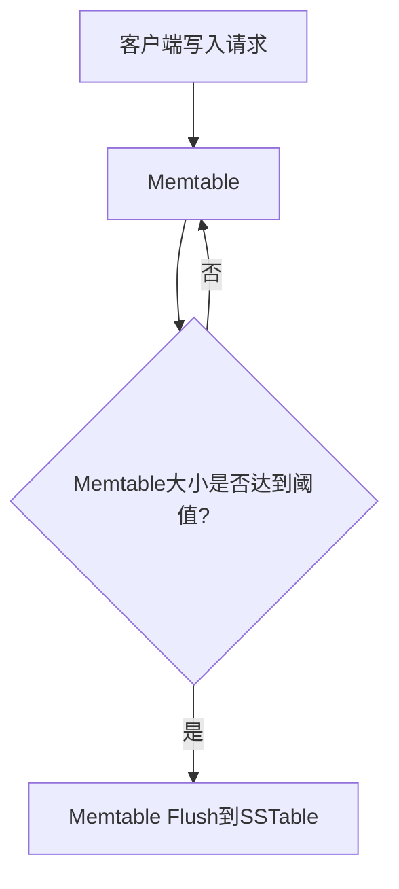

# Cassandra Memtable详解

## 介绍

在Cassandra中，**Memtable**是一个内存中的数据结构，用于临时存储写入的数据。它是Cassandra写入路径中的关键组件之一，负责在数据被持久化到磁盘之前，高效地管理写入操作。理解Memtable的工作原理对于优化Cassandra的性能至关重要。

## Memtable的工作原理

当数据写入Cassandra时，首先会被写入Memtable。Memtable是一个有序的内存数据结构，通常基于**跳跃表（Skip List）**或**红黑树（Red-Black Tree）**实现。这种数据结构允许快速插入和查找操作。

### 写入流程

1. **数据写入**：当客户端向Cassandra发送写入请求时，数据首先被写入Memtable。
2. **内存管理**：Memtable在内存中维护数据，直到达到一定的大小阈值。
3. **刷新到磁盘**：当Memtable达到阈值时，其内容会被刷新到磁盘上的**SSTable（Sorted String Table）**中。这个过程称为**Memtable Flush**。



### 读取流程

当客户端请求读取数据时，Cassandra会首先检查Memtable，然后再检查磁盘上的SSTable。由于Memtable是内存中的数据结构，读取操作通常非常快速。

## 实际应用场景

### 场景1：高写入吞吐量

在一个需要处理大量写入请求的系统中，Memtable的设计使得Cassandra能够高效地处理这些请求。由于数据首先被写入内存，写入操作的速度非常快。

### 场景2：数据一致性

在分布式系统中，数据一致性是一个重要的问题。Cassandra通过Memtable和SSTable的结合，确保了数据的一致性和持久性。即使系统崩溃，Memtable中的数据也会在恢复时被刷新到SSTable中。

## 代码示例

以下是一个简单的Python示例，展示了如何使用Cassandra的Python驱动程序（`cassandra-driver`）进行数据写入操作：

```python
from cassandra.cluster import Cluster

# 连接到Cassandra集群
cluster = Cluster(['127.0.0.1'])
session = cluster.connect('my_keyspace')

# 插入数据
session.execute("""
    INSERT INTO my_table (id, name, age)
    VALUES (%s, %s, %s)
""", (1, 'Alice', 30))

# 查询数据
rows = session.execute("SELECT * FROM my_table WHERE id = 1")
for row in rows:
    print(row.id, row.name, row.age)
```

**输出**：
```
1 Alice 30
```

## 优化Memtable性能

### 1. 调整Memtable大小

通过调整Memtable的大小阈值，可以平衡内存使用和写入性能。较大的Memtable可以减少刷新到磁盘的频率，但会增加内存使用量。

### 2. 使用压缩

Cassandra支持对Memtable中的数据进行压缩，以减少内存使用。压缩可以减少Memtable的大小，从而降低内存压力。

### 3. 监控Memtable状态

定期监控Memtable的状态，可以帮助识别潜在的性能问题。Cassandra提供了多种工具和指标，用于监控Memtable的使用情况。

## 总结

Memtable是Cassandra中一个关键的内存数据结构，负责临时存储写入的数据。通过理解Memtable的工作原理和优化策略，可以显著提高Cassandra的性能和可靠性。

## 附加资源

- [Cassandra官方文档](https://cassandra.apache.org/doc/latest/)
- [Cassandra性能调优指南](https://cassandra.apache.org/doc/latest/operating/performance_tuning.html)
- [Cassandra Memtable源码分析](https://github.com/apache/cassandra)

## 练习

1. 尝试调整Cassandra集群中的Memtable大小，观察其对写入性能的影响。
2. 使用Cassandra的监控工具，查看Memtable的使用情况，并分析其与系统性能的关系。
3. 编写一个脚本，模拟高写入负载，并观察Memtable的刷新行为。

:::tip
提示：在进行性能调优时，建议在测试环境中进行，以避免影响生产环境的稳定性。
:::