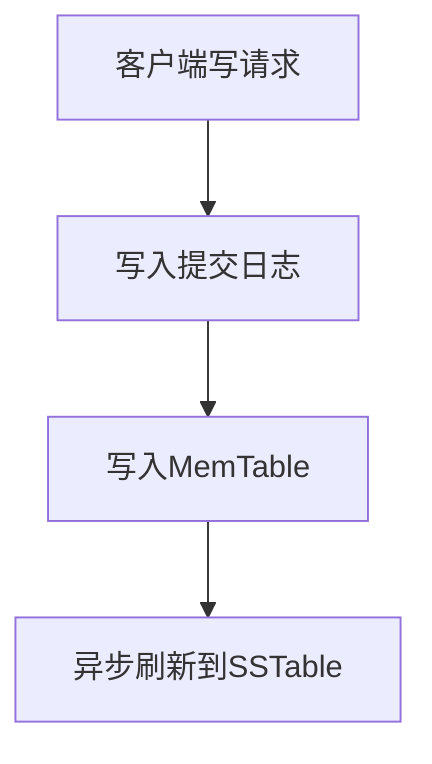

# Cassandra 提交日志

Cassandra是一个高性能、分布式的NoSQL数据库，广泛应用于大规模数据存储场景。在Cassandra的架构中，**提交日志（Commit Log）**是一个至关重要的组件，它确保了数据的持久性和一致性。本文将深入探讨Cassandra提交日志的工作原理、配置选项以及实际应用场景。

## 什么是提交日志？

提交日志是Cassandra用于确保数据持久化的一种机制。每当有写操作（如插入、更新或删除）发生时，Cassandra会先将这些操作记录到提交日志中，然后再将数据写入内存中的**MemTable**。这种设计确保了即使在系统崩溃的情况下，数据也不会丢失，因为提交日志可以在系统恢复时用于重放未完成的写操作。

:::note
提交日志的主要目的是确保数据的持久性。即使系统崩溃，提交日志中的数据也可以用于恢复未完成的写操作。
:::

## 提交日志的工作原理

### 写操作的流程

1. **接收写请求**：客户端向Cassandra节点发送写请求。
2. **写入提交日志**：Cassandra首先将写操作记录到提交日志中。
3. **写入MemTable**：提交日志记录完成后，数据被写入内存中的MemTable。
4. **异步刷新到SSTable**：当MemTable达到一定大小时，数据会被刷新到磁盘上的SSTable中。



### 提交日志的结构

提交日志是一个顺序写入的文件，每个写操作都会被追加到文件的末尾。这种设计使得写操作非常高效，因为顺序写入比随机写入要快得多。

:::tip
提交日志的顺序写入特性使得Cassandra在高并发写操作下仍能保持高性能。
:::

## 配置提交日志

Cassandra提供了多种配置选项来优化提交日志的性能和可靠性。以下是一些常见的配置参数：

- **commitlog_directory**：指定提交日志文件的存储目录。
- **commitlog_segment_size_in_mb**：设置提交日志段的大小，默认为32MB。
- **commitlog_sync**：控制提交日志的同步方式，可以是`periodic`或`batch`。

```yaml
commitlog_directory: /var/lib/cassandra/commitlog
commitlog_segment_size_in_mb: 64
commitlog_sync: periodic
```

:::caution
修改提交日志的配置可能会影响Cassandra的性能和可靠性，建议在生产环境中谨慎操作。
:::

## 实际应用场景

### 数据恢复

假设一个Cassandra节点在写入数据时突然崩溃。由于提交日志已经记录了所有的写操作，系统可以在重启后通过重放提交日志来恢复未完成的操作，确保数据的一致性。

### 高并发写入

在一个高并发的写入场景中，提交日志的顺序写入特性使得Cassandra能够高效地处理大量的写请求，而不会因为磁盘I/O瓶颈导致性能下降。

## 总结

提交日志是Cassandra确保数据持久性和一致性的关键组件。通过将写操作首先记录到提交日志中，Cassandra能够在系统崩溃时恢复数据，同时保持高性能的写入能力。理解提交日志的工作原理和配置选项，对于优化Cassandra的性能和可靠性至关重要。

## 附加资源

- [Cassandra官方文档](https://cassandra.apache.org/doc/latest/)
- [Cassandra提交日志配置指南](https://cassandra.apache.org/doc/latest/operating/commitlog.html)

## 练习

1. 修改Cassandra的提交日志配置，观察其对写入性能的影响。
2. 模拟一个系统崩溃场景，验证提交日志在数据恢复中的作用。
