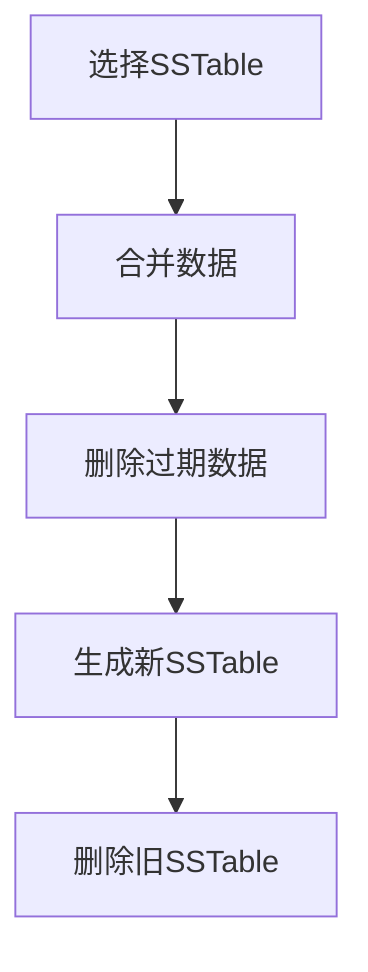

# Cassandra 压缩过程

Cassandra是一个高度可扩展的分布式数据库，广泛用于处理大规模数据。在Cassandra中，**压缩（Compaction）**是一个关键的后台进程，用于优化存储空间并提高读取性能。本文将详细介绍Cassandra的压缩过程，帮助初学者理解其工作原理和实际应用。

## 什么是压缩？

在Cassandra中，数据以**SSTable（Sorted String Table）**的形式存储在磁盘上。随着数据的写入和更新，Cassandra会生成多个SSTable文件。压缩过程的主要目的是将这些SSTable文件合并，删除过期或重复的数据，从而减少磁盘空间的使用并提高查询效率。

:::note
**SSTable**是Cassandra中用于存储数据的不可变文件。每个SSTable包含一系列按键排序的数据记录。
:::

## 压缩的工作原理

Cassandra的压缩过程可以分为以下几个步骤：

1. **选择SSTable**：Cassandra会根据配置的策略选择需要压缩的SSTable文件。
2. **合并数据**：将选中的SSTable文件合并为一个新的SSTable文件。
3. **删除过期数据**：在合并过程中，Cassandra会删除已经过期的数据（基于TTL或墓碑标记）。
4. **生成新文件**：合并后的数据写入一个新的SSTable文件，旧的SSTable文件被删除。



## 压缩策略

Cassandra支持多种压缩策略，您可以根据应用场景选择合适的策略。常见的压缩策略包括：

- **SizeTieredCompactionStrategy (STCS)**：适用于写入密集型场景，将大小相似的SSTable合并。
- **LeveledCompactionStrategy (LCS)**：适用于读取密集型场景，确保每个级别的SSTable数量较少，从而提高读取性能。
- **TimeWindowCompactionStrategy (TWCS)**：适用于时间序列数据，按时间窗口合并SSTable。

:::tip
选择合适的压缩策略可以显著提高Cassandra的性能。例如，对于时间序列数据，使用`TimeWindowCompactionStrategy`可以更好地管理数据。
:::

## 配置压缩

您可以通过`cassandra.yaml`配置文件或使用CQL语句来配置压缩策略。以下是一个使用CQL配置压缩策略的示例：

```sql
ALTER TABLE my_keyspace.my_table 
WITH compaction = {'class': 'LeveledCompactionStrategy'};
```

## 实际案例

假设您正在开发一个物联网应用，需要存储大量的传感器数据。由于传感器数据是按时间顺序生成的，您可以选择`TimeWindowCompactionStrategy`来优化存储和查询性能。

```sql
CREATE TABLE sensor_data (
    sensor_id uuid,
    timestamp timestamp,
    value double,
    PRIMARY KEY (sensor_id, timestamp)
) WITH compaction = {'class': 'TimeWindowCompactionStrategy', 'compaction_window_unit': 'DAYS', 'compaction_window_size': 1};
```

在这个例子中，Cassandra会每天将传感器数据压缩到一个新的SSTable中，从而简化数据管理并提高查询效率。

## 总结

Cassandra的压缩过程是优化存储和查询性能的关键机制。通过理解压缩的工作原理和配置选项，您可以更好地管理Cassandra中的数据，并根据应用场景选择合适的压缩策略。

:::caution
压缩过程可能会占用大量的I/O和CPU资源，因此在生产环境中需要谨慎配置压缩策略和调度。
:::

## 附加资源

- [Cassandra官方文档](https://cassandra.apache.org/doc/latest/)
- [Cassandra压缩策略详解](https://docs.datastax.com/en/cassandra-oss/3.x/cassandra/operations/opsConfigureCompaction.html)
- [Cassandra性能调优指南](https://docs.datastax.com/en/dse/6.7/dse-admin/datastax_enterprise/performance/index.html)

## 练习

1. 在本地Cassandra实例中创建一个表，并尝试使用不同的压缩策略。
2. 使用CQL查询压缩后的SSTable文件，观察其大小和数量变化。
3. 模拟一个时间序列数据的场景，配置`TimeWindowCompactionStrategy`并观察压缩效果。

通过以上练习，您将更深入地理解Cassandra的压缩过程及其在实际应用中的作用。