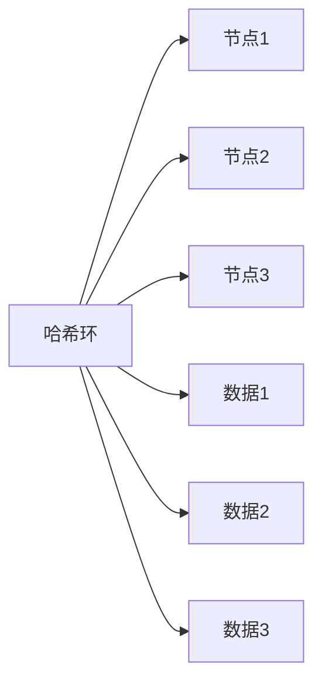
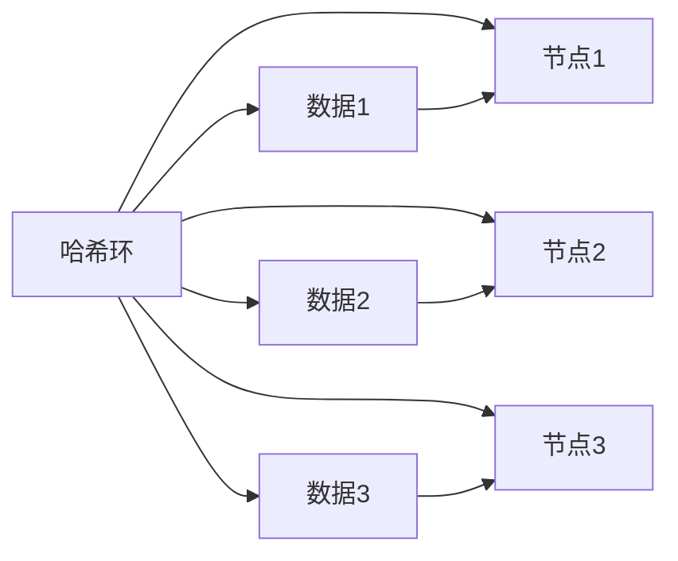
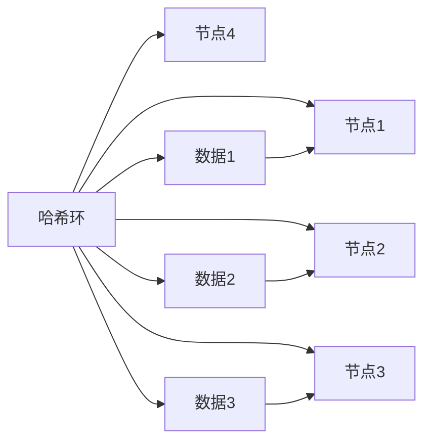
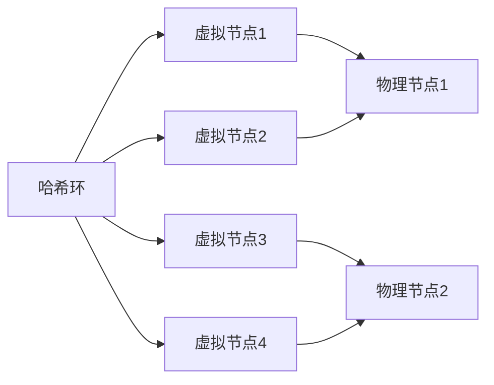

# Cassandra 一致性哈希

## 介绍

在分布式系统中，数据分布和负载均衡是至关重要的。Cassandra作为一个高度可扩展的分布式数据库，使用**一致性哈希**来确保数据在集群中的均匀分布和高效访问。本文将深入探讨一致性哈希的概念、工作原理及其在Cassandra中的应用。

## 什么是一致性哈希？

一致性哈希是一种特殊的哈希技术，用于在分布式系统中分配数据。与传统的哈希方法不同，一致性哈希在节点加入或离开时，只需重新分配少量的数据，从而减少了数据迁移的开销。

### 传统哈希的问题

在传统哈希中，数据通过哈希函数映射到一个固定范围的哈希值，然后根据哈希值分配到相应的节点。然而，当节点数量发生变化时，几乎所有数据的哈希值都需要重新计算，导致大量数据迁移。

### 一致性哈希的优势

一致性哈希通过将节点和数据映射到一个环形哈希空间（哈希环）中，解决了传统哈希的问题。当节点加入或离开时，只需重新分配相邻节点的数据，从而大大减少了数据迁移的开销。

## 一致性哈希的工作原理

### 哈希环

一致性哈希使用一个环形结构（哈希环）来表示所有可能的哈希值。节点和数据都被映射到这个环上。

### 数据分配

当数据需要存储时，首先计算其哈希值，然后在哈希环上找到第一个顺时针方向的节点，该节点即为数据的存储位置。

### 节点加入与离开

当新节点加入时，只需将其插入哈希环的适当位置，并重新分配其相邻节点的部分数据。同样，当节点离开时，只需将其数据重新分配给相邻节点。

## Cassandra 中的一致性哈希

在Cassandra中，一致性哈希用于确定数据在集群中的分布。每个节点负责哈希环上的一段范围，数据根据其哈希值存储在相应的节点上。

### 虚拟节点

为了提高负载均衡，Cassandra引入了**虚拟节点**的概念。每个物理节点可以映射到多个虚拟节点，从而在哈希环上占据多个位置。这样，即使物理节点数量较少，数据也能更均匀地分布。

### 数据复制

Cassandra还通过一致性哈希实现数据的复制。每个数据项会被复制到多个节点上，以确保高可用性和容错性。复制策略通常包括简单策略和网络拓扑策略。

## 实际案例

假设我们有一个Cassandra集群，包含三个节点：`Node1`、`Node2`和`Node3`。我们使用一致性哈希来分配数据。

1. **数据插入**：当插入数据`Data1`时，计算其哈希值并找到哈希环上的第一个节点`Node2`，数据将被存储在`Node2`上。
2. **节点加入**：当`Node4`加入集群时，只需重新分配`Node2`和`Node3`的部分数据到`Node4`。
3. **节点离开**：当`Node2`离开集群时，其数据将被重新分配给`Node1`和`Node3`。

## 总结

一致性哈希是Cassandra实现高效数据分布和负载均衡的关键技术。通过哈希环和虚拟节点的结合，Cassandra能够在节点动态变化时保持数据的均匀分布和高效访问。

## 附加资源与练习

- **练习**：尝试在一个小型Cassandra集群中模拟节点加入和离开的过程，观察数据分布的变化。
- **资源**：阅读Cassandra官方文档中关于一致性哈希和虚拟节点的详细说明。

:::tip
一致性哈希不仅适用于Cassandra，还广泛应用于其他分布式系统，如分布式缓存和负载均衡器。理解其原理将有助于你更好地设计和优化分布式系统。
:::