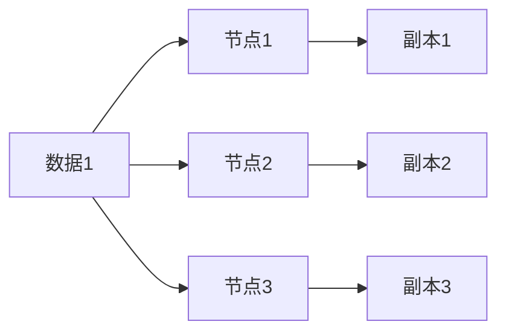

# Cassandra 副本策略

Cassandra是一个高度可扩展的分布式数据库系统，其核心设计目标之一是实现高可用性和容错性。为了实现这些目标，Cassandra使用了一种称为**副本策略**的机制。副本策略决定了数据在集群中的多个节点之间如何复制和分布。本文将详细介绍Cassandra的副本策略，包括其工作原理、配置方式以及实际应用场景。

## 什么是副本策略？

在Cassandra中，副本策略（Replication Strategy）是指数据在集群中如何复制和分布的规则。Cassandra通过将数据复制到多个节点来确保高可用性和容错性。副本策略定义了数据在集群中的哪些节点上存储副本，以及如何选择这些节点。

Cassandra支持两种主要的副本策略：

1. **SimpleStrategy**：适用于单数据中心（单区域）部署。
2. **NetworkTopologyStrategy**：适用于多数据中心（多区域）部署。

### SimpleStrategy

`SimpleStrategy` 是Cassandra中最简单的副本策略，适用于单数据中心部署。它通过将数据复制到集群中的多个节点来确保数据的冗余。副本的数量由 `replication_factor` 参数决定。

例如，假设我们有一个包含5个节点的Cassandra集群，并且我们设置了 `replication_factor` 为3。那么，Cassandra会将每份数据复制到3个不同的节点上。

```sql
CREATE KEYSPACE my_keyspace
WITH replication = {'class': 'SimpleStrategy', 'replication_factor': 3};
```

在这个例子中，`my_keyspace` 是一个键空间（keyspace），它使用 `SimpleStrategy` 作为副本策略，并且设置了 `replication_factor` 为3。

### NetworkTopologyStrategy

`NetworkTopologyStrategy` 是Cassandra中更复杂的副本策略，适用于多数据中心部署。它允许你为每个数据中心指定不同的副本数量。这对于跨多个地理区域部署的Cassandra集群非常有用。

例如，假设我们有两个数据中心：`DC1` 和 `DC2`。我们可以为每个数据中心设置不同的副本数量：

```sql
CREATE KEYSPACE my_keyspace
WITH replication = {
    'class': 'NetworkTopologyStrategy',
    'DC1': 3,
    'DC2': 2
};
```

在这个例子中，`my_keyspace` 键空间使用 `NetworkTopologyStrategy` 作为副本策略，并且在 `DC1` 数据中心设置了3个副本，在 `DC2` 数据中心设置了2个副本。

## 副本策略的工作原理

Cassandra使用一致性哈希（Consistent Hashing）来决定数据在集群中的分布。每个节点负责一定范围的哈希值，数据根据其哈希值被分配到相应的节点上。副本策略则决定了这些数据在哪些节点上存储副本。

### 一致性哈希

一致性哈希是一种分布式哈希算法，它确保在节点加入或离开集群时，只有少量的数据需要重新分配。Cassandra使用一致性哈希来将数据均匀地分布在集群中的节点上。



在这个简单的图表中，数据1被分配到节点1、节点2和节点3上，每个节点存储一个副本。

### 副本选择

Cassandra根据副本策略选择存储副本的节点。对于 `SimpleStrategy`，Cassandra会按照一致性哈希的顺序选择节点。对于 `NetworkTopologyStrategy`，Cassandra会优先选择与客户端相同数据中心的节点，以提高读取性能。

## 实际应用场景

### 单数据中心部署

在单数据中心部署中，`SimpleStrategy` 是一个简单而有效的选择。它通过将数据复制到多个节点来确保数据的冗余和高可用性。例如，在一个电子商务网站的后端数据库中，使用 `SimpleStrategy` 可以确保即使某个节点发生故障，数据仍然可以从其他节点访问。

### 多数据中心部署

在多数据中心部署中，`NetworkTopologyStrategy` 是更好的选择。它允许你为每个数据中心设置不同的副本数量，从而在多个地理区域之间实现数据的高可用性和容错性。例如，在一个全球分布的社交媒体平台中，使用 `NetworkTopologyStrategy` 可以确保用户在任何地区都能快速访问数据。

## 总结

Cassandra的副本策略是确保数据高可用性和容错性的关键机制。通过 `SimpleStrategy` 和 `NetworkTopologyStrategy`，Cassandra能够在单数据中心和多数据中心部署中有效地管理数据的复制和分布。理解这些策略的工作原理和配置方式，对于设计和维护一个可靠的Cassandra集群至关重要。

## 附加资源与练习

- **练习1**：在一个单节点Cassandra集群中创建一个键空间，使用 `SimpleStrategy` 并设置 `replication_factor` 为2。然后插入一些数据，并观察数据是如何复制的。
- **练习2**：在一个多节点Cassandra集群中创建一个键空间，使用 `NetworkTopologyStrategy` 并为每个数据中心设置不同的副本数量。然后插入一些数据，并观察数据是如何在不同数据中心之间复制的。

:::tip
了解更多关于Cassandra副本策略的详细信息，可以参考 [Cassandra官方文档](https://cassandra.apache.org/doc/latest/architecture/dynamo.html#replication)。
:::