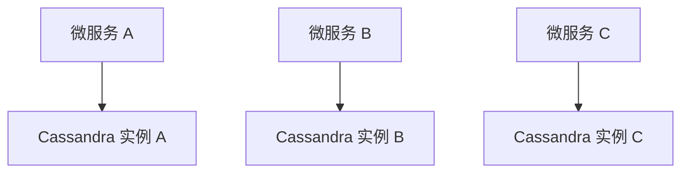
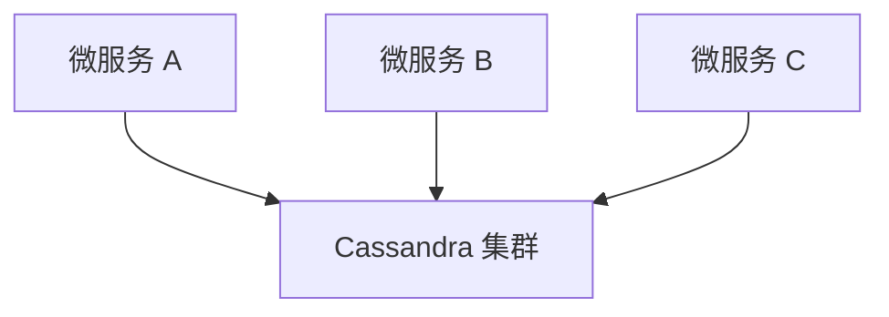
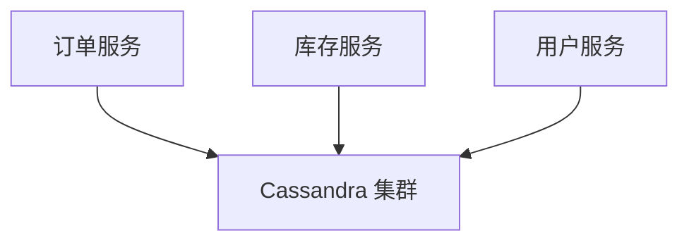
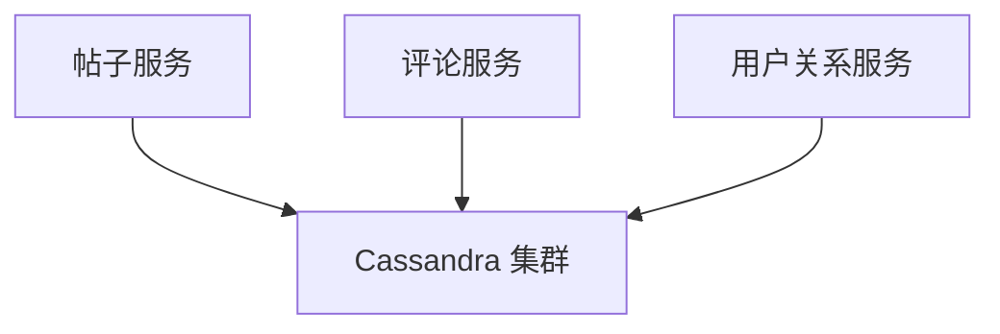

# Cassandra 与微服务架构

## 介绍

在现代软件开发中，微服务架构已经成为一种流行的设计模式。它将应用程序分解为多个小型、独立的服务，每个服务都可以独立开发、部署和扩展。为了支持这种架构，数据库的选择至关重要。Apache Cassandra 是一个高度可扩展、分布式的 NoSQL 数据库，非常适合微服务架构的需求。

本文将探讨如何将 Cassandra 与微服务架构集成，并展示其在实际应用中的优势。

## 微服务架构概述

微服务架构是一种将应用程序分解为多个小型服务的架构风格。每个服务都围绕特定的业务功能构建，并且可以独立部署和扩展。这种架构的主要优势包括：

- **松耦合**：服务之间通过 API 通信，减少了依赖性。
- **可扩展性**：每个服务可以根据需求独立扩展。
- **技术多样性**：不同的服务可以使用不同的技术栈。

## Cassandra 的优势

Cassandra 是一个分布式 NoSQL 数据库，具有以下特点：

- **高可用性**：Cassandra 采用分布式架构，数据在多个节点上复制，确保高可用性。
- **线性可扩展性**：通过添加更多节点，可以轻松扩展 Cassandra 集群。
- **无单点故障**：Cassandra 的设计避免了单点故障，确保系统的稳定性。
- **灵活的数据模型**：Cassandra 支持灵活的数据模型，适合处理各种类型的数据。

## Cassandra 与微服务集成

将 Cassandra 与微服务架构集成，可以为每个微服务提供独立的数据库实例，或者共享一个 Cassandra 集群。以下是集成的几种常见方式：

### 1. 每个微服务拥有独立的 Cassandra 实例

在这种模式下，每个微服务都有自己的 Cassandra 实例。这种方式提供了最大的隔离性，但也增加了管理和维护的复杂性。



### 2. 共享 Cassandra 集群

在这种模式下，多个微服务共享同一个 Cassandra 集群。这种方式减少了资源开销，但需要确保数据隔离和访问控制。



## 实际应用场景

### 场景 1：电子商务平台

在一个电子商务平台中，订单服务、库存服务和用户服务可以分别使用 Cassandra 来存储相关数据。订单服务可以存储订单历史，库存服务可以存储商品库存信息，用户服务可以存储用户资料。



### 场景 2：社交媒体平台

在一个社交媒体平台中，帖子服务、评论服务和用户关系服务可以分别使用 Cassandra 来存储相关数据。帖子服务可以存储用户发布的帖子，评论服务可以存储用户对帖子的评论，用户关系服务可以存储用户之间的关注关系。



## 代码示例

以下是一个简单的 Node.js 微服务示例，展示如何使用 Cassandra 存储和检索数据。

```javascript
const cassandra = require('cassandra-driver');

const client = new cassandra.Client({
  contactPoints: ['127.0.0.1'],
  localDataCenter: 'datacenter1',
  keyspace: 'my_keyspace'
});

async function insertData() {
  const query = 'INSERT INTO users (id, name, email) VALUES (?, ?, ?)';
  const params = [1, 'John Doe', 'john.doe@example.com'];
  await client.execute(query, params, { prepare: true });
  console.log('Data inserted');
}

async function retrieveData() {
  const query = 'SELECT * FROM users WHERE id = ?';
  const params = [1];
  const result = await client.execute(query, params, { prepare: true });
  console.log('Retrieved data:', result.rows[0]);
}

insertData().then(retrieveData);
```

**输出：**

```
Data inserted
Retrieved data: { id: 1, name: 'John Doe', email: 'john.doe@example.com' }
```

## 总结

Cassandra 是一个强大的分布式数据库，非常适合与微服务架构集成。它提供了高可用性、线性可扩展性和灵活的数据模型，能够满足微服务的需求。通过合理的架构设计，Cassandra 可以为微服务提供可靠的数据存储解决方案。

## 附加资源

- [Cassandra 官方文档](https://cassandra.apache.org/doc/latest/)
- [微服务架构设计模式](https://microservices.io/)
- [Node.js Cassandra 驱动文档](https://docs.datastax.com/en/developer/nodejs-driver/latest/)

## 练习

1. 尝试在本地环境中设置一个 Cassandra 集群，并创建一个简单的微服务来存储和检索数据。
2. 探索如何在微服务架构中实现数据隔离和访问控制。
3. 研究 Cassandra 的数据复制策略，并思考如何在高可用性和一致性之间进行权衡。
