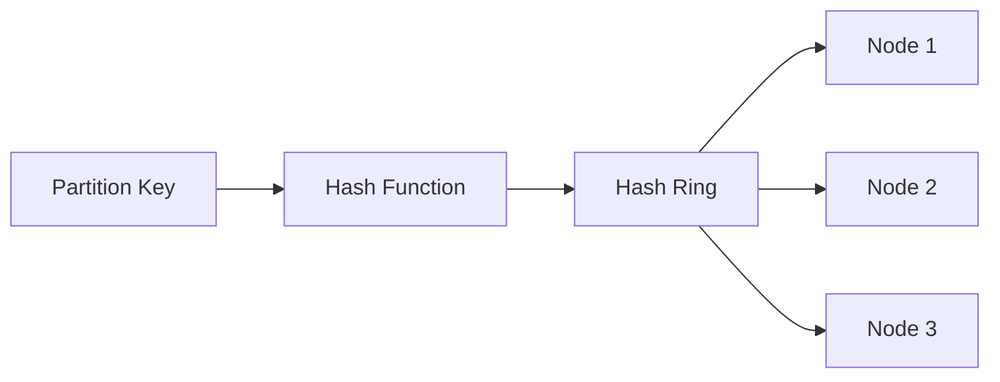
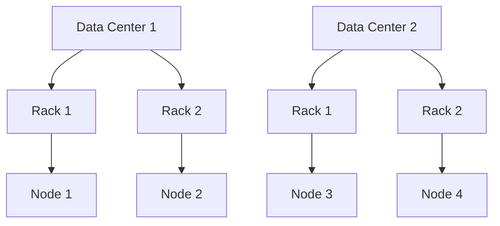

# Cassandra 负载均衡

## 介绍

在分布式数据库系统中，负载均衡是确保系统高效运行的关键机制之一。Cassandra作为一个高度可扩展的分布式数据库，通过其内置的负载均衡机制，能够有效地分配数据请求和存储负载，从而避免单点故障和性能瓶颈。

负载均衡的核心目标是将数据请求均匀地分布到集群中的各个节点上，以确保每个节点的负载相对均衡，从而提高系统的整体性能和可靠性。

## Cassandra 的负载均衡机制

Cassandra的负载均衡主要通过以下几个方面来实现：

1. **数据分区**：Cassandra使用一致性哈希算法将数据分布到集群中的各个节点上。每个节点负责存储一部分数据，这种分布方式确保了数据的均匀分布。

2. **副本策略**：Cassandra通过副本策略（Replication Strategy）来确保数据的冗余存储。每个数据分区会有多个副本存储在不同的节点上，这样即使某个节点发生故障，数据仍然可以从其他节点获取。

3. **请求路由**：Cassandra客户端通过协调器节点（Coordinator Node）来路由请求。协调器节点会根据数据的分区信息将请求转发到相应的节点上。

## 数据分区与负载均衡

Cassandra使用一致性哈希算法来分配数据分区。每个节点在哈希环上占据一个位置，数据根据其分区键（Partition Key）的哈希值被分配到相应的节点上。



在上图中，数据的分区键通过哈希函数映射到哈希环上的某个位置，然后被分配到最近的节点上。

## 副本策略与负载均衡

Cassandra支持多种副本策略，最常见的是`SimpleStrategy`和`NetworkTopologyStrategy`。

- **SimpleStrategy**：适用于单数据中心环境，副本分布在哈希环上的连续节点上。
- **NetworkTopologyStrategy**：适用于多数据中心环境，副本分布在不同的数据中心和机架上，以提高容错能力。



在上图中，数据副本分布在不同的数据中心和机架上，以确保即使某个数据中心或机架发生故障，数据仍然可用。

## 请求路由与负载均衡

Cassandra客户端通过协调器节点来路由请求。协调器节点会根据数据的分区信息将请求转发到相应的节点上。如果请求的数据不在协调器节点上，协调器节点会将请求转发到存储该数据的节点上。

```java
// 示例：Cassandra客户端请求路由
Session session = cluster.connect("my_keyspace");
ResultSet resultSet = session.execute("SELECT * FROM my_table WHERE id = 1;");
```

在上面的代码示例中，Cassandra客户端通过`Session`对象执行查询请求。协调器节点会根据`id`的分区键将请求路由到存储该数据的节点上。

## 实际案例

假设我们有一个电商网站，使用Cassandra来存储用户订单数据。为了确保系统的高可用性和高性能，我们需要将订单数据均匀地分布到集群中的各个节点上。

1. **数据分区**：我们使用用户ID作为分区键，将订单数据分布到不同的节点上。
2. **副本策略**：我们使用`NetworkTopologyStrategy`，将订单数据的副本分布在不同的数据中心和机架上。
3. **请求路由**：当用户查询订单时，Cassandra客户端会将请求路由到存储该订单数据的节点上。

通过这种方式，我们可以确保订单数据的高可用性和高性能，即使某个节点或数据中心发生故障，系统仍然可以正常运行。

## 总结

Cassandra的负载均衡机制通过数据分区、副本策略和请求路由等方式，确保了数据在集群中的均匀分布和高可用性。对于初学者来说，理解这些基本概念是掌握Cassandra性能优化的关键。

## 附加资源与练习

- **练习**：尝试在一个Cassandra集群中配置不同的副本策略，并观察数据分布和系统性能的变化。
- **资源**：阅读Cassandra官方文档中关于[数据分区](https://cassandra.apache.org/doc/latest/cassandra/architecture/dynamo.html)和[副本策略](https://cassandra.apache.org/doc/latest/cassandra/architecture/replication.html)的详细说明。

:::tip
提示：在实际生产环境中，建议使用`NetworkTopologyStrategy`来确保数据的高可用性和容错能力。
:::