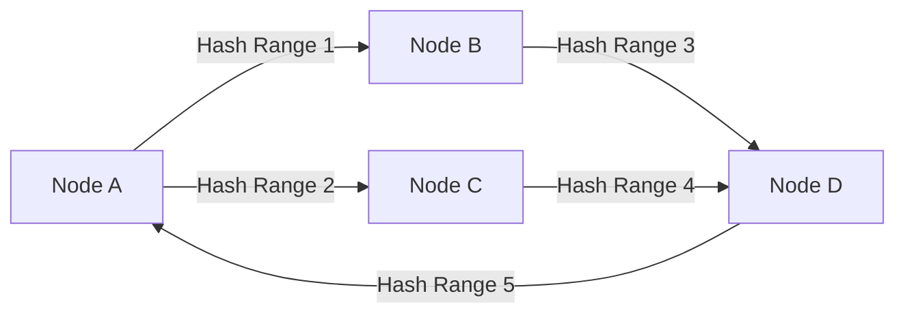
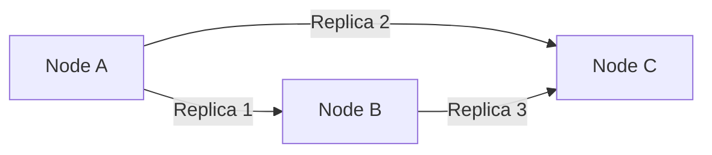

# Cassandra 故障转移

## 介绍

Apache Cassandra 是一个高度可扩展的分布式数据库系统，设计用于处理大量数据跨多个数据中心和云区域。Cassandra 的高可用性是其核心特性之一，而**故障转移**是实现这一特性的关键机制。故障转移是指在某个节点发生故障时，系统能够自动将请求重定向到其他健康的节点，从而确保服务的连续性。

在本教程中，我们将深入探讨Cassandra的故障转移机制，了解其工作原理，并通过实际案例展示如何在实际应用中使用这一功能。

## Cassandra 的故障转移机制

### 1. 分布式架构

Cassandra采用分布式架构，数据被分散存储在多个节点上。每个节点都包含数据的一部分副本，并且这些副本分布在不同的数据中心或机架上。这种设计使得即使某个节点发生故障，数据仍然可以从其他节点访问。

### 2. 一致性哈希

Cassandra使用一致性哈希算法来确定数据在集群中的分布。每个节点负责一定范围的哈希值，当某个节点发生故障时，其负责的数据范围会被重新分配给其他节点。



### 3. Gossip协议

Cassandra使用Gossip协议来检测节点故障。每个节点定期与其他节点交换状态信息，如果某个节点在一段时间内没有响应，它将被标记为故障节点。

### 4. 故障转移

当某个节点被标记为故障时，Cassandra会自动将请求重定向到其他健康的节点。这个过程对客户端是透明的，客户端不需要做任何额外的配置。

## 实际案例

假设我们有一个Cassandra集群，包含三个节点：`Node A`、`Node B`和`Node C`。每个节点都存储了部分数据副本。



### 场景1：节点故障

假设`Node A`发生故障，Cassandra会自动将请求重定向到`Node B`和`Node C`。客户端仍然可以正常访问数据，尽管`Node A`不可用。

### 场景2：节点恢复

当`Node A`恢复后，Cassandra会重新将其纳入集群，并重新分配数据范围。这个过程也是自动的，不需要人工干预。

## 代码示例

以下是一个简单的Python示例，展示了如何在Cassandra中处理节点故障。

```python
from cassandra.cluster import Cluster

# 连接到Cassandra集群
cluster = Cluster(['node1', 'node2', 'node3'])
session = cluster.connect('my_keyspace')

# 执行查询
try:
    rows = session.execute('SELECT * FROM my_table')
    for row in rows:
        print(row)
except Exception as e:
    print(f"Error: {e}")
finally:
    cluster.shutdown()
```

在这个示例中，如果`node1`发生故障，Cassandra会自动将请求重定向到`node2`或`node3`。

## 总结

Cassandra的故障转移机制是其高可用性的核心。通过分布式架构、一致性哈希、Gossip协议和自动故障转移，Cassandra能够在节点故障时保持服务的连续性。理解这些机制对于构建可靠的分布式系统至关重要。

## 附加资源

- [Cassandra官方文档](https://cassandra.apache.org/doc/latest/)
- [Cassandra Gossip协议详解](https://www.datastax.com/blog/how-cassandra-uses-gossip-protocol)
- [Cassandra一致性哈希算法](https://www.datastax.com/blog/understanding-cassandra-consistent-hashing)

## 练习

1. 在一个Cassandra集群中，模拟一个节点故障，并观察系统的行为。
2. 编写一个Python脚本，连接到Cassandra集群，并测试故障转移机制。
3. 阅读Cassandra的Gossip协议文档，了解其工作原理。

通过以上内容，你应该对Cassandra的故障转移机制有了深入的理解。继续探索和实践，你将能够更好地应用这些知识到实际项目中。