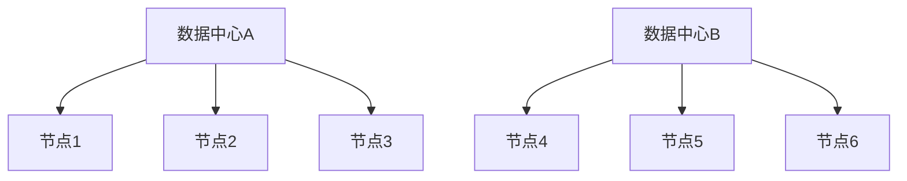

# Cassandra 容灾策略

Cassandra是一个分布式NoSQL数据库，以其高可用性和容灾能力而闻名。在设计分布式系统时，容灾策略是确保系统在硬件故障、网络中断或其他异常情况下仍能正常运行的关键。本文将详细介绍Cassandra的容灾策略，帮助初学者理解其核心概念和实现方式。

## 什么是容灾策略？

容灾策略是指通过一系列技术手段，确保系统在发生故障时能够继续提供服务或快速恢复。对于Cassandra这样的分布式数据库，容灾策略主要包括数据复制、一致性级别配置和故障恢复机制。

## 数据复制

Cassandra通过数据复制来实现高可用性。每个数据项都会被复制到多个节点上，以确保即使某些节点发生故障，数据仍然可用。

### 复制因子（Replication Factor）

复制因子（Replication Factor, RF）决定了数据在集群中的副本数量。例如，如果RF=3，那么每个数据项会被复制到3个不同的节点上。

```sql
CREATE KEYSPACE my_keyspace WITH replication = {
  'class': 'SimpleStrategy',
  'replication_factor': 3
};
```

:::tip
在实际生产环境中，建议使用`NetworkTopologyStrategy`，它可以根据数据中心的分布来配置复制因子。
:::

### 一致性级别（Consistency Level）

一致性级别决定了在读写操作时需要多少个副本确认才能认为操作成功。Cassandra提供了多种一致性级别，如`ONE`、`QUORUM`和`ALL`。

```sql
CONSISTENCY QUORUM;
```

:::note
`QUORUM`表示大多数副本（即`(RF/2) + 1`）需要确认操作。例如，如果RF=3，那么至少需要2个副本确认。
:::

## 故障恢复机制

Cassandra通过以下几种机制来处理节点故障：

### 1. 节点故障检测

Cassandra使用Gossip协议来检测节点故障。每个节点会定期与其他节点交换信息，以确定哪些节点处于活动状态，哪些节点可能已经失效。

### 2. 数据修复（Repair）

当节点重新加入集群时，Cassandra会自动启动数据修复过程，以确保该节点上的数据与其他副本保持一致。

```bash
nodetool repair
```

### 3. 提示移交（Hinted Handoff）

如果某个节点暂时不可用，Cassandra会将写操作存储为“提示”，并在该节点恢复后将这些写操作重新应用。

## 实际案例

假设我们有一个跨数据中心的Cassandra集群，配置如下：

- 数据中心A：3个节点
- 数据中心B：3个节点
- 复制因子：3（每个数据中心至少有一个副本）



在这种情况下，即使整个数据中心A发生故障，数据中心B仍然可以提供完整的数据访问服务。

## 总结

Cassandra通过数据复制、一致性级别配置和故障恢复机制，实现了强大的容灾能力。理解这些策略对于设计和维护高可用性系统至关重要。

## 附加资源

- [Cassandra官方文档](https://cassandra.apache.org/doc/latest/)
- 《Cassandra: The Definitive Guide》 by Eben Hewitt

## 练习

1. 在一个三节点的Cassandra集群中，设置复制因子为2，并测试在其中一个节点故障时，系统是否仍然可以正常读写数据。
2. 使用`nodetool repair`命令修复一个故障节点，并观察数据修复的过程。

通过以上内容，你应该对Cassandra的容灾策略有了初步的了解。继续深入学习，你将能够更好地应用这些策略来构建高可用性的分布式系统。