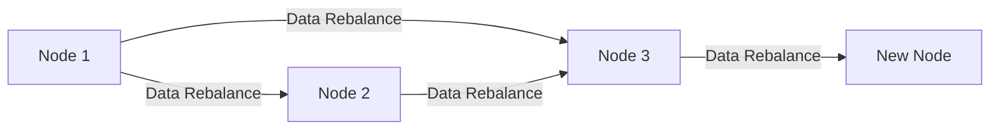
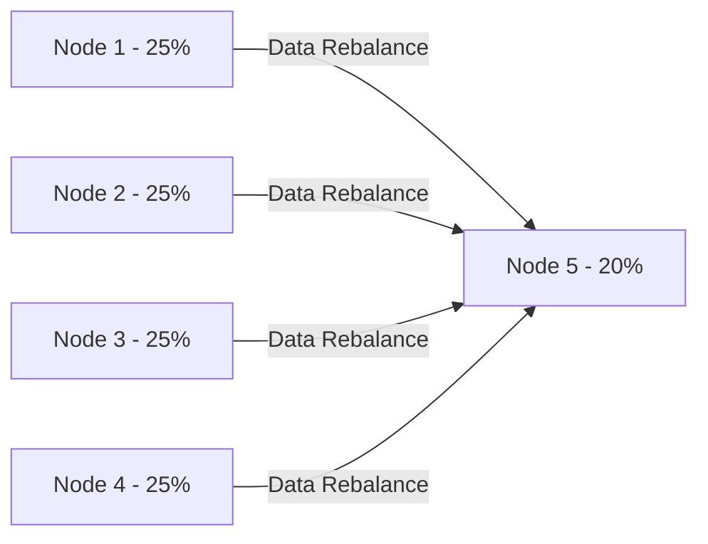

# Cassandra 自动均衡

Cassandra是一个分布式NoSQL数据库，设计用于处理大规模数据和高并发请求。为了确保系统的高可用性和性能，Cassandra采用了**自动均衡**机制。本文将详细介绍Cassandra的自动均衡机制，包括其工作原理、实际应用场景以及如何配置和管理。

## 什么是自动均衡？

自动均衡是Cassandra在集群中动态调整数据分布和负载的过程。当新节点加入集群或现有节点离开时，Cassandra会自动重新分配数据，以确保每个节点存储的数据量大致相同。这种机制不仅提高了系统的可用性，还优化了查询性能。

:::note
自动均衡是Cassandra高可用性的核心机制之一，它确保了数据在集群中的均匀分布。
:::

## 自动均衡的工作原理

Cassandra的自动均衡机制基于**一致性哈希**和**虚拟节点**（vnode）的概念。以下是其工作原理的逐步解释：

1. **一致性哈希**：Cassandra使用一致性哈希算法将数据分布到集群中的各个节点。每个节点负责一定范围的哈希值，数据根据其哈希值被分配到相应的节点。

2. **虚拟节点**：为了更均匀地分布数据，Cassandra引入了虚拟节点的概念。每个物理节点可以包含多个虚拟节点，这些虚拟节点分布在哈希环上。这样，即使物理节点的数量较少，数据也能均匀分布。

3. **数据重新分配**：当新节点加入集群时，Cassandra会自动将部分数据从现有节点迁移到新节点。同样，当节点离开集群时，其数据会被重新分配到其他节点。



:::tip
虚拟节点的引入使得Cassandra能够更灵活地处理节点的加入和离开，减少了数据迁移的开销。
:::

## 配置和管理自动均衡

Cassandra的自动均衡机制默认是启用的，但你可以通过以下配置参数进行调整：

- **`num_tokens`**：指定每个节点的虚拟节点数量。增加虚拟节点数量可以提高数据分布的均匀性，但也会增加管理开销。
  
- **`hinted_handoff_enabled`**：控制是否启用提示移交（hinted handoff）。提示移交是一种机制，用于在节点暂时不可用时保存写操作，待节点恢复后再执行。

- **`nodetool`**：Cassandra提供了`nodetool`命令行工具，用于手动触发数据重新平衡。例如，你可以使用以下命令手动启动数据迁移：

  ```bash
  nodetool repair
  ```

:::caution
手动触发数据重新平衡可能会对系统性能产生影响，建议在低峰时段执行。
:::

## 实际应用场景

假设你有一个包含4个节点的Cassandra集群，每个节点存储了25%的数据。当第5个节点加入集群时，Cassandra会自动将部分数据从现有节点迁移到新节点，使每个节点存储的数据量减少到20%。这种自动均衡机制确保了集群的高可用性和性能。



## 总结

Cassandra的自动均衡机制通过一致性哈希和虚拟节点的结合，确保了数据在集群中的均匀分布和负载均衡。这种机制不仅提高了系统的可用性，还优化了查询性能。通过合理配置和管理，你可以进一步优化Cassandra集群的性能。

## 附加资源

- [Cassandra官方文档](https://cassandra.apache.org/doc/latest/)
- [Cassandra数据分布与一致性哈希](https://docs.datastax.com/en/cassandra-oss/3.x/cassandra/architecture/archDataDistributeHashing.html)
- [Cassandra性能调优指南](https://docs.datastax.com/en/cassandra-oss/3.x/cassandra/operations/opsTune.html)

## 练习

1. 在一个包含3个节点的Cassandra集群中，添加第4个节点，并观察数据如何自动重新分布。
2. 使用`nodetool`工具手动触发数据重新平衡，并记录系统性能的变化。
3. 调整`num_tokens`参数，观察虚拟节点数量对数据分布的影响。

通过以上练习，你将更深入地理解Cassandra的自动均衡机制及其在实际应用中的重要性。