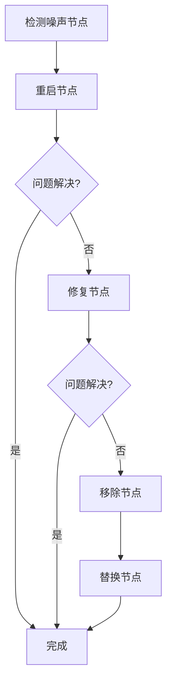

# Cassandra 噪声节点处理

Cassandra是一个高度可扩展的分布式数据库系统，设计用于处理大量数据跨多个节点。然而，在实际运行中，可能会遇到“噪声节点”问题，即某些节点由于硬件故障、网络问题或软件错误等原因，无法正常工作或响应缓慢。这些噪声节点可能会影响整个集群的性能和可用性。本文将详细介绍Cassandra中噪声节点的概念及其处理方法。

## 什么是噪声节点？

噪声节点（Noisy Node）是指在Cassandra集群中，由于各种原因导致性能下降或无法正常工作的节点。这些节点可能会频繁超时、响应缓慢或完全无法响应，从而影响整个集群的读写操作。

:::note
噪声节点不仅会影响单个节点的性能，还可能导致数据不一致或集群分裂（Split-Brain）等问题。
:::

## 噪声节点的检测

Cassandra提供了多种工具和方法来检测噪声节点。以下是一些常用的方法：

1. **Nodetool工具**：Cassandra自带的`nodetool`工具可以用来监控集群中各个节点的状态。通过`nodetool status`命令，可以查看每个节点的状态、负载和延迟等信息。

   ```bash
   nodetool status
   ```

   输出示例：

   ```
   Datacenter: datacenter1
   =======================
   Status=Up/Down
   |/ State=Normal/Leaving/Joining/Moving
   --  Address        Load       Tokens       Owns    Host ID                               Rack
   UN  192.168.1.101  1.2 GB     256          ?       123e4567-e89b-12d3-a456-426614174000  rack1
   UN  192.168.1.102  1.1 GB     256          ?       123e4567-e89b-12d3-a456-426614174001  rack1
   DN  192.168.1.103  1.3 GB     256          ?       123e4567-e89b-12d3-a456-426614174002  rack1
   ```

   在上面的输出中，`DN`表示节点`192.168.1.103`处于宕机状态（Down），这可能是一个噪声节点。

2. **日志分析**：Cassandra的日志文件（`system.log`和`debug.log`）中会记录节点的各种事件和错误信息。通过分析这些日志，可以识别出潜在的噪声节点。

3. **监控工具**：使用第三方监控工具（如Prometheus、Grafana等）可以实时监控Cassandra集群的性能指标，如CPU使用率、内存使用率、磁盘I/O等，从而及时发现噪声节点。

## 噪声节点的处理

一旦检测到噪声节点，可以采取以下措施进行处理：

### 1. 重启节点

有时，简单的重启操作可以解决节点的问题。通过`nodetool`工具可以安全地重启节点：

```bash
nodetool restart
```

:::caution
在重启节点之前，请确保该节点上没有正在进行的重要操作，以避免数据丢失或服务中断。
:::

### 2. 修复节点

如果节点由于数据不一致或损坏而成为噪声节点，可以使用`nodetool repair`命令来修复数据：

```bash
nodetool repair
```

该命令会启动一个修复过程，确保节点上的数据与其他节点保持一致。

### 3. 移除节点

如果节点无法通过重启或修复恢复正常，可以考虑将其从集群中移除。首先，使用`nodetool decommission`命令将节点从集群中移除：

```bash
nodetool decommission
```

然后，手动删除该节点上的数据文件，并重新加入集群。

### 4. 替换节点

如果节点硬件故障或无法修复，可以考虑替换该节点。首先，移除故障节点，然后添加一个新的节点到集群中。Cassandra会自动将数据重新分布到新节点上。

## 实际案例

假设我们有一个由5个节点组成的Cassandra集群，其中节点`192.168.1.103`由于磁盘故障导致响应缓慢。通过`nodetool status`命令，我们发现该节点处于`DN`状态。我们尝试重启节点，但问题依然存在。于是，我们决定使用`nodetool repair`命令修复数据，但修复过程失败。最终，我们决定将该节点从集群中移除，并添加一个新的节点`192.168.1.104`来替换它。



## 总结

噪声节点是Cassandra集群中常见的问题之一，可能会严重影响集群的性能和可用性。通过使用`nodetool`工具、日志分析和监控工具，可以及时发现并处理噪声节点。常见的处理方法包括重启节点、修复节点、移除节点和替换节点。通过合理的处理，可以确保Cassandra集群的高可用性和稳定性。

## 附加资源

- [Cassandra官方文档](https://cassandra.apache.org/doc/latest/)
- [Nodetool命令参考](https://cassandra.apache.org/doc/latest/tools/nodetool/nodetool.html)
- [Cassandra监控与调优](https://www.datastax.com/dev/blog/cassandra-monitoring-and-tuning)

## 练习

1. 使用`nodetool status`命令查看你的Cassandra集群中各个节点的状态。
2. 尝试使用`nodetool repair`命令修复一个节点，并观察修复过程。
3. 模拟一个噪声节点场景，并尝试使用本文介绍的方法进行处理。
