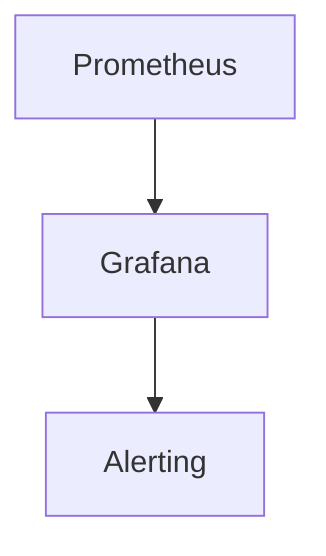

## 介绍

Apache Cassandra 是一个高度可扩展的分布式 NoSQL 数据库，广泛应用于需要处理大量数据的场景。然而，随着数据量的增加和安全威胁的多样化，确保 Cassandra 的安全性变得至关重要。本文将介绍一些 Cassandra 安全的最佳实践，帮助您保护数据库免受未经授权的访问和数据泄露。

## 1. 启用身份验证和授权

### 1.1 启用身份验证

Cassandra 默认情况下不启用身份验证，这意味着任何能够连接到数据库的用户都可以访问数据。为了增强安全性，您应该启用身份验证。

```bash
# 在 cassandra.yaml 中启用身份验证
authenticator: PasswordAuthenticator
```

### 1.2 创建用户和角色

启用身份验证后，您需要创建用户并分配适当的角色。

```sql
-- 创建用户
CREATE USER 'admin' WITH PASSWORD 'securepassword';

-- 授予角色
CREATE ROLE 'admin_role' WITH SUPERUSER = true;
GRANT 'admin_role' TO 'admin';
```

## 2. 配置网络加密

### 2.1 启用 SSL/TLS 加密

为了防止数据在传输过程中被窃听，您应该启用 SSL/TLS 加密。

```bash
# 在 cassandra.yaml 中配置 SSL
server_encryption_options:
    internode_encryption: all
    keystore: /path/to/keystore
    keystore_password: keystore_password
    truststore: /path/to/truststore
    truststore_password: truststore_password
```

### 2.2 客户端加密

同样，客户端与 Cassandra 之间的通信也应加密。

```bash
client_encryption_options:
    enabled: true
    optional: false
    keystore: /path/to/client_keystore
    keystore_password: client_keystore_password
```

## 3. 数据备份与恢复

### 3.1 定期备份

定期备份是防止数据丢失的关键步骤。您可以使用 `nodetool` 工具来创建快照。

```bash
nodetool snapshot -t my_snapshot
```

### 3.2 恢复数据

在需要时，您可以从快照中恢复数据。

```bash
nodetool refresh -- my_keyspace my_table
```

## 4. 审计与监控

### 4.1 启用审计日志

审计日志可以帮助您跟踪数据库中的操作，识别潜在的安全威胁。

```bash
# 在 cassandra.yaml 中启用审计日志
audit_logging_options:
    enabled: true
    logger: LogbackAuditLogger
    included_keyspaces: my_keyspace
```

### 4.2 监控数据库性能

使用工具如 Prometheus 和 Grafana 来监控 Cassandra 的性能，及时发现异常行为。



## 5. 实际案例

### 5.1 金融行业

在金融行业中，Cassandra 用于存储交易数据。通过启用身份验证、加密通信和审计日志，金融机构可以确保交易数据的安全性和合规性。

### 5.2 医疗行业

医疗行业使用 Cassandra 存储患者记录。通过定期备份和恢复策略，医疗机构可以防止数据丢失，确保患者信息的完整性。

## 总结

通过实施这些 Cassandra 安全最佳实践，您可以显著提高数据库的安全性，保护敏感数据免受未经授权的访问和潜在威胁。记住，安全是一个持续的过程，需要定期审查和更新您的安全策略。

## 附加资源

- [Cassandra 官方文档](https://cassandra.apache.org/doc/latest/)
- [Cassandra 安全指南](https://cassandra.apache.org/doc/latest/operating/security.html)
- [Prometheus 和 Grafana 监控指南](https://prometheus.io/docs/introduction/overview/)

## 练习

1. 在您的 Cassandra 实例中启用身份验证，并创建一个具有管理员权限的用户。
2. 配置 SSL/TLS 加密，确保客户端和服务器之间的通信安全。
3. 设置定期备份策略，并尝试从备份中恢复数据。
4. 启用审计日志，并分析日志以识别潜在的安全威胁。

通过完成这些练习，您将更好地理解如何在实际环境中应用 Cassandra 安全最佳实践。