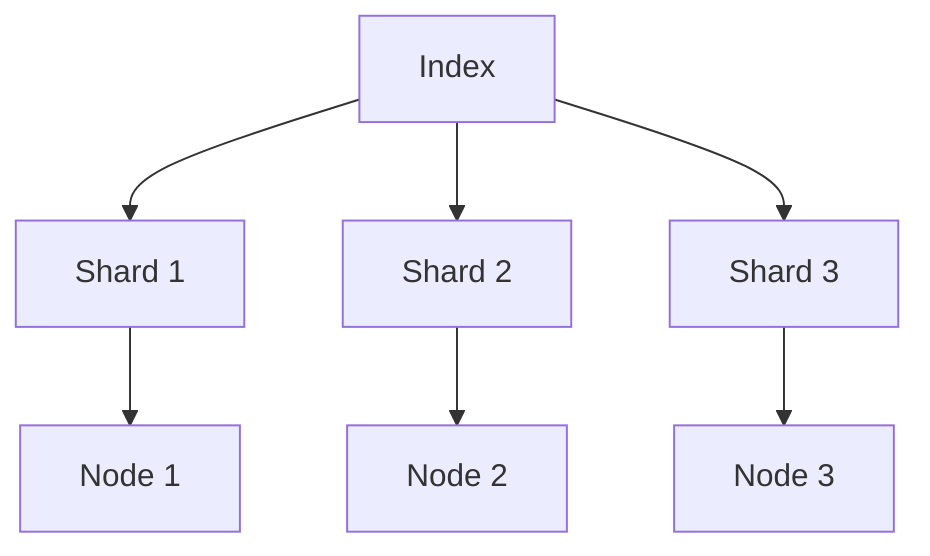
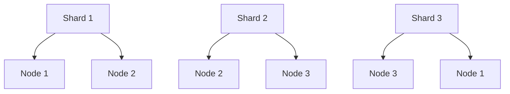

# Elasticsearch 核心概念

Elasticsearch 是一个分布式、可扩展的搜索和分析引擎，广泛应用于日志分析、全文搜索、实时数据分析等场景。要理解 Elasticsearch，首先需要掌握其核心概念。本文将详细介绍这些概念，并通过实际案例帮助你更好地理解。

## 1. 索引（Index）

**索引** 是 Elasticsearch 中最基本的数据存储单元。你可以将索引类比为关系型数据库中的“数据库”。每个索引包含一组相关的文档，并且可以定义自己的映射（mapping）和设置（settings）。

:::note
索引名称必须是小写字母，不能包含特殊字符（如 `*`, `?`, `"`, `<`, `>`, `|` 等）。
:::

### 示例：创建索引

```bash
PUT /my_index
{
  "settings": {
    "number_of_shards": 3,
    "number_of_replicas": 2
  }
}
```

- **number_of_shards**: 分片数量，决定了数据如何分布。
- **number_of_replicas**: 副本数量，用于提高数据的可用性和容错性。

## 2. 文档（Document）

**文档** 是 Elasticsearch 中存储的基本数据单元。每个文档是一个 JSON 对象，包含一组键值对。文档必须属于某个索引，并且每个文档都有一个唯一的 ID。

:::tip
文档的 ID 可以由用户指定，也可以由 Elasticsearch 自动生成。
:::

### 示例：插入文档

```bash
POST /my_index/_doc/1
{
  "name": "John Doe",
  "age": 30,
  "email": "john.doe@example.com"
}
```

- **`POST /my_index/_doc/1`**: 将文档插入到 `my_index` 索引中，并指定文档 ID 为 `1`。

## 3. 分片（Shard）

**分片** 是 Elasticsearch 中数据分布的基本单位。每个索引可以被分成多个分片，每个分片是一个独立的 Lucene 索引。分片允许 Elasticsearch 将数据分布在多个节点上，从而实现水平扩展。

:::caution
分片数量在索引创建时确定，之后无法更改。因此，在创建索引时需要谨慎选择分片数量。
:::

### 示例：分片分布



- **Shard 1**, **Shard 2**, **Shard 3**: 索引 `my_index` 被分成三个分片。
- **Node 1**, **Node 2**, **Node 3**: 每个分片存储在不同的节点上。

## 4. 副本（Replica）

**副本** 是分片的复制品，用于提高数据的可用性和容错性。每个分片可以有零个或多个副本。副本分片可以处理读请求，从而分担主分片的负载。

:::warning
副本分片不能与主分片存储在同一个节点上，否则无法提供容错能力。
:::

### 示例：副本分布



- **Shard 1** 的主分片存储在 **Node 1**，副本分片存储在 **Node 2**。
- **Shard 2** 的主分片存储在 **Node 2**，副本分片存储在 **Node 3**。
- **Shard 3** 的主分片存储在 **Node 3**，副本分片存储在 **Node 1**。

## 5. 映射（Mapping）

**映射** 定义了索引中的文档结构，包括字段的类型、格式、分析器等。映射类似于关系型数据库中的表结构。

### 示例：定义映射

```bash
PUT /my_index
{
  "mappings": {
    "properties": {
      "name": { "type": "text" },
      "age": { "type": "integer" },
      "email": { "type": "keyword" }
    }
  }
}
```

- **`name`**: 文本类型，支持全文搜索。
- **`age`**: 整数类型。
- **`email`**: 关键字类型，用于精确匹配。

## 6. 实际案例：日志分析

假设你正在构建一个日志分析系统，需要存储和分析大量的日志数据。你可以使用 Elasticsearch 来实现这一目标。

### 步骤 1：创建日志索引

```bash
PUT /logs
{
  "settings": {
    "number_of_shards": 5,
    "number_of_replicas": 1
  },
  "mappings": {
    "properties": {
      "timestamp": { "type": "date" },
      "level": { "type": "keyword" },
      "message": { "type": "text" }
    }
  }
}
```

### 步骤 2：插入日志数据

```bash
POST /logs/_doc
{
  "timestamp": "2023-10-01T12:00:00Z",
  "level": "ERROR",
  "message": "Failed to connect to database"
}
```

### 步骤 3：搜索日志数据

```bash
GET /logs/_search
{
  "query": {
    "match": {
      "message": "database"
    }
  }
}
```

## 总结

通过本文，你已经了解了 Elasticsearch 的核心概念，包括索引、文档、分片、副本和映射。这些概念是理解和使用 Elasticsearch 的基础。希望你能通过实际案例更好地掌握这些知识。

## 附加资源

- [Elasticsearch 官方文档](https://www.elastic.co/guide/en/elasticsearch/reference/current/index.html)
- [Elasticsearch 入门教程](https://www.elastic.co/guide/en/elasticsearch/guide/current/index.html)

## 练习

1. 创建一个名为 `books` 的索引，包含 `title`（文本类型）、`author`（关键字类型）和 `year`（整数类型）字段。
2. 插入几本书的文档，并尝试搜索特定作者的书。
3. 修改 `books` 索引的副本数量为 2，并观察集群状态的变化。

祝你学习愉快！