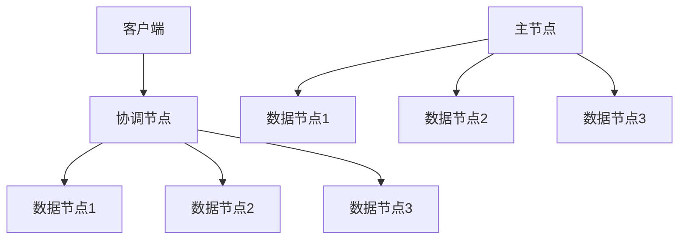
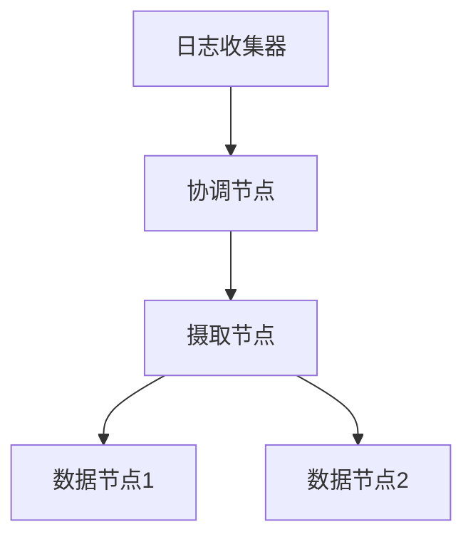

# Elasticsearch 节点类型

Elasticsearch是一个分布式搜索引擎，它的核心设计理念是通过多个节点协同工作来实现高可用性和高性能。在Elasticsearch集群中，节点（Node）是构成集群的基本单元。每个节点可以承担不同的角色，这些角色决定了节点在集群中的职责和行为。本文将详细介绍Elasticsearch中的节点类型，帮助你理解它们在集群中的作用。

## 什么是Elasticsearch节点？

在Elasticsearch中，节点是集群中的一个实例，它可以是一台物理机、虚拟机或容器。每个节点都运行着Elasticsearch的实例，并且可以与其他节点通信以共同完成数据存储、搜索和分析任务。节点类型决定了节点在集群中的角色和功能。

## 主要节点类型

Elasticsearch中的节点类型主要包括以下几种：

1. **主节点（Master Node）**
2. **数据节点（Data Node）**
3. **协调节点（Coordinating Node）**
4. **摄取节点（Ingest Node）**
5. **机器学习节点（Machine Learning Node）**

### 1. 主节点（Master Node）

主节点负责管理集群的全局状态，例如创建或删除索引、决定哪些分片分配给哪些节点、以及处理节点的加入和离开。主节点是集群的“大脑”，确保集群的稳定性和一致性。

:::note
一个集群中可以有多个主节点候选节点（Master-eligible Nodes），但只有一个节点会被选举为当前的主节点。如果主节点宕机，其他候选节点会通过选举产生新的主节点。
:::

**配置示例：**

```yaml
node.master: true
node.data: false
node.ingest: false
```

### 2. 数据节点（Data Node）

数据节点负责存储数据并执行与数据相关的操作，如搜索、聚合和索引。数据节点是集群中处理实际数据的节点，因此它们通常需要更多的计算和存储资源。

**配置示例：**

```yaml
node.master: false
node.data: true
node.ingest: false
```

### 3. 协调节点（Coordinating Node）

协调节点不存储数据，也不参与主节点的选举。它们的主要职责是接收客户端的请求，并将请求转发给适当的数据节点，然后将结果汇总返回给客户端。协调节点通常用于负载均衡和请求路由。

**配置示例：**

```yaml
node.master: false
node.data: false
node.ingest: false
```

### 4. 摄取节点（Ingest Node）

摄取节点负责在数据被索引之前对其进行预处理。它们可以执行各种转换操作，如解析、丰富和过滤数据。摄取节点通常用于处理日志数据或需要预处理的数据流。

**配置示例：**

```yaml
node.master: false
node.data: false
node.ingest: true
```

### 5. 机器学习节点（Machine Learning Node）

机器学习节点专门用于运行Elasticsearch的机器学习任务，如异常检测和预测分析。这些节点需要额外的资源来执行复杂的计算任务。

**配置示例：**

```yaml
node.master: false
node.data: false
node.ingest: false
node.ml: true
```

## 节点类型的实际应用场景

### 场景1：高可用性集群

在一个高可用性集群中，通常会配置多个主节点候选节点，以确保在主节点宕机时能够快速选举出新的主节点。数据节点则负责存储和处理数据，而协调节点用于处理客户端请求。



### 场景2：日志处理

在日志处理场景中，摄取节点可以用于解析和丰富日志数据，然后再将其存储到数据节点中。协调节点则负责接收来自日志收集器的请求，并将处理后的日志数据分发到适当的数据节点。



## 总结

Elasticsearch中的节点类型决定了节点在集群中的角色和功能。主节点负责管理集群状态，数据节点负责存储和处理数据，协调节点负责请求路由，摄取节点负责数据预处理，而机器学习节点则专门用于执行机器学习任务。理解这些节点类型及其配置方式，有助于你更好地设计和优化Elasticsearch集群。

## 附加资源

- [Elasticsearch官方文档](https://www.elastic.co/guide/en/elasticsearch/reference/current/modules-node.html)
- [Elasticsearch节点配置指南](https://www.elastic.co/guide/en/elasticsearch/reference/current/important-settings.html)

## 练习

1. 在一个三节点的Elasticsearch集群中，配置一个主节点、两个数据节点和一个协调节点。
2. 尝试在一个摄取节点上配置一个简单的管道，用于解析JSON格式的日志数据。
