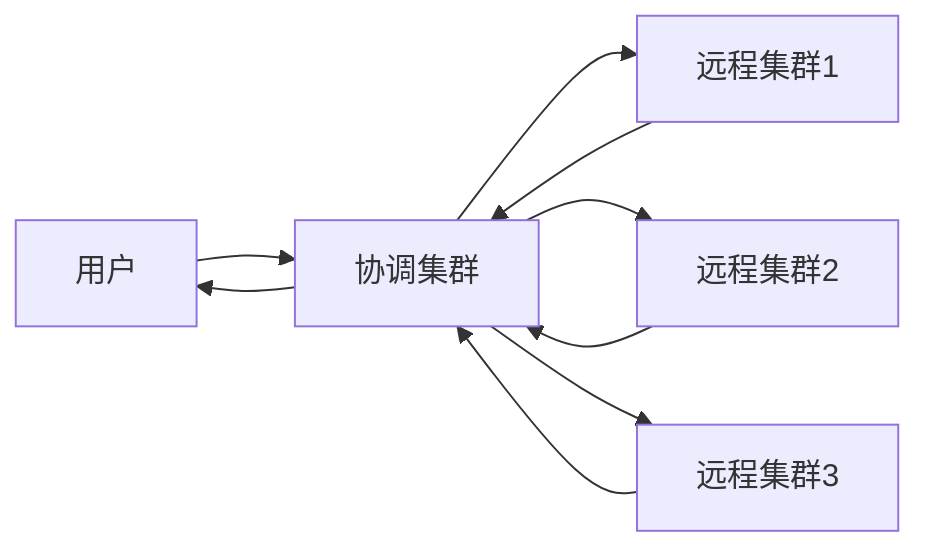

## 介绍

Elasticsearch 是一个强大的分布式搜索引擎，广泛用于日志分析、全文搜索和实时数据分析等场景。随着数据量的增长，单一集群可能无法满足需求，因此跨集群搜索（Cross-Cluster Search, CCS）应运而生。跨集群搜索允许你在多个独立的Elasticsearch集群之间执行搜索操作，就像它们是一个集群一样。

通过跨集群搜索，你可以将多个集群的数据整合到一个查询中，从而简化数据管理和查询操作。这对于拥有多个数据中心或分布式团队的组织尤其有用。

## 跨集群搜索的工作原理

跨集群搜索的核心思想是通过一个“协调集群”来连接多个“远程集群”。协调集群负责接收用户的查询请求，并将请求分发到远程集群。远程集群执行查询后，将结果返回给协调集群，协调集群再将结果汇总并返回给用户。



:::note
跨集群搜索需要远程集群的地址和认证信息。确保协调集群能够访问远程集群的网络和端口。
:::

## 配置跨集群搜索

要启用跨集群搜索，首先需要在协调集群中配置远程集群的连接信息。以下是一个配置示例：

```yaml
# 在协调集群的 elasticsearch.yml 中添加以下配置
cluster:
  remote:
    cluster_one:
      seeds: ["192.168.1.1:9300"]
    cluster_two:
      seeds: ["192.168.1.2:9300"]
```

在这个示例中，`cluster_one` 和 `cluster_two` 是远程集群的名称，`seeds` 是远程集群的节点地址。

## 执行跨集群搜索

配置完成后，你可以通过指定集群名称来执行跨集群搜索。以下是一个简单的查询示例：

```json
GET /cluster_one:index_name,cluster_two:index_name/_search
{
  "query": {
    "match": {
      "field_name": "search_term"
    }
  }
}
```

在这个查询中，`cluster_one:index_name` 和 `cluster_two:index_name` 分别表示远程集群 `cluster_one` 和 `cluster_two` 中的索引。查询结果将包含来自两个集群的数据。

:::tip
你可以使用通配符 `*` 来匹配多个索引，例如 `cluster_one:index_*` 将匹配 `cluster_one` 中所有以 `index_` 开头的索引。
:::

## 实际应用场景

### 1. 多数据中心搜索

假设你的公司在多个数据中心部署了Elasticsearch集群，每个数据中心存储了不同地区的日志数据。通过跨集群搜索，你可以轻松地从所有数据中心检索日志数据，而无需手动查询每个集群。

### 2. 分布式团队协作

如果你的团队分布在不同的地理位置，每个团队可能维护自己的Elasticsearch集群。跨集群搜索允许你整合所有团队的数据，进行统一的查询和分析。

### 3. 数据隔离与共享

在某些情况下，你可能希望将敏感数据存储在独立的集群中，同时允许其他集群访问非敏感数据。通过跨集群搜索，你可以实现数据隔离与共享的平衡。

## 总结

跨集群搜索是Elasticsearch中一个强大的功能，它允许你在多个独立的集群之间执行统一的查询操作。通过配置远程集群的连接信息，并使用特定的查询语法，你可以轻松地整合多个集群的数据。

:::caution
跨集群搜索可能会增加查询的延迟，尤其是在远程集群之间的网络连接较慢的情况下。建议在性能要求较高的场景中谨慎使用。
:::

## 附加资源与练习

- **官方文档**: [Elasticsearch Cross-Cluster Search](https://www.elastic.co/guide/en/elasticsearch/reference/current/modules-cross-cluster-search.html)
- **练习**: 尝试在你的本地环境中配置两个Elasticsearch集群，并执行跨集群搜索。观察查询结果和性能表现。

通过掌握跨集群搜索，你将能够更好地管理和查询分布式数据，提升Elasticsearch的使用效率。