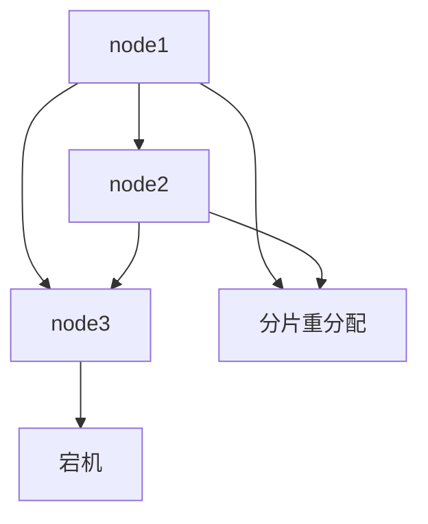

# Elasticsearch 恢复策略

Elasticsearch是一个强大的分布式搜索和分析引擎，但在实际使用中，可能会遇到各种故障。为了确保数据的完整性和系统的可用性，掌握Elasticsearch的恢复策略至关重要。本文将详细介绍Elasticsearch恢复策略的基本概念、常见问题及解决方案，帮助初学者更好地理解和应对故障。

## 什么是Elasticsearch恢复策略？

Elasticsearch恢复策略是指在集群或节点发生故障时，如何恢复数据和服务的一系列方法和步骤。恢复策略的目标是最大限度地减少数据丢失和服务中断，确保系统能够快速恢复正常运行。

## 常见的恢复场景

### 1. 节点故障

当集群中的某个节点发生故障时，Elasticsearch会自动将该节点上的分片重新分配到其他可用节点上。这个过程称为**分片重分配**。

```json
PUT /_cluster/settings
{
  "transient": {
    "cluster.routing.allocation.enable": "all"
  }
}
```

### 2. 数据丢失

在某些情况下，可能会发生数据丢失。Elasticsearch提供了**快照和恢复**功能，可以通过定期备份数据来防止数据丢失。

```json
PUT /_snapshot/my_backup/snapshot_1
{
  "indices": "my_index",
  "ignore_unavailable": true,
  "include_global_state": false
}
```

### 3. 集群状态异常

当集群状态异常时，可能需要手动干预来恢复集群。常见的操作包括**重启节点**、**调整集群设置**等。

```json
POST /_cluster/reroute
{
  "commands": [
    {
      "move": {
        "index": "my_index",
        "shard": 0,
        "from_node": "node1",
        "to_node": "node2"
      }
    }
  ]
}
```

## 实际案例

### 案例1：节点故障恢复

假设我们有一个三节点的Elasticsearch集群，其中一个节点（node3）突然宕机。Elasticsearch会自动将node3上的分片重新分配到node1和node2上。如果node3重新上线，Elasticsearch会再次平衡分片分布。



### 案例2：数据丢失恢复

假设我们有一个重要的索引`my_index`，由于硬件故障导致数据丢失。如果我们之前创建了快照，可以通过以下命令恢复数据：

```json
POST /_snapshot/my_backup/snapshot_1/_restore
{
  "indices": "my_index",
  "ignore_unavailable": true,
  "include_global_state": false
}
```

## 总结

Elasticsearch恢复策略是确保系统高可用性和数据完整性的关键。通过理解常见的恢复场景和掌握相应的恢复方法，初学者可以更好地应对Elasticsearch中的各种故障。

## 附加资源

- [Elasticsearch官方文档](https://www.elastic.co/guide/en/elasticsearch/reference/current/index.html)
- [Elasticsearch快照和恢复指南](https://www.elastic.co/guide/en/elasticsearch/reference/current/snapshots.html)

## 练习

1. 尝试在一个三节点的Elasticsearch集群中模拟节点故障，观察分片重分配的过程。
2. 创建一个索引的快照，并尝试从快照中恢复数据。

通过以上练习，您将更深入地理解Elasticsearch恢复策略的实际应用。