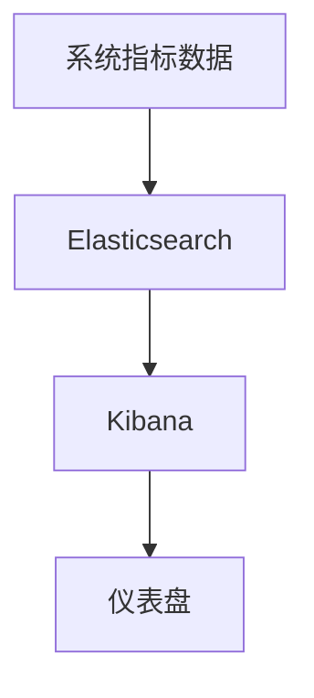

# Elasticsearch 实时监控平台

在现代应用程序中，实时监控是确保系统稳定性和性能的关键。Elasticsearch 作为一个强大的分布式搜索引擎，不仅可以用于搜索和分析数据，还可以用于构建实时监控平台。本文将带你从零开始，学习如何使用 Elasticsearch 构建一个实时监控平台。

## 什么是实时监控平台？

实时监控平台是一种能够实时收集、存储、分析和可视化系统或应用程序运行数据的工具。它可以帮助开发者和运维人员快速发现和解决问题，确保系统的高可用性和性能。

Elasticsearch 由于其高效的索引和查询能力，非常适合用于构建实时监控平台。结合 Kibana（Elasticsearch 的可视化工具），你可以轻松地创建仪表盘，实时监控系统的各项指标。

## 核心概念

在开始构建实时监控平台之前，我们需要了解一些核心概念：

1. **索引（Index）**：Elasticsearch 中的数据存储单元，类似于数据库中的表。
2. **文档（Document）**：存储在索引中的基本数据单元，类似于表中的一行记录。
3. **映射（Mapping）**：定义文档的结构和字段类型。
4. **查询（Query）**：用于从索引中检索数据的请求。
5. **聚合（Aggregation）**：用于对数据进行分组和统计的操作。

## 构建实时监控平台的步骤

### 1. 数据收集

首先，我们需要收集系统的监控数据。常见的监控数据包括 CPU 使用率、内存使用率、网络流量等。你可以使用 Beats（如 Metricbeat）或 Logstash 来收集这些数据并将其发送到 Elasticsearch。

```bash
# 示例：使用 Metricbeat 收集系统指标
metricbeat setup -e
metricbeat -e
```

### 2. 数据存储

收集到的数据将被存储在 Elasticsearch 中。你需要创建一个索引来存储这些数据。以下是一个创建索引的示例：

```bash
PUT /system_metrics
{
  "mappings": {
    "properties": {
      "timestamp": { "type": "date" },
      "cpu_usage": { "type": "float" },
      "memory_usage": { "type": "float" },
      "network_traffic": { "type": "float" }
    }
  }
}
```

### 3. 数据查询与分析

一旦数据存储在 Elasticsearch 中，你可以使用查询和聚合来分析数据。例如，你可以查询过去一小时内 CPU 使用率的平均值：

```bash
GET /system_metrics/_search
{
  "query": {
    "range": {
      "timestamp": {
        "gte": "now-1h",
        "lte": "now"
      }
    }
  },
  "aggs": {
    "avg_cpu_usage": {
      "avg": {
        "field": "cpu_usage"
      }
    }
  }
}
```

### 4. 数据可视化

最后，你可以使用 Kibana 来创建仪表盘，实时展示系统的监控数据。以下是一个简单的 Kibana 仪表盘配置示例：



## 实际案例：监控 Web 服务器

假设你有一个 Web 服务器，你需要监控其请求响应时间、错误率等指标。你可以使用以下步骤来实现：

1. **收集数据**：使用 Filebeat 收集 Web 服务器的日志数据。
2. **存储数据**：将日志数据存储在 Elasticsearch 中。
3. **分析数据**：使用 Elasticsearch 的查询和聚合功能，分析请求响应时间和错误率。
4. **可视化数据**：在 Kibana 中创建仪表盘，实时展示 Web 服务器的性能指标。

## 总结

通过本文，你已经学习了如何使用 Elasticsearch 构建一个实时监控平台。我们从数据收集、存储、查询分析到可视化，逐步讲解了每个步骤的实现方法。希望这些内容能够帮助你更好地理解和应用 Elasticsearch 在实时监控领域的强大功能。

## 附加资源与练习

- **练习**：尝试使用 Elasticsearch 和 Kibana 监控你自己的应用程序，并创建一个仪表盘展示关键指标。
- **资源**：
  - [Elasticsearch 官方文档](https://www.elastic.co/guide/en/elasticsearch/reference/current/index.html)
  - [Kibana 官方文档](https://www.elastic.co/guide/en/kibana/current/index.html)
  - [Beats 官方文档](https://www.elastic.co/guide/en/beats/libbeat/current/index.html)

:::tip
如果你在实践过程中遇到问题，可以访问 Elasticsearch 的官方论坛或社区，获取帮助和支持。
:::