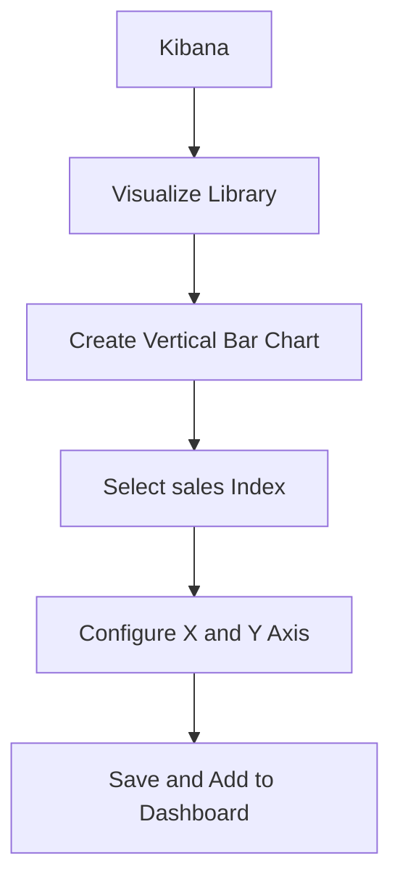

# Elasticsearch BI分析系统

## 介绍

Elasticsearch 是一个分布式的搜索和分析引擎，广泛用于日志分析、全文搜索和实时数据分析。结合 Kibana，Elasticsearch 可以构建一个强大的 BI（商业智能）分析系统，帮助企业从海量数据中提取有价值的洞察。

在本教程中，我们将逐步介绍如何使用 Elasticsearch 和 Kibana 构建一个简单的 BI 分析系统，并通过实际案例展示其应用场景。

## 1. 安装与配置

首先，确保你已经安装了 Elasticsearch 和 Kibana。你可以从 [Elasticsearch 官方网站](https://www.elastic.co/cn/downloads/elasticsearch) 下载并安装这两个工具。

安装完成后，启动 Elasticsearch 和 Kibana：

```bash
# 启动 Elasticsearch
./bin/elasticsearch

# 启动 Kibana
./bin/kibana
```

:::note
确保 Elasticsearch 和 Kibana 的版本匹配，以避免兼容性问题。
:::

## 2. 数据导入

接下来，我们需要将数据导入 Elasticsearch。假设我们有一个包含销售数据的 CSV 文件 `sales_data.csv`，内容如下：

```csv
date,product,category,revenue
2023-01-01,Product A,Electronics,1000
2023-01-02,Product B,Home Appliances,1500
2023-01-03,Product C,Electronics,2000
```

我们可以使用 Elasticsearch 的 Bulk API 将数据导入到索引中：

```bash
curl -X POST "localhost:9200/sales/_bulk" -H "Content-Type: application/json" -d'
{ "index": {} }
{ "date": "2023-01-01", "product": "Product A", "category": "Electronics", "revenue": 1000 }
{ "index": {} }
{ "date": "2023-01-02", "product": "Product B", "category": "Home Appliances", "revenue": 1500 }
{ "index": {} }
{ "date": "2023-01-03", "product": "Product C", "category": "Electronics", "revenue": 2000 }
'
```

:::tip
你可以使用 Logstash 或 Beats 来自动化数据导入过程。
:::

## 3. 数据查询与分析

一旦数据导入完成，我们可以使用 Elasticsearch 的查询 DSL 来执行各种分析操作。例如，计算每个类别的总收入：

```json
GET /sales/_search
{
  "size": 0,
  "aggs": {
    "total_revenue_by_category": {
      "terms": {
        "field": "category.keyword"
      },
      "aggs": {
        "total_revenue": {
          "sum": {
            "field": "revenue"
          }
        }
      }
    }
  }
}
```

输出结果如下：

```json
{
  "aggregations": {
    "total_revenue_by_category": {
      "buckets": [
        {
          "key": "Electronics",
          "doc_count": 2,
          "total_revenue": {
            "value": 3000
          }
        },
        {
          "key": "Home Appliances",
          "doc_count": 1,
          "total_revenue": {
            "value": 1500
          }
        }
      ]
    }
  }
}
```

:::caution
确保字段类型正确，例如 `category` 字段应为 `keyword` 类型，以便进行聚合操作。
:::

## 4. 数据可视化

Kibana 提供了强大的数据可视化功能。我们可以使用 Kibana 创建仪表板，展示销售数据的各种图表。

1. 打开 Kibana，进入 `Visualize Library`。
2. 创建一个新的 `Vertical Bar Chart`。
3. 选择 `sales` 索引，并配置 X 轴为 `category.keyword`，Y 轴为 `revenue` 的 `Sum` 聚合。
4. 保存并添加到仪表板。



## 5. 实际案例

假设你是一家电商公司的数据分析师，你需要分析过去一年的销售数据，找出最畅销的产品类别，并预测未来的销售趋势。

1. 使用 Elasticsearch 导入过去一年的销售数据。
2. 使用聚合查询计算每个类别的总收入。
3. 使用 Kibana 创建仪表板，展示销售趋势和类别分布。
4. 根据分析结果，制定营销策略。

:::warning
数据分析结果仅供参考，实际决策应结合其他因素。
:::

## 总结

通过本教程，你学会了如何使用 Elasticsearch 和 Kibana 构建一个简单的 BI 分析系统。我们从数据导入、查询分析到数据可视化，逐步讲解了每个步骤，并通过实际案例展示了其应用场景。

## 附加资源与练习

- [Elasticsearch 官方文档](https://www.elastic.co/guide/en/elasticsearch/reference/current/index.html)
- [Kibana 官方文档](https://www.elastic.co/guide/en/kibana/current/index.html)
- 练习：尝试使用 Elasticsearch 和 Kibana 分析你的日志数据，并创建一个监控仪表板。

希望本教程对你有所帮助，祝你在 Elasticsearch 的学习之旅中取得成功！