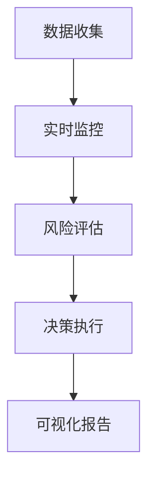

# Elasticsearch 风控系统

在现代互联网应用中，风险控制（风控）系统是保障业务安全的重要组成部分。Elasticsearch作为一个强大的分布式搜索引擎，能够高效地处理和分析大量数据，非常适合用于构建风控系统。本文将逐步介绍如何使用Elasticsearch构建一个风控系统，并通过实际案例展示其应用场景。

## 什么是风控系统？

风控系统是一种用于识别、评估和应对潜在风险的机制。它通常用于金融、电商、社交网络等领域，以防止欺诈、滥用和其他恶意行为。一个高效的风控系统需要能够实时处理大量数据，并快速做出决策。

## 为什么选择Elasticsearch？

Elasticsearch具有以下优势，使其成为构建风控系统的理想选择：

- **实时性**：Elasticsearch能够实时索引和搜索数据，非常适合需要快速响应的风控场景。
- **可扩展性**：Elasticsearch是分布式的，可以轻松扩展以处理大规模数据。
- **强大的查询能力**：Elasticsearch支持复杂的查询和聚合操作，能够快速分析数据并识别异常行为。

## 构建Elasticsearch风控系统的步骤

### 1. 数据收集与索引

首先，我们需要将风控相关的数据收集并索引到Elasticsearch中。这些数据可能包括用户行为日志、交易记录、设备信息等。

```json
PUT /risk_control_logs
{
  "mappings": {
    "properties": {
      "user_id": { "type": "keyword" },
      "action": { "type": "keyword" },
      "timestamp": { "type": "date" },
      "device_id": { "type": "keyword" },
      "ip_address": { "type": "ip" }
    }
  }
}
```

### 2. 实时监控与异常检测

接下来，我们可以使用Elasticsearch的实时搜索功能来监控用户行为，并检测异常模式。例如，我们可以查询某个用户在短时间内是否进行了大量操作。

```json
GET /risk_control_logs/_search
{
  "query": {
    "bool": {
      "must": [
        { "term": { "user_id": "12345" } },
        { "range": { "timestamp": { "gte": "now-5m" } } }
      ]
    }
  },
  "aggs": {
    "actions_count": {
      "terms": { "field": "action" }
    }
  }
}
```

### 3. 风险评估与决策

根据检测到的异常行为，我们可以进行风险评估并做出相应的决策。例如，如果某个用户在短时间内进行了大量高风险操作，我们可以暂时冻结其账户。

```json
POST /risk_control_actions/_doc
{
  "user_id": "12345",
  "action": "freeze_account",
  "reason": "suspicious_activity",
  "timestamp": "2023-10-01T12:00:00Z"
}
```

### 4. 可视化与报告

最后，我们可以使用Elasticsearch的可视化工具（如Kibana）来生成风险报告，帮助业务团队更好地理解风险趋势。



## 实际案例：电商平台风控系统

假设我们正在为一个电商平台构建风控系统。以下是一个实际应用场景：

1. **数据收集**：收集用户的登录、浏览、下单等行为数据。
2. **实时监控**：监控用户是否在短时间内多次尝试登录失败。
3. **风险评估**：如果检测到异常登录行为，系统会自动触发风险评估。
4. **决策执行**：根据风险评估结果，系统可能会要求用户进行二次验证或暂时冻结账户。
5. **可视化报告**：生成每日风险报告，帮助安全团队了解平台的安全状况。

## 总结

通过本文的介绍，我们了解了如何使用Elasticsearch构建一个高效的风控系统。Elasticsearch的实时性、可扩展性和强大的查询能力使其成为风控系统的理想选择。通过实际案例，我们展示了如何将Elasticsearch应用于电商平台的风控场景。

## 附加资源与练习

- **练习**：尝试在本地搭建一个Elasticsearch集群，并模拟一个简单的风控场景。
- **资源**：阅读Elasticsearch官方文档，了解更多关于查询和聚合的用法。

:::tip
如果你对Elasticsearch的某些功能还不熟悉，建议先从基础教程开始学习，逐步掌握其高级功能。
:::