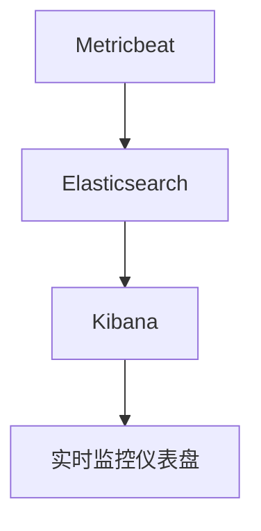

# Elasticsearch 时序数据分析

时序数据（Time Series Data）是指按时间顺序记录的数据点序列，通常用于监控、日志分析、金融数据等领域。Elasticsearch 是一个强大的分布式搜索引擎，特别适合处理大规模的时序数据。本文将带你从零开始，学习如何使用 Elasticsearch 进行时序数据分析。

## 什么是时序数据？

时序数据是按时间顺序排列的数据点集合，通常包含时间戳和对应的值。例如：

- 服务器监控数据（CPU 使用率、内存使用率等）
- 股票市场数据（股票价格、交易量等）
- 物联网设备数据（传感器读数、温度、湿度等）

时序数据的特点是数据量大、写入频繁，且通常需要按时间范围进行查询和分析。

## Elasticsearch 中的时序数据

Elasticsearch 是一个分布式搜索引擎，支持高效的索引和查询操作。对于时序数据，Elasticsearch 提供了以下特性：

- **时间戳字段**：可以轻松地按时间范围过滤数据。
- **聚合功能**：支持按时间间隔（如每分钟、每小时）进行数据聚合。
- **高吞吐量**：适合处理高频写入的时序数据。

### 1. 创建时序数据索引

首先，我们需要创建一个专门用于存储时序数据的索引。假设我们要存储服务器监控数据，包含时间戳、CPU 使用率和内存使用率。

```json
PUT /server_metrics
{
  "mappings": {
    "properties": {
      "timestamp": {
        "type": "date"
      },
      "cpu_usage": {
        "type": "float"
      },
      "memory_usage": {
        "type": "float"
      }
    }
  }
}
```

:::note
`timestamp` 字段的类型是 `date`，这是 Elasticsearch 中用于存储时间戳的标准类型。
:::

### 2. 插入时序数据

接下来，我们可以向索引中插入一些示例数据。

```json
POST /server_metrics/_doc/
{
  "timestamp": "2023-10-01T12:00:00Z",
  "cpu_usage": 45.6,
  "memory_usage": 32.1
}

POST /server_metrics/_doc/
{
  "timestamp": "2023-10-01T12:05:00Z",
  "cpu_usage": 47.2,
  "memory_usage": 33.5
}

POST /server_metrics/_doc/
{
  "timestamp": "2023-10-01T12:10:00Z",
  "cpu_usage": 50.1,
  "memory_usage": 34.0
}
```

:::tip
在实际应用中，数据通常是通过日志收集工具（如 Logstash 或 Beats）自动插入的。
:::

### 3. 查询时序数据

我们可以使用 Elasticsearch 的查询功能，按时间范围过滤数据。

```json
GET /server_metrics/_search
{
  "query": {
    "range": {
      "timestamp": {
        "gte": "2023-10-01T12:00:00Z",
        "lte": "2023-10-01T12:10:00Z"
      }
    }
  }
}
```

返回的结果将包含在指定时间范围内的所有数据点。

### 4. 时序数据聚合

Elasticsearch 的聚合功能非常适合分析时序数据。例如，我们可以按时间间隔（如每分钟）计算 CPU 使用率的平均值。

```json
GET /server_metrics/_search
{
  "size": 0,
  "aggs": {
    "cpu_usage_over_time": {
      "date_histogram": {
        "field": "timestamp",
        "calendar_interval": "minute"
      },
      "aggs": {
        "avg_cpu_usage": {
          "avg": {
            "field": "cpu_usage"
          }
        }
      }
    }
  }
}
```

:::caution
`size: 0` 表示我们不需要返回原始文档，只返回聚合结果。
:::

### 5. 实际案例：服务器监控

假设我们有一个服务器集群，需要监控每台服务器的 CPU 和内存使用情况。我们可以使用 Elasticsearch 存储这些数据，并通过 Kibana 进行可视化。

1. **数据收集**：使用 Beats（如 Metricbeat）收集服务器的 CPU 和内存使用数据，并发送到 Elasticsearch。
2. **数据存储**：Elasticsearch 存储这些时序数据。
3. **数据分析**：通过 Kibana 创建仪表盘，实时监控服务器的健康状况。



## 总结

Elasticsearch 是一个强大的工具，特别适合处理时序数据。通过本文的学习，你应该已经掌握了如何创建时序数据索引、插入数据、查询数据以及进行聚合分析。时序数据分析在监控、日志分析、金融等领域有广泛的应用，掌握这些技能将为你的数据分析工作提供强大的支持。

## 附加资源与练习

- **练习**：尝试创建一个索引，存储股票市场数据（时间戳、股票代码、价格），并查询某只股票在特定时间范围内的价格变化。
- **资源**：
  - [Elasticsearch 官方文档](https://www.elastic.co/guide/en/elasticsearch/reference/current/index.html)
  - [Kibana 可视化教程](https://www.elastic.co/guide/en/kibana/current/index.html)
