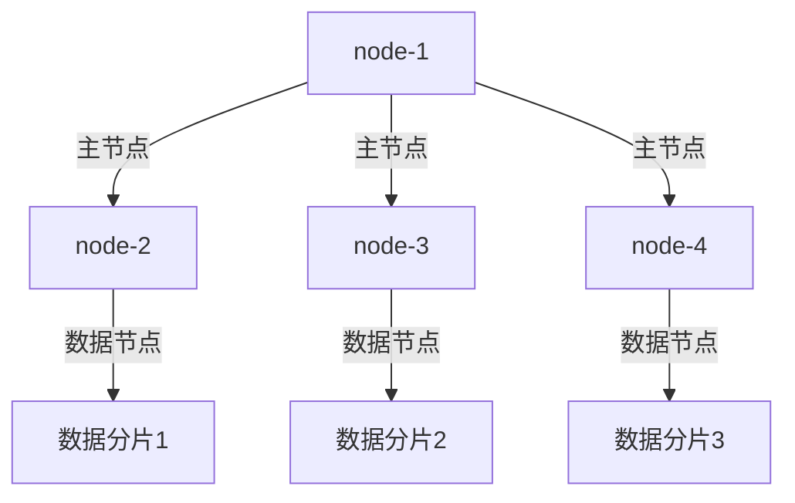

# Elasticsearch 节点管理

Elasticsearch是一个分布式搜索引擎，它的核心架构依赖于多个节点的协同工作。节点是Elasticsearch集群的基本组成单元，理解如何管理和配置这些节点对于维护一个健康的集群至关重要。本文将详细介绍Elasticsearch节点的类型、配置和管理方法，并通过实际案例帮助您更好地理解这些概念。

## 什么是Elasticsearch节点？

在Elasticsearch中，**节点（Node）** 是指一个运行中的Elasticsearch实例。一个节点可以是一个物理服务器、虚拟机，甚至是一个容器。多个节点可以组成一个**集群（Cluster）**，集群中的节点共同协作以存储和检索数据。

Elasticsearch节点可以分为以下几种类型：

1. **主节点（Master Node）**：负责集群范围内的管理操作，如创建或删除索引、决定哪些分片分配给哪些节点等。
2. **数据节点（Data Node）**：存储数据并执行与数据相关的操作，如搜索和聚合。
3. **协调节点（Coordinating Node）**：负责接收客户端请求，并将请求路由到适当的节点。
4. **摄取节点（Ingest Node）**：用于在索引文档之前对文档进行预处理。

:::note
一个节点可以同时承担多种角色。例如，一个节点可以既是主节点又是数据节点。
:::

## 节点配置

在Elasticsearch中，节点的角色和行为可以通过配置文件（通常是`elasticsearch.yml`）进行定义。以下是一些常见的配置选项：

```yaml
# 节点名称
node.name: "node-1"

# 节点角色配置
node.master: true
node.data: true
node.ingest: false

# 集群名称
cluster.name: "my-cluster"

# 网络配置
network.host: 0.0.0.0
http.port: 9200
```

### 节点角色配置

- `node.master: true`：表示该节点可以作为主节点。
- `node.data: true`：表示该节点可以存储数据。
- `node.ingest: false`：表示该节点不处理摄取管道。

:::caution
在生产环境中，建议将主节点和数据节点分开，以避免主节点因数据操作而过载。
:::

## 节点管理

### 查看节点状态

您可以使用Elasticsearch的REST API来查看集群中节点的状态。以下是一个简单的API调用示例：

```bash
GET /_cat/nodes?v
```

输出示例：

```
ip         heap.percent ram.percent cpu load_1m load_5m load_15m node.role master name
192.168.1.1           35          95   2    0.15    0.10     0.05 mdi       *      node-1
192.168.1.2           40          90   3    0.20    0.15     0.10 di        -      node-2
```

### 添加和移除节点

在Elasticsearch集群中添加或移除节点是一个常见的操作。添加节点时，只需在新节点上启动Elasticsearch实例，并确保其配置与集群中的其他节点一致。移除节点时，可以通过以下步骤安全地关闭节点：

1. 停止数据写入操作。
2. 使用以下API将节点从集群中排除：

```bash
PUT /_cluster/settings
{
  "transient": {
    "cluster.routing.allocation.exclude._ip": "192.168.1.2"
  }
}
```

3. 等待数据重新分配完成后，关闭节点。

:::tip
在移除节点之前，确保集群中有足够的资源来处理数据重新分配，以避免数据丢失或性能下降。
:::

## 实际案例

假设您有一个包含三个节点的Elasticsearch集群，其中`node-1`是主节点，`node-2`和`node-3`是数据节点。由于业务增长，您决定添加一个新的数据节点`node-4`。

1. 在`node-4`上安装并配置Elasticsearch，确保其`cluster.name`与现有集群一致。
2. 启动`node-4`，它将自动加入集群并开始接收数据分片。
3. 使用`GET /_cat/nodes?v` API确认`node-4`已成功加入集群。



## 总结

Elasticsearch节点管理是维护一个健康集群的关键。通过理解节点的类型、配置和管理方法，您可以更好地优化集群性能并确保数据的高可用性。本文介绍了节点的基本概念、配置选项以及如何添加和移除节点，并通过实际案例展示了这些操作的应用场景。

## 附加资源

- [Elasticsearch官方文档](https://www.elastic.co/guide/en/elasticsearch/reference/current/index.html)
- [Elasticsearch节点角色详解](https://www.elastic.co/guide/en/elasticsearch/reference/current/modules-node.html)

## 练习

1. 在本地环境中启动一个包含两个节点的Elasticsearch集群，并配置其中一个节点为主节点，另一个为数据节点。
2. 使用`GET /_cat/nodes?v` API查看节点状态，并记录每个节点的角色和状态。
3. 尝试添加一个新的数据节点，并观察集群如何重新分配数据分片。

通过完成这些练习，您将更深入地理解Elasticsearch节点管理的实际操作。