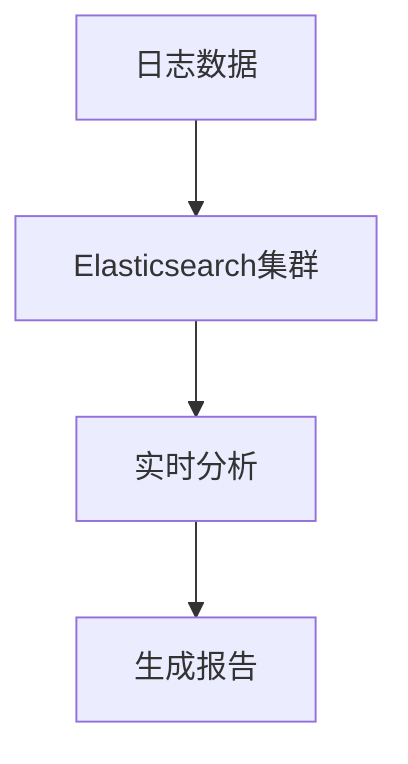
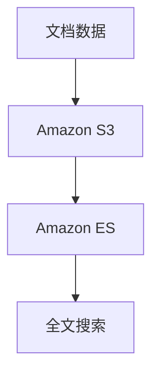

# Elasticsearch 云服务选择

Elasticsearch 是一个强大的分布式搜索和分析引擎，广泛应用于日志分析、全文搜索、实时数据分析等场景。随着云计算的普及，越来越多的开发者选择将 Elasticsearch 部署在云上，以享受弹性扩展、高可用性和简化运维的优势。本文将为您介绍如何选择合适的 Elasticsearch 云服务，并提供实际案例帮助您理解其应用场景。

## 什么是 Elasticsearch 云服务？

Elasticsearch 云服务是由云服务提供商托管的 Elasticsearch 解决方案。它允许用户通过简单的配置和操作，快速部署和管理 Elasticsearch 集群，而无需关心底层的基础设施。常见的 Elasticsearch 云服务提供商包括：

- **Elastic Cloud**：由 Elastic 公司官方提供的托管服务。
- **Amazon Elasticsearch Service (Amazon ES)**：AWS 提供的托管 Elasticsearch 服务。
- **Azure Elasticsearch**：微软 Azure 提供的 Elasticsearch 托管服务。
- **Google Cloud Elasticsearch**：Google Cloud 提供的 Elasticsearch 托管服务。

## 如何选择合适的 Elasticsearch 云服务？

选择 Elasticsearch 云服务时，需要考虑以下几个关键因素：

### 1. 性能与扩展性

不同的云服务提供商在性能和扩展性方面有所不同。例如，Elastic Cloud 提供了多种集群配置选项，支持自动扩展和优化。而 Amazon ES 则与 AWS 的其他服务（如 Lambda、S3）深度集成，适合已经在 AWS 上运行的项目。

:::tip
如果您需要高性能和灵活的扩展性，建议选择 Elastic Cloud 或 Amazon ES。
:::

### 2. 成本

成本是选择云服务时的重要考虑因素。不同的云服务提供商在定价模型上有所不同。例如，Amazon ES 按小时计费，而 Elastic Cloud 提供按需和预留实例两种计费方式。

:::caution
在选择云服务时，请务必仔细阅读定价文档，以避免意外的高额费用。
:::

### 3. 集成与生态系统

Elasticsearch 通常需要与其他工具和服务集成。例如，如果您已经在使用 AWS 的其他服务，选择 Amazon ES 可能会更加方便。同样，如果您使用 Azure 或 Google Cloud，选择相应的托管服务可能会更合适。

### 4. 安全性与合规性

安全性是任何云服务的重要考虑因素。确保您选择的云服务提供商符合您的安全性和合规性要求。例如，Elastic Cloud 提供了多种安全功能，如加密、访问控制和审计日志。

## 实际案例

### 案例 1：日志分析

假设您正在为一个大型电子商务网站构建日志分析系统。您需要实时分析数百万条日志数据，并快速生成报告。在这种情况下，Elastic Cloud 可能是一个不错的选择，因为它提供了高性能的集群配置和自动扩展功能。

### 案例 2：全文搜索

假设您正在为一个内容管理系统（CMS）构建全文搜索功能。您需要快速索引和搜索大量文档。在这种情况下，Amazon ES 可能是一个不错的选择，因为它与 AWS 的其他服务（如 S3、Lambda）深度集成，可以轻松实现数据导入和搜索功能。

## 总结

选择合适的 Elasticsearch 云服务需要综合考虑性能、成本、集成和安全性等因素。根据您的项目需求和现有技术栈，选择最适合的云服务提供商可以帮助您更高效地构建和管理 Elasticsearch 集群。

## 附加资源

- [Elastic Cloud 官方文档](https://www.elastic.co/cloud/)
- [Amazon Elasticsearch Service 官方文档](https://aws.amazon.com/elasticsearch-service/)
- [Azure Elasticsearch 官方文档](https://azure.microsoft.com/en-us/services/elasticsearch/)
- [Google Cloud Elasticsearch 官方文档](https://cloud.google.com/elasticsearch)

## 练习

1. 比较 Elastic Cloud 和 Amazon ES 的定价模型，并计算一个中等规模集群的月费用。
2. 在 AWS 上创建一个 Amazon ES 集群，并尝试导入一些数据并进行搜索。
3. 探索 Elastic Cloud 的安全功能，并配置一个安全的 Elasticsearch 集群。

通过以上内容，您应该对如何选择合适的 Elasticsearch 云服务有了更深入的理解。希望这些信息能帮助您在实际项目中做出明智的决策。