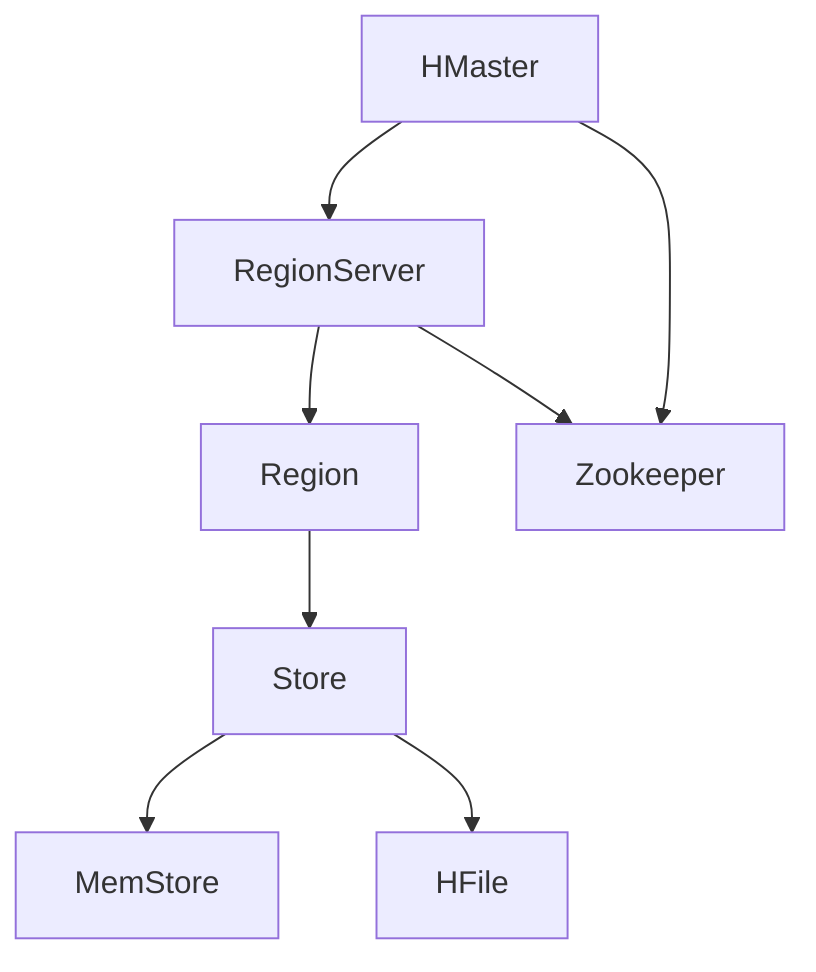

# HBase 简介

HBase是一个开源的、分布式的、面向列的数据库，它是基于Google的Bigtable论文设计的。HBase是Apache Hadoop生态系统的一部分，专门用于处理大规模数据集。它提供了高可靠性、高性能和可扩展性，特别适合存储和处理海量数据。

## 什么是HBase？

HBase是一个分布式的、面向列的数据库，它运行在Hadoop分布式文件系统（HDFS）之上。HBase的设计目标是提供对大规模数据集的实时读写访问。与传统的行式数据库不同，HBase以列族（Column Family）为单位存储数据，这使得它在处理稀疏数据时非常高效。

### HBase 的核心概念

在深入了解HBase之前，我们需要先了解一些核心概念：

1. **表（Table）**：HBase中的数据存储在表中，表由行和列组成。
2. **行键（Row Key）**：每一行数据都有一个唯一的行键，行键是HBase中数据访问的主要方式。
3. **列族（Column Family）**：列族是列的集合，表中的列必须属于某个列族。列族在表创建时定义，之后不能轻易修改。
4. **列限定符（Column Qualifier）**：列限定符是列族中的具体列，用于标识列族中的不同列。
5. **单元格（Cell）**：单元格是表中存储数据的最小单元，由行键、列族、列限定符和时间戳唯一确定。
6. **时间戳（Timestamp）**：每个单元格中的数据都有一个时间戳，用于标识数据的版本。

### HBase 的架构

HBase的架构由以下几个主要组件组成：

1. **HMaster**：HMaster是HBase的主服务器，负责管理表的元数据、分配Region以及处理故障转移。
2. **RegionServer**：RegionServer负责存储和管理表中的数据。每个RegionServer管理多个Region，每个Region是表的一个子集。
3. **Zookeeper**：Zookeeper用于协调HBase集群中的各个节点，管理集群的配置信息和状态。



### HBase 的实际应用场景

HBase广泛应用于需要处理海量数据的场景，例如：

1. **日志存储与分析**：HBase可以高效地存储和查询大量的日志数据，适用于日志分析和监控系统。
2. **实时数据存储**：HBase支持实时读写操作，适合用于实时数据存储和查询的场景，如社交网络、推荐系统等。
3. **时序数据存储**：HBase的时间戳功能使其非常适合存储时序数据，如传感器数据、股票交易数据等。

### 示例：创建一个HBase表并插入数据

以下是一个简单的示例，展示如何使用HBase Shell创建一个表并插入数据。

```bash
# 启动HBase Shell
hbase shell

# 创建一个名为 'test_table' 的表，包含一个列族 'cf'
create 'test_table', 'cf'

# 插入一行数据，行键为 'row1'，列族为 'cf'，列限定符为 'col1'，值为 'value1'
put 'test_table', 'row1', 'cf:col1', 'value1'

# 查询表中的数据
get 'test_table', 'row1'
```

**输出：**

```plaintext
COLUMN                CELL
 cf:col1              timestamp=1633072800000, value=value1
```

### 总结

HBase是一个强大的分布式数据库，特别适合处理大规模数据集。通过本文，我们了解了HBase的基本概念、架构以及实际应用场景。希望这些内容能帮助你快速入门HBase，并为你的编程学习之旅打下坚实的基础。

### 附加资源

- [HBase官方文档](https://hbase.apache.org/)
- [HBase in Action](https://www.manning.com/books/hbase-in-action) - 一本深入讲解HBase的书籍
- [HBase Tutorial](https://www.tutorialspoint.com/hbase/index.htm) - 一个适合初学者的HBase教程

### 练习

1. 使用HBase Shell创建一个包含两个列族的表，并插入一些数据。
2. 查询表中的数据，并尝试使用不同的行键和列限定符。
3. 探索HBase的时间戳功能，尝试插入多个版本的数据，并查询不同版本的数据。

:::tip
如果你在练习中遇到问题，可以参考HBase官方文档或社区论坛，那里有丰富的资源和经验分享。
:::