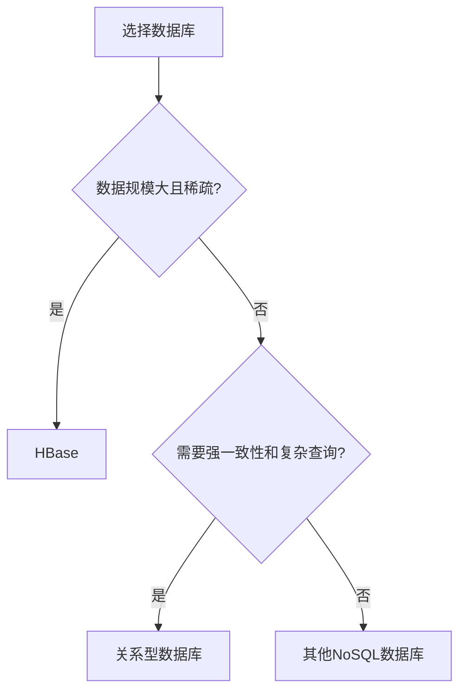

## 介绍

在数据库领域，HBase和关系型数据库（如MySQL、PostgreSQL）是两种常见的数据存储解决方案。它们各自有不同的设计目标和适用场景。本文将逐步讲解HBase与关系型数据库的核心区别，并通过实际案例帮助你理解它们的应用场景。

## 什么是HBase？

HBase是一个分布式的、面向列的NoSQL数据库，基于Google的Bigtable设计。它构建在Hadoop文件系统（HDFS）之上，专为处理大规模数据集而设计。HBase适合存储稀疏数据，并且能够高效地处理海量数据的读写操作。

## 什么是关系型数据库？

关系型数据库（RDBMS）是基于关系模型的数据库，使用表格（表）来存储数据。每个表由行和列组成，行表示记录，列表示字段。关系型数据库支持SQL（结构化查询语言），能够进行复杂的查询和事务处理。

## HBase 与关系型数据库的核心区别

### 1. 数据模型

- **HBase**：HBase是一个面向列的数据库，数据以列族（Column Family）的形式存储。每个列族可以包含多个列，列可以动态添加。HBase的数据模型是稀疏的，适合存储非结构化或半结构化数据。

- **关系型数据库**：关系型数据库使用表格来存储数据，数据以行和列的形式组织。每个表有固定的模式（Schema），列的数量和类型在创建表时定义。

### 2. 扩展性

- **HBase**：HBase是分布式的，能够轻松扩展到数千台服务器，适合处理海量数据。它通过水平扩展（增加节点）来提高性能。

- **关系型数据库**：关系型数据库通常通过垂直扩展（增加单个服务器的资源）来提高性能。虽然某些关系型数据库支持分布式架构，但其扩展性通常不如HBase。

### 3. 事务支持

- **HBase**：HBase支持单行事务，但不支持跨行事务。它更注重高吞吐量和低延迟，适合处理大规模数据的读写操作。

- **关系型数据库**：关系型数据库支持ACID事务（原子性、一致性、隔离性、持久性），能够保证数据的完整性和一致性。

### 4. 查询语言

- **HBase**：HBase没有内置的查询语言，通常通过API（如Java API）或HBase Shell进行操作。它不支持复杂的查询，如JOIN操作。

- **关系型数据库**：关系型数据库使用SQL进行查询，支持复杂的查询操作，如JOIN、GROUP BY、ORDER BY等。

### 5. 数据一致性

- **HBase**：HBase采用最终一致性模型，数据在分布式环境中可能会存在短暂的延迟。

- **关系型数据库**：关系型数据库采用强一致性模型，确保数据在任何时刻都是一致的。

## 实际案例

### 案例1：社交媒体数据存储

假设你正在开发一个社交媒体平台，需要存储用户的动态信息（如帖子、评论、点赞等）。这些数据通常是稀疏的，且数据量非常大。

- **HBase**：HBase适合存储这种稀疏数据，并且能够高效地处理海量数据的读写操作。你可以将用户的动态信息存储在HBase中，每个用户对应一个行键（Row Key），列族可以包含帖子、评论、点赞等信息。

- **关系型数据库**：虽然关系型数据库也可以存储这些数据，但随着数据量的增加，性能可能会下降。此外，关系型数据库的固定模式可能不适合动态添加的列。

### 案例2：金融交易系统

假设你正在开发一个金融交易系统，需要处理大量的交易记录，并且需要保证数据的一致性和完整性。

- **HBase**：HBase不适合这种场景，因为它不支持跨行事务，无法保证交易的原子性。

- **关系型数据库**：关系型数据库是更好的选择，因为它支持ACID事务，能够确保每笔交易的完整性和一致性。

## 总结

HBase和关系型数据库各有优缺点，适用于不同的场景。HBase适合处理大规模、稀疏的非结构化数据，而关系型数据库适合处理结构化数据，并且需要强一致性和复杂查询的场景。

:::tip
在选择数据库时，应根据具体的业务需求和数据特点来决定使用HBase还是关系型数据库。
:::

## 附加资源

- [HBase官方文档](https://hbase.apache.org/)
- [MySQL官方文档](https://dev.mysql.com/doc/)
- [PostgreSQL官方文档](https://www.postgresql.org/docs/)

## 练习

1. 尝试在HBase中创建一个表，并插入一些数据。然后使用HBase Shell查询这些数据。
2. 在关系型数据库（如MySQL）中创建一个表，并插入一些数据。然后使用SQL查询这些数据。
3. 比较HBase和关系型数据库在数据插入和查询性能上的差异。

:::note
以上图表展示了在选择数据库时的决策流程。根据数据的特点和业务需求，选择合适的数据库类型。
:::