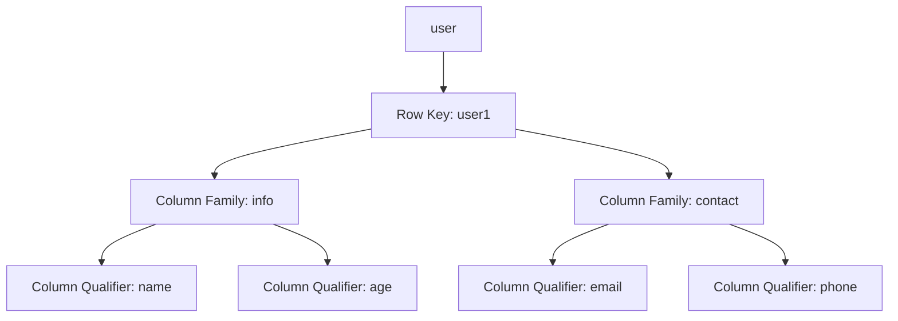

## 介绍

HBase是一个分布式的、面向列的数据库，设计用于存储大规模数据。它是基于Google的Bigtable论文实现的，并且是Hadoop生态系统的一部分。HBase的数据模型是其核心特性之一，理解它对于有效地使用HBase至关重要。

HBase的数据模型与关系型数据库有很大的不同。它没有固定的表结构，而是通过行键（Row Key）、列族（Column Family）、列限定符（Column Qualifier）和时间戳（Timestamp）来组织数据。

## HBase 数据模型的核心概念

### 1. 表（Table）

HBase中的数据存储在表中。表由行和列组成，但与关系型数据库不同的是，HBase的表是稀疏的，这意味着表中的某些单元格可以为空。

### 2. 行（Row）

HBase表中的每一行都有一个唯一的行键（Row Key）。行键是字节数组，通常用于标识和检索数据。行键的设计对HBase的性能有重要影响。

### 3. 列族（Column Family）

列族是HBase表中的一个逻辑分组，用于存储一组相关的列。列族在表创建时定义，并且不能动态修改。每个列族可以包含多个列限定符。

### 4. 列限定符（Column Qualifier）

列限定符是列族中的具体列。列限定符是动态的，可以在插入数据时动态添加。列限定符与列族一起唯一标识一个列。

### 5. 时间戳（Timestamp）

HBase中的每个单元格（Cell）都有一个时间戳，用于标识数据的版本。时间戳通常由系统自动生成，但也可以手动指定。HBase支持多版本数据存储，这意味着同一个单元格可以存储多个版本的数据。

## HBase 数据模型示例

让我们通过一个简单的例子来理解HBase的数据模型。

假设我们有一个名为 `user` 的表，用于存储用户信息。表中有两个列族：`info` 和 `contact`。



在这个例子中，`user1` 是行键，`info` 和 `contact` 是列族。`info` 列族包含 `name` 和 `age` 两个列限定符，`contact` 列族包含 `email` 和 `phone` 两个列限定符。

### 插入数据

我们可以使用HBase Shell插入数据：

```bash
put 'user', 'user1', 'info:name', 'Alice'
put 'user', 'user1', 'info:age', '25'
put 'user', 'user1', 'contact:email', 'alice@example.com'
put 'user', 'user1', 'contact:phone', '123-456-7890'
```

### 查询数据

查询 `user1` 的所有数据：

```bash
get 'user', 'user1'
```

输出结果：

```bash
COLUMN                CELL
 info:age             timestamp=1633072800000, value=25
 info:name            timestamp=1633072800000, value=Alice
 contact:email        timestamp=1633072800000, value=alice@example.com
 contact:phone        timestamp=1633072800000, value=123-456-7890
```

## 实际应用场景

HBase的数据模型非常适合存储大规模、稀疏的数据集。以下是一些实际应用场景：

1. **日志存储**：HBase可以高效地存储和检索大量的日志数据。每行可以代表一个日志条目，列族可以用于存储不同类型的日志信息。

2. **用户画像**：在电商或社交网络中，HBase可以用于存储用户的行为数据。每行代表一个用户，列族可以存储用户的浏览历史、购买记录等信息。

3. **时间序列数据**：HBase的时间戳特性使其非常适合存储时间序列数据，如传感器数据、股票价格等。

## 总结

HBase的数据模型是其强大功能的核心。通过理解表、行、列族、列限定符和时间戳的概念，你可以更好地设计和使用HBase。HBase的灵活性使其适用于多种应用场景，特别是在处理大规模、稀疏数据集时。

## 附加资源

- [HBase官方文档](https://hbase.apache.org/book.html)
- [HBase Shell命令参考](https://hbase.apache.org/book.html#shell)
- [HBase数据模型深入解析](https://hbase.apache.org/book.html#datamodel)

## 练习

1. 创建一个名为 `employee` 的HBase表，包含两个列族：`personal` 和 `professional`。
2. 插入一些数据到 `employee` 表中，并使用HBase Shell查询数据。
3. 尝试插入多个版本的数据到同一个单元格，并查询不同版本的数据。

通过完成这些练习，你将更深入地理解HBase的数据模型及其应用。