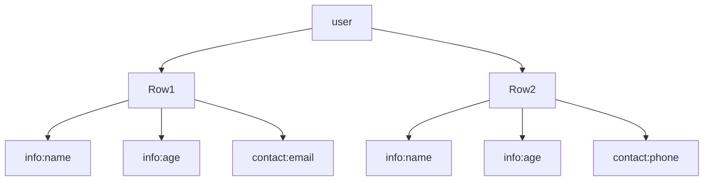
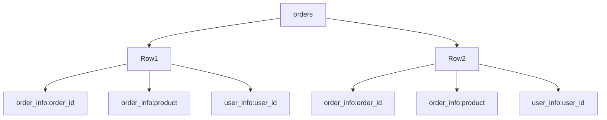

## 介绍

HBase是一个分布式的、面向列的数据库，基于Google的Bigtable设计。它是Hadoop生态系统的一部分，专为处理大规模数据而设计。HBase的逻辑数据模型是其核心概念之一，理解它对于掌握HBase的使用至关重要。

在HBase中，数据以表的形式存储，表由行和列组成。与关系型数据库不同，HBase的列是动态的，可以根据需要动态添加。HBase的逻辑数据模型包括表（Table）、行（Row）、列族（Column Family）、列限定符（Column Qualifier）和单元格（Cell）。

## 核心概念

### 表（Table）

HBase中的表是数据的逻辑容器，类似于关系型数据库中的表。每个表由多行组成，每行包含多个列族。

### 行（Row）

HBase中的每一行由一个行键（Row Key）唯一标识。行键是字节数组，可以是任意字符串。行键的设计对HBase的性能有重要影响，因此需要仔细考虑。

### 列族（Column Family）

列族是列的集合，每个列族包含多个列。列族在表创建时定义，并且不能动态修改。列族是物理存储的基本单位，HBase将同一列族的数据存储在同一个文件中，以提高读取效率。

### 列限定符（Column Qualifier）

列限定符是列族中的具体列，用于唯一标识列族中的某一列。列限定符是动态的，可以在插入数据时动态添加。

### 单元格（Cell）

单元格是表中存储数据的最小单位，由行键、列族、列限定符和时间戳唯一标识。单元格中存储的是字节数组。

## 数据模型示例

假设我们有一个名为 `user` 的表，用于存储用户信息。表中有两个列族：`info` 和 `contact`。

在这个示例中，`Row1` 和 `Row2` 是两行数据，`info` 和 `contact` 是两个列族。`info:name`、`info:age`、`contact:email` 和 `contact:phone` 是列限定符。

## 实际应用场景

假设我们有一个电商网站，需要存储用户的订单信息。我们可以使用HBase来存储这些数据。表结构如下：

- 表名：`orders`
- 列族：`order_info` 和 `user_info`

在这个示例中，`Row1` 和 `Row2` 分别存储了两个订单的信息。`order_info:order_id` 和 `order_info:product` 是订单相关的信息，`user_info:user_id` 是用户相关的信息。

## 总结

HBase的逻辑数据模型是其核心概念之一，理解它对于掌握HBase的使用至关重要。HBase的表由行和列组成，列族是列的集合，列限定符是列族中的具体列，单元格是存储数据的最小单位。通过实际应用场景，我们可以更好地理解HBase的逻辑数据模型。

## 附加资源

- [HBase官方文档](https://hbase.apache.org/)
- [HBase入门教程](https://www.tutorialspoint.com/hbase/index.htm)
- [HBase实战](https://www.oreilly.com/library/view/hbase-in-action/9781935182957/)

## 练习

1. 创建一个名为 `student` 的HBase表，包含两个列族：`personal_info` 和 `academic_info`。
2. 插入两行数据到 `student` 表中，分别存储学生的个人信息和学术信息。
3. 查询 `student` 表中的数据，并解释查询结果。

:::tip
在设计和实现HBase表时，务必考虑行键的设计，因为它对HBase的性能有重要影响。
:::