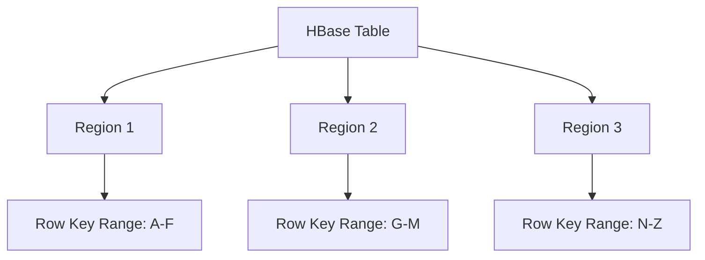
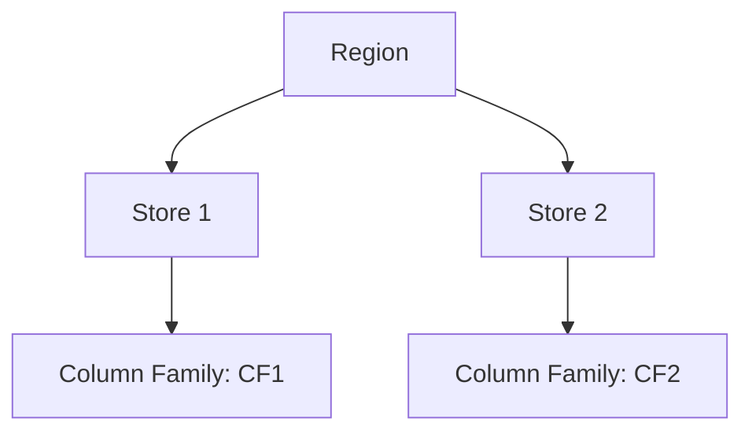
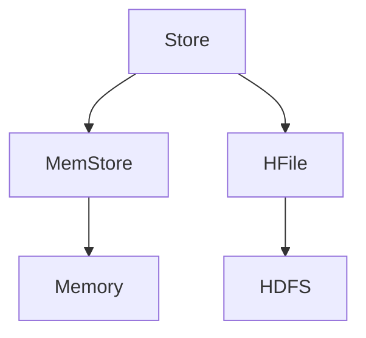
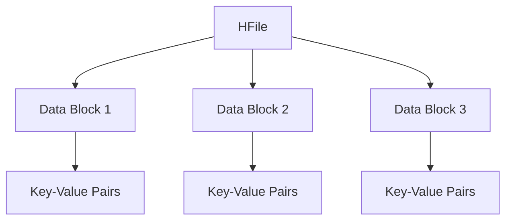

# HBase 物理存储模型

HBase是一个分布式的、面向列的数据库，基于Google的Bigtable设计。它的物理存储模型是其高效存储和检索数据的核心。本文将详细介绍HBase的物理存储模型，帮助你理解数据在HBase中是如何组织和存储的。

## 介绍

HBase的物理存储模型是基于HDFS（Hadoop分布式文件系统）构建的。数据以表的形式存储，表由行和列组成。每一行都有一个唯一的行键（Row Key），列则被组织成列族（Column Family）。HBase的物理存储模型主要包括以下几个关键概念：

- **Region**：表被水平分割成多个Region，每个Region包含一段连续的行键范围。
- **Store**：每个Region包含多个Store，每个Store对应一个列族。
- **MemStore**：Store中的数据首先写入内存中的MemStore，当MemStore达到一定大小时，数据会被刷新到HDFS中的HFile。
- **HFile**：HFile是HBase中存储数据的实际文件格式，基于HDFS。

## Region

Region是HBase表的基本存储单元。一个表可以被分割成多个Region，每个Region负责存储一段连续的行键范围。当Region的大小达到一定阈值时，HBase会自动将其分裂成两个新的Region。



## Store

每个Region包含多个Store，每个Store对应一个列族。Store是HBase中数据存储的基本单位，负责管理内存中的MemStore和磁盘上的HFile。



## MemStore

MemStore是Store的内存部分，用于缓存新写入的数据。当MemStore达到一定大小时，数据会被刷新到HDFS中的HFile。MemStore的设计使得HBase能够高效地处理写操作。



## HFile

HFile是HBase中存储数据的实际文件格式，基于HDFS。HFile采用列式存储，支持高效的数据压缩和快速的数据检索。每个HFile包含多个数据块（Data Block），每个数据块存储一定数量的键值对。



## 实际案例

假设我们有一个HBase表，用于存储用户信息。表的结构如下：

- 表名：`users`
- 列族：`info`, `contact`
- 行键：用户ID

当插入一条新用户数据时，数据首先会被写入MemStore。当MemStore达到一定大小时，数据会被刷新到HDFS中的HFile。以下是一个简单的插入操作示例：

```java
// 创建HBase配置
Configuration config = HBaseConfiguration.create();
config.set("hbase.zookeeper.quorum", "localhost");

// 创建HBase连接
Connection connection = ConnectionFactory.createConnection(config);

// 获取表对象
Table table = connection.getTable(TableName.valueOf("users"));

// 创建Put对象，指定行键
Put put = new Put(Bytes.toBytes("user1"));

// 添加列族和列值
put.addColumn(Bytes.toBytes("info"), Bytes.toBytes("name"), Bytes.toBytes("Alice"));
put.addColumn(Bytes.toBytes("contact"), Bytes.toBytes("email"), Bytes.toBytes("alice@example.com"));

// 插入数据
table.put(put);

// 关闭连接
table.close();
connection.close();
```

## 总结

HBase的物理存储模型是其高效存储和检索数据的核心。通过理解Region、Store、MemStore和HFile等关键概念，你可以更好地掌握HBase的数据存储机制。希望本文能帮助你入门HBase的物理存储模型，并为你的进一步学习打下坚实的基础。

## 附加资源

- [HBase官方文档](https://hbase.apache.org/book.html)
- [HBase架构详解](https://www.edureka.co/blog/hbase-architecture/)
- [HBase实战教程](https://www.tutorialspoint.com/hbase/index.htm)

## 练习

1. 创建一个HBase表，并插入几条数据，观察数据在HDFS中的存储结构。
2. 修改HBase配置，调整MemStore的大小，观察数据刷新到HFile的频率变化。
3. 使用HBase Shell或Java API查询数据，理解HBase的数据检索机制。
