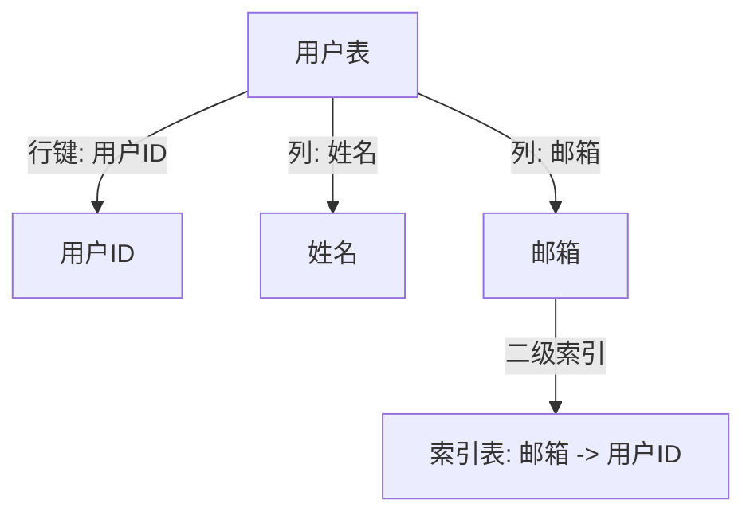

# HBase 二级索引

## 介绍

HBase是一个分布式的、面向列的数据库，通常用于处理大规模数据。然而，HBase的原生数据模型只支持通过行键（Row Key）进行高效查询。如果你需要根据其他列的值进行查询，HBase的原生功能就无法直接满足需求。这时，**二级索引**（Secondary Index）就派上了用场。

二级索引是一种允许你根据非行键列进行查询的机制。通过二级索引，你可以快速定位到包含特定列值的行，从而提高查询效率。

## 为什么需要二级索引？

在HBase中，数据是按行键（Row Key）进行存储和检索的。如果你需要根据其他列的值进行查询，HBase会扫描整个表，这在大数据场景下会非常低效。二级索引通过为这些列创建额外的索引表，使得查询可以快速定位到目标行。

## 二级索引的实现方式

HBase本身并不直接支持二级索引，但可以通过以下几种方式实现：

1. **客户端维护索引**：在客户端代码中手动维护一个索引表。
2. **协处理器（Coprocessor）**：使用HBase的协处理器机制自动维护索引。
3. **外部工具**：使用如Apache Phoenix等外部工具来管理二级索引。

### 客户端维护索引

在客户端维护索引的方式中，你需要手动创建和维护一个索引表。每次插入数据时，你需要在主表和索引表中分别插入数据。

```java
// 插入主表数据
Put put = new Put(Bytes.toBytes("row1"));
put.addColumn(Bytes.toBytes("cf"), Bytes.toBytes("col1"), Bytes.toBytes("value1"));
table.put(put);

// 插入索引表数据
Put indexPut = new Put(Bytes.toBytes("value1"));
indexPut.addColumn(Bytes.toBytes("cf"), Bytes.toBytes("col1"), Bytes.toBytes("row1"));
indexTable.put(indexPut);
```

:::note
这种方式简单直接，但需要开发者在客户端代码中处理所有索引逻辑，容易出错且维护成本较高。
:::

### 协处理器（Coprocessor）

协处理器是HBase提供的一种机制，允许你在服务器端执行自定义逻辑。通过协处理器，你可以在数据插入主表时自动更新索引表。

```java
public class IndexObserver extends BaseRegionObserver {
    @Override
    public void prePut(ObserverContext<RegionCoprocessorEnvironment> e, Put put, WALEdit edit, Durability durability) throws IOException {
        // 获取主表数据
        byte[] rowKey = put.getRow();
        byte[] colValue = put.get(Bytes.toBytes("cf"), Bytes.toBytes("col1")).get(0).getValue();

        // 插入索引表
        Put indexPut = new Put(colValue);
        indexPut.addColumn(Bytes.toBytes("cf"), Bytes.toBytes("col1"), rowKey);
        e.getEnvironment().getTable(TableName.valueOf("indexTable")).put(indexPut);
    }
}
```

:::tip
协处理器方式可以自动维护索引，减少了客户端的负担，但需要一定的开发经验来编写和维护协处理器代码。
:::

### 外部工具（如Apache Phoenix）

Apache Phoenix是一个基于HBase的SQL层，它提供了对二级索引的原生支持。通过Phoenix，你可以像使用传统关系型数据库一样创建和使用二级索引。

```sql
CREATE TABLE my_table (id VARCHAR PRIMARY KEY, col1 VARCHAR);
CREATE INDEX my_index ON my_table (col1);
```

:::caution
使用外部工具虽然方便，但可能会引入额外的复杂性和性能开销，特别是在大规模数据场景下。
:::

## 实际应用场景

假设你有一个用户表，存储了用户的ID、姓名和邮箱。你希望通过邮箱快速查找用户信息。在这种情况下，你可以为邮箱列创建一个二级索引。



通过二级索引，你可以快速根据邮箱查找用户ID，然后再从主表中获取用户详细信息。

## 总结

二级索引是HBase中一个非常有用的功能，它允许你根据非行键列进行高效查询。虽然HBase本身不直接支持二级索引，但通过客户端维护、协处理器或外部工具，你可以实现这一功能。选择哪种方式取决于你的具体需求和开发经验。

## 附加资源

- [HBase官方文档](https://hbase.apache.org/)
- [Apache Phoenix官方文档](https://phoenix.apache.org/)
- [HBase协处理器指南](https://hbase.apache.org/book.html#cp)

## 练习

1. 尝试在HBase中手动创建一个二级索引表，并编写代码插入和查询数据。
2. 使用协处理器实现自动维护二级索引的功能。
3. 安装并配置Apache Phoenix，尝试使用SQL语句创建和使用二级索引。
