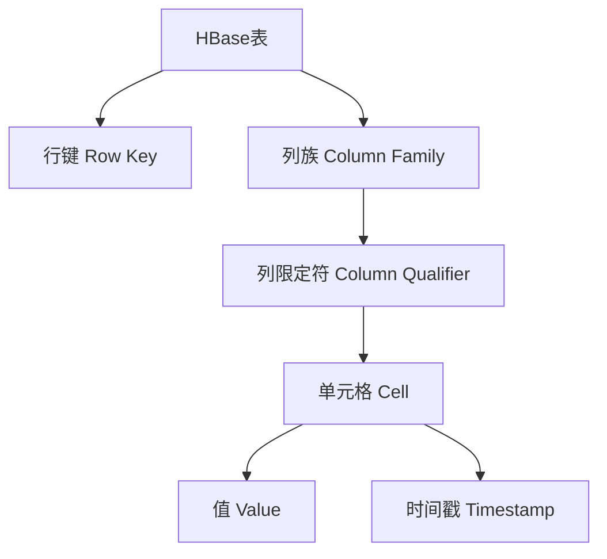

# HBase 表结构

HBase是一个分布式的、面向列的NoSQL数据库，广泛用于处理大规模数据。理解HBase的表结构是掌握其工作原理的关键。本文将详细介绍HBase表的核心组成部分，并通过实际案例帮助你更好地理解其应用场景。

## 什么是HBase表结构？

HBase表结构与传统关系型数据库的表结构有很大不同。HBase表由**行键（Row Key）**、**列族（Column Family）**和**列限定符（Column Qualifier）**组成。数据以**键值对（Key-Value）**的形式存储，并通过行键进行索引。

### 核心组成部分

1. **行键（Row Key）**  
   行键是HBase表中每一行的唯一标识符。它类似于关系型数据库中的主键，但HBase的行键是字节数组，可以是任意数据类型。行键的设计对查询性能有重要影响。

2. **列族（Column Family）**  
   列族是HBase表中的一个逻辑分组，用于将相关的列组织在一起。每个列族可以包含多个列限定符。列族在表创建时定义，后续不能轻易修改。

3. **列限定符（Column Qualifier）**  
   列限定符是列族中的具体列名。它可以是动态生成的，不需要在表创建时预先定义。列限定符与列族一起组成完整的列名，例如 `cf:column1`。

4. **时间戳（Timestamp）**  
   HBase中的每个单元格（Cell）可以存储多个版本的数据，每个版本通过时间戳进行区分。时间戳可以是系统自动生成的，也可以由用户指定。

5. **单元格（Cell）**  
   单元格是HBase中存储数据的最小单位，由行键、列族、列限定符和时间戳唯一确定。单元格中存储的是具体的值。

## HBase 表结构的示例

以下是一个简单的HBase表结构示例：

| 行键（Row Key） | 列族 `cf1` | 列族 `cf2` |
|----------------|------------|------------|
| `row1`         | `cf1:col1=value1` | `cf2:col1=value2` |
| `row2`         | `cf1:col1=value3` | `cf2:col1=value4` |

在这个示例中：
- 行键是 `row1` 和 `row2`。
- 列族是 `cf1` 和 `cf2`。
- 列限定符是 `col1`。
- 单元格的值是 `value1`、`value2`、`value3` 和 `value4`。

## 实际案例：用户行为日志存储

假设我们需要存储用户的浏览行为日志，每条日志包含用户ID、时间戳、页面URL和操作类型。我们可以设计一个HBase表来存储这些数据。

### 表设计
- **行键（Row Key）**：`用户ID + 时间戳`（例如 `user1_1633072800`）。
- **列族（Column Family）**：`info`。
- **列限定符（Column Qualifier）**：`url` 和 `action`。

### 示例数据

| 行键（Row Key） | 列族 `info` |
|----------------|-------------|
| `user1_1633072800` | `info:url=/home, info:action=click` |
| `user2_1633072900` | `info:url=/product, info:action=view` |

:::tip
在实际应用中，行键的设计非常重要。合理的行键设计可以提高查询性能并避免热点问题。
:::

## HBase 表结构的可视化

为了更好地理解HBase表结构，我们可以使用Mermaid图表进行可视化：

## 总结

HBase表结构由行键、列族、列限定符、时间戳和单元格组成。与传统关系型数据库不同，HBase的表结构更加灵活，适合存储大规模的非结构化数据。通过合理设计行键和列族，可以显著提高HBase的性能和可扩展性。

## 附加资源与练习

1. **练习**  
   尝试设计一个HBase表来存储电商平台的订单数据。思考如何设计行键和列族以支持高效的查询。

2. **进一步学习**  
   - [HBase官方文档](https://hbase.apache.org/)
   - 《HBase权威指南》书籍

:::caution
HBase的表结构设计需要根据具体业务需求进行调整，避免过度设计或设计不足。
:::