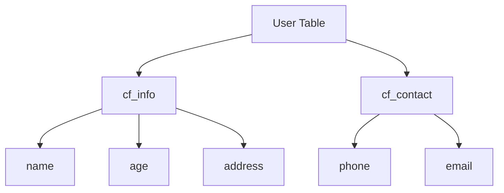
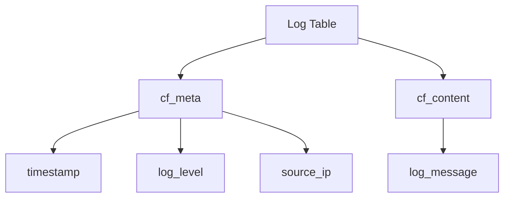

# HBase 列族设计

HBase是一个分布式的、面向列的数据库，广泛应用于大数据存储和处理场景。在HBase中，**列族（Column Family）** 是表结构设计中的核心概念之一。合理的列族设计可以显著提升数据存储和查询的效率。本文将详细介绍HBase列族设计的基本概念、设计原则以及实际应用场景。

## 什么是列族？

在HBase中，表由行和列组成，而列又被组织成列族。列族是逻辑上的分组，用于将相关的列存储在一起。每个列族在物理存储上对应一个独立的文件（HFile），因此列族的设计直接影响数据的存储和访问性能。

:::note
列族是HBase表结构设计中的核心概念，合理的列族设计可以显著提升数据存储和查询的效率。
:::

## 列族设计的基本原则

### 1. 列族数量不宜过多

HBase建议每个表的列族数量不要超过2-3个。这是因为每个列族在存储时会生成独立的HFile，过多的列族会导致大量的文件操作，增加系统的I/O负担。

:::caution
过多的列族会导致存储和性能问题，建议每个表的列族数量控制在2-3个。
:::

### 2. 列族内的列应具有相似的访问模式

将具有相似访问模式的列放在同一个列族中，可以提高数据读取的效率。例如，如果某些列经常一起被查询，那么它们应该属于同一个列族。

### 3. 列族名称应简洁且有意义

列族名称是HBase表结构的一部分，应简洁且具有描述性。通常使用小写字母和数字，避免使用特殊字符。

:::tip
列族名称应简洁且有意义，例如 `cf1`、`cf2` 或 `user_info`、`product_info` 等。
:::

## 列族设计的实际案例

### 案例1：用户信息表

假设我们需要设计一个存储用户信息的HBase表，包含用户的姓名、年龄、地址和联系方式。我们可以将用户的基本信息和联系方式分别放在两个列族中：



在这个设计中，`cf_info` 列族存储用户的基本信息，`cf_contact` 列族存储用户的联系方式。这种设计使得查询用户基本信息或联系方式时，只需访问对应的列族，提高了查询效率。

### 案例2：日志存储表

假设我们需要存储系统日志，每条日志包含时间戳、日志级别、日志内容和来源IP。我们可以将日志内容和元数据分别放在两个列族中：



在这个设计中，`cf_meta` 列族存储日志的元数据，`cf_content` 列族存储日志内容。这种设计使得查询日志元数据时，无需读取日志内容，减少了I/O操作。

## 列族设计的代码示例

以下是一个使用HBase Shell创建表的示例，展示了如何定义列族：

```bash
# 创建表并定义列族
create 'user_table', 'cf_info', 'cf_contact'

# 插入数据
put 'user_table', 'user1', 'cf_info:name', 'Alice'
put 'user_table', 'user1', 'cf_info:age', '25'
put 'user_table', 'user1', 'cf_info:address', '123 Main St'
put 'user_table', 'user1', 'cf_contact:phone', '555-1234'
put 'user_table', 'user1', 'cf_contact:email', 'alice@example.com'

# 查询数据
get 'user_table', 'user1'
```

输出结果：

```plaintext
COLUMN                     CELL
 cf_info:address           timestamp=..., value=123 Main St
 cf_info:age               timestamp=..., value=25
 cf_info:name              timestamp=..., value=Alice
 cf_contact:email          timestamp=..., value=alice@example.com
 cf_contact:phone          timestamp=..., value=555-1234
```

## 总结

HBase列族设计是表结构设计中的关键环节，合理的列族设计可以显著提升数据存储和查询的效率。在设计列族时，应遵循以下原则：

1. 列族数量不宜过多，建议控制在2-3个。
2. 列族内的列应具有相似的访问模式。
3. 列族名称应简洁且有意义。

通过实际案例和代码示例，我们展示了如何在实际应用中设计列族。希望本文能帮助你更好地理解HBase列族设计的概念和最佳实践。

## 附加资源

- [HBase官方文档](https://hbase.apache.org/book.html)
- [HBase列族设计指南](https://hbase.apache.org/apidocs/org/apache/hadoop/hbase/HColumnDescriptor.html)

## 练习

1. 设计一个存储电商订单信息的HBase表，包含订单ID、用户ID、商品ID、订单金额和订单时间。请定义合适的列族并解释设计思路。
2. 使用HBase Shell创建一个包含两个列族的表，并插入一些数据。然后查询数据并分析查询结果。
