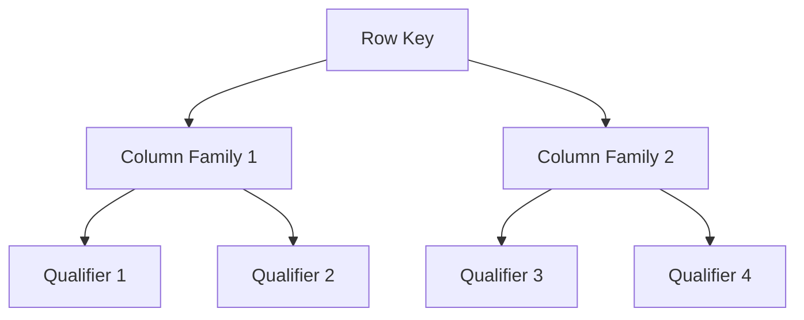

# HBase 限定符

在HBase中，限定符（Qualifier）是列族（Column Family）下的一个关键组成部分。它用于进一步细分列族中的数据，使得数据存储更加灵活和高效。本文将详细介绍HBase限定符的概念、用法以及实际应用场景。

## 什么是HBase限定符？

HBase是一个分布式的、面向列的数据库，它的数据模型由行键（Row Key）、列族（Column Family）和限定符（Qualifier）组成。限定符是列族下的一个子列，用于标识具体的列。每个限定符都可以存储一个值，并且可以在运行时动态添加。

### 数据模型回顾

在HBase中，数据是按行存储的，每行数据由一个唯一的行键标识。每行数据可以包含多个列族，每个列族下又可以包含多个限定符。限定符是列族下的具体列名，用于存储实际的数据值。



## 限定符的命名规则

限定符的命名可以是任意的字符串，通常用于描述数据的属性或类型。例如，在一个存储用户信息的表中，限定符可以是 `name`、`age`、`email` 等。

:::note
限定符的命名应尽量简洁且具有描述性，以便于理解和维护。
:::

## 限定符的使用示例

假设我们有一个存储用户信息的HBase表，表名为 `users`，列族为 `info`。我们可以使用限定符来存储用户的具体信息，如姓名、年龄和电子邮件。

### 插入数据

以下是一个插入数据的示例：

```java
import org.apache.hadoop.hbase.client.Put;
import org.apache.hadoop.hbase.client.Table;
import org.apache.hadoop.hbase.util.Bytes;

Table table = connection.getTable(TableName.valueOf("users"));
Put put = new Put(Bytes.toBytes("user1"));
put.addColumn(Bytes.toBytes("info"), Bytes.toBytes("name"), Bytes.toBytes("Alice"));
put.addColumn(Bytes.toBytes("info"), Bytes.toBytes("age"), Bytes.toBytes("25"));
put.addColumn(Bytes.toBytes("info"), Bytes.toBytes("email"), Bytes.toBytes("alice@example.com"));
table.put(put);
```

### 查询数据

查询数据的示例：

```java
import org.apache.hadoop.hbase.client.Get;
import org.apache.hadoop.hbase.client.Result;
import org.apache.hadoop.hbase.util.Bytes;

Get get = new Get(Bytes.toBytes("user1"));
Result result = table.get(get);
byte[] name = result.getValue(Bytes.toBytes("info"), Bytes.toBytes("name"));
byte[] age = result.getValue(Bytes.toBytes("info"), Bytes.toBytes("age"));
byte[] email = result.getValue(Bytes.toBytes("info"), Bytes.toBytes("email"));

System.out.println("Name: " + Bytes.toString(name));
System.out.println("Age: " + Bytes.toString(age));
System.out.println("Email: " + Bytes.toString(email));
```

### 输出

```
Name: Alice
Age: 25
Email: alice@example.com
```

## 限定符的实际应用场景

限定符在HBase中的应用非常广泛，以下是一些常见的应用场景：

1. **用户信息存储**：如上例所示，限定符可以用于存储用户的各种信息，如姓名、年龄、电子邮件等。
2. **日志数据存储**：在存储日志数据时，限定符可以用于标识不同的日志字段，如时间戳、日志级别、消息内容等。
3. **时间序列数据存储**：在存储时间序列数据时，限定符可以用于标识不同的时间点或时间段。

:::tip
在实际应用中，限定符的设计应根据具体的业务需求进行优化，以提高查询效率和数据管理的灵活性。
:::

## 总结

HBase中的限定符是列族下的具体列名，用于存储实际的数据值。它使得HBase的数据模型更加灵活和高效，适用于各种复杂的应用场景。通过合理设计限定符，可以大大提高数据的查询效率和管理能力。

## 附加资源与练习

- **练习**：尝试在HBase中创建一个表，并使用限定符存储不同类型的数据。然后编写代码插入和查询这些数据。
- **资源**：阅读HBase官方文档，了解更多关于限定符和列族的高级用法。

:::caution
在实际使用中，请注意限定符的命名规范和数据类型，以避免潜在的数据冲突和查询错误。
:::