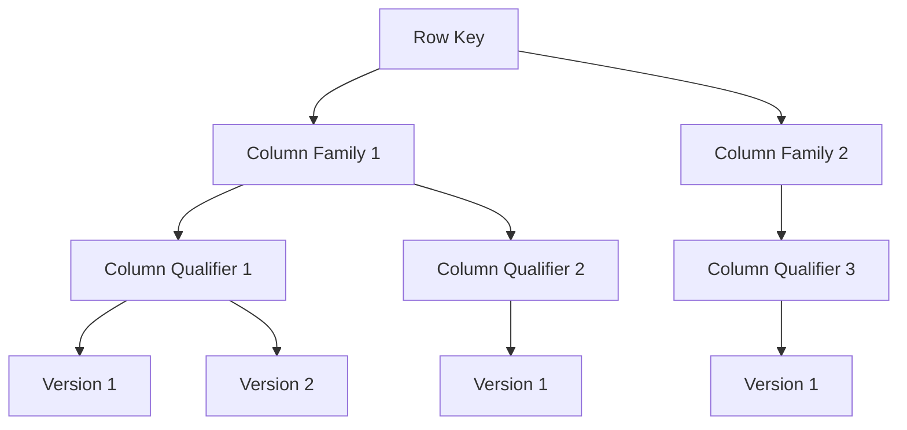

# HBase 版本控制

HBase是一个分布式的、面向列的数据库，广泛应用于大数据存储和处理场景。HBase的一个重要特性是**版本控制**，它允许用户存储和管理数据的多个版本。本文将详细介绍HBase的版本控制机制，并通过示例和实际案例帮助初学者理解其工作原理和应用场景。

## 什么是HBase版本控制？

在HBase中，每个单元格（cell）可以存储多个版本的数据。每个版本都有一个时间戳（timestamp），用于标识数据的创建或更新时间。通过版本控制，用户可以查询某个单元格的历史数据，或者根据时间戳范围检索特定版本的数据。

:::note
HBase默认情况下会为每个单元格保留3个版本的数据，但可以通过配置调整保留的版本数量。
:::

## HBase 版本控制的工作原理

HBase的版本控制基于时间戳实现。每次插入或更新数据时，HBase会为数据分配一个时间戳。默认情况下，时间戳是系统当前时间（以毫秒为单位），但用户也可以自定义时间戳。

### 数据存储结构

在HBase中，数据按行存储，每行包含多个列族（column family），每个列族包含多个列限定符（column qualifier），每个列限定符可以存储多个版本的数据。以下是一个简化的数据存储结构示例：



### 版本控制的操作

HBase支持以下与版本控制相关的操作：

1. **插入数据**：每次插入数据时，HBase会为数据分配一个时间戳，并将数据存储为新的版本。
2. **查询数据**：用户可以通过指定时间戳或时间戳范围来查询特定版本的数据。
3. **删除数据**：删除操作可以删除特定版本的数据，也可以删除所有版本的数据。

## 代码示例

以下是一个使用HBase Java API进行版本控制的示例：

```java
import org.apache.hadoop.hbase.TableName;
import org.apache.hadoop.hbase.client.*;
import org.apache.hadoop.hbase.util.Bytes;

public class HBaseVersionControlExample {
    public static void main(String[] args) throws Exception {
        Connection connection = ConnectionFactory.createConnection();
        Table table = connection.getTable(TableName.valueOf("my_table"));

        // 插入数据
        Put put = new Put(Bytes.toBytes("row1"));
        put.addColumn(Bytes.toBytes("cf"), Bytes.toBytes("col1"), System.currentTimeMillis(), Bytes.toBytes("value1"));
        table.put(put);

        // 查询数据
        Get get = new Get(Bytes.toBytes("row1"));
        get.setMaxVersions(3); // 获取最多3个版本的数据
        Result result = table.get(get);
        System.out.println("Value: " + Bytes.toString(result.getValue(Bytes.toBytes("cf"), Bytes.toBytes("col1"))));

        // 删除数据
        Delete delete = new Delete(Bytes.toBytes("row1"));
        delete.addColumn(Bytes.toBytes("cf"), Bytes.toBytes("col1"), System.currentTimeMillis()); // 删除特定版本
        table.delete(delete);

        table.close();
        connection.close();
    }
}
```

### 输入和输出

- **输入**：插入数据时，HBase会为数据分配时间戳并存储为新的版本。
- **输出**：查询数据时，HBase会返回指定版本的数据。如果未指定版本，默认返回最新版本的数据。

## 实际应用场景

### 场景1：数据审计

在金融或医疗行业，数据的历史版本非常重要。通过HBase的版本控制，用户可以轻松查询某个账户或患者的历史数据，进行审计或分析。

### 场景2：数据恢复

如果误删了某些数据，可以通过查询历史版本来恢复数据。HBase的版本控制机制为用户提供了数据恢复的可能性。

## 总结

HBase的版本控制机制为用户提供了强大的数据管理能力。通过时间戳，用户可以存储、查询和删除数据的多个版本。本文通过介绍HBase版本控制的工作原理、代码示例和实际应用场景，帮助初学者理解并掌握这一重要概念。

## 附加资源

- [HBase官方文档](https://hbase.apache.org/)
- 《HBase权威指南》—— Lars George

## 练习

1. 在HBase中创建一个表，并插入多个版本的数据。尝试查询不同版本的数据。
2. 修改HBase表的配置，将每个单元格的版本数量从3个增加到5个，观察数据存储的变化。
3. 编写一个Java程序，删除某个单元格的特定版本数据，并验证删除操作是否成功。
