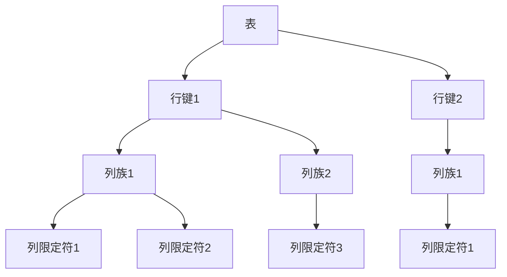

# HBase 数据存储格式

HBase是一个分布式的、面向列的数据库，它基于Google的Bigtable设计。HBase的数据存储格式是其核心特性之一，理解这一格式对于高效使用HBase至关重要。本文将详细介绍HBase的数据存储格式，并通过实际案例帮助你更好地理解其工作原理。

## 1. 介绍

HBase的数据存储格式是基于列族（Column Family）的，这意味着数据是按列族存储的，而不是按行存储。每个列族可以包含多个列限定符（Column Qualifier），这些列限定符可以动态添加。HBase的数据存储格式主要包括以下几个关键概念：

- **表（Table）**：HBase中的数据存储在表中，表由行和列组成。
- **行键（Row Key）**：每一行数据都有一个唯一的行键，行键是数据的唯一标识符。
- **列族（Column Family）**：列族是列的集合，每个列族可以包含多个列限定符。
- **列限定符（Column Qualifier）**：列限定符是列族中的具体列，用于存储实际的数据。
- **时间戳（Timestamp）**：每个数据单元都有一个时间戳，用于标识数据的版本。

## 2. HBase数据存储格式详解

### 2.1 表结构

HBase的表结构可以理解为一个多维的映射表，其中行键是主键，列族和列限定符用于定位具体的数据单元。以下是一个简单的表结构示例：



### 2.2 数据存储格式

HBase的数据存储格式是基于键值对的，每个数据单元（Cell）由行键、列族、列限定符和时间戳唯一标识。数据单元的值是实际存储的数据。以下是一个数据单元的示例：

```
Row Key: "user1"
Column Family: "info"
Column Qualifier: "name"
Timestamp: 1633072800000
Value: "John Doe"
```

### 2.3 数据版本控制

HBase支持多版本数据存储，每个数据单元可以有多个版本，每个版本由时间戳标识。默认情况下，HBase会保留最近的三版本数据。以下是一个多版本数据单元的示例：

```
Row Key: "user1"
Column Family: "info"
Column Qualifier: "name"
Timestamp: 1633072800000, Value: "John Doe"
Timestamp: 1633072900000, Value: "Jane Doe"
```

## 3. 实际案例

假设我们有一个用户信息表，用于存储用户的基本信息和联系方式。表结构如下：

- 表名：`user_info`
- 列族：`info`（存储用户基本信息），`contact`（存储用户联系方式）

以下是一个用户数据的示例：

```java
// 插入数据
Put put = new Put(Bytes.toBytes("user1"));
put.addColumn(Bytes.toBytes("info"), Bytes.toBytes("name"), Bytes.toBytes("John Doe"));
put.addColumn(Bytes.toBytes("info"), Bytes.toBytes("age"), Bytes.toBytes("30"));
put.addColumn(Bytes.toBytes("contact"), Bytes.toBytes("email"), Bytes.toBytes("john.doe@example.com"));
table.put(put);

// 查询数据
Get get = new Get(Bytes.toBytes("user1"));
Result result = table.get(get);
byte[] name = result.getValue(Bytes.toBytes("info"), Bytes.toBytes("name"));
System.out.println("Name: " + Bytes.toString(name));
```

在这个案例中，我们插入了一个用户的基本信息和联系方式，并通过行键查询了该用户的数据。

## 4. 总结

HBase的数据存储格式是其核心特性之一，理解这一格式对于高效使用HBase至关重要。本文详细介绍了HBase的数据存储格式，包括表结构、数据存储格式和数据版本控制，并通过实际案例展示了其应用场景。

## 5. 附加资源与练习

- **附加资源**：
  - [HBase官方文档](https://hbase.apache.org/book.html)
  - 《HBase权威指南》

- **练习**：
  1. 创建一个HBase表，插入一些数据，并尝试查询不同版本的数据。
  2. 尝试使用HBase的Java API进行数据的增删改查操作。

通过本文的学习，你应该对HBase的数据存储格式有了初步的了解。接下来，你可以通过实际操作和练习进一步巩固这些知识。