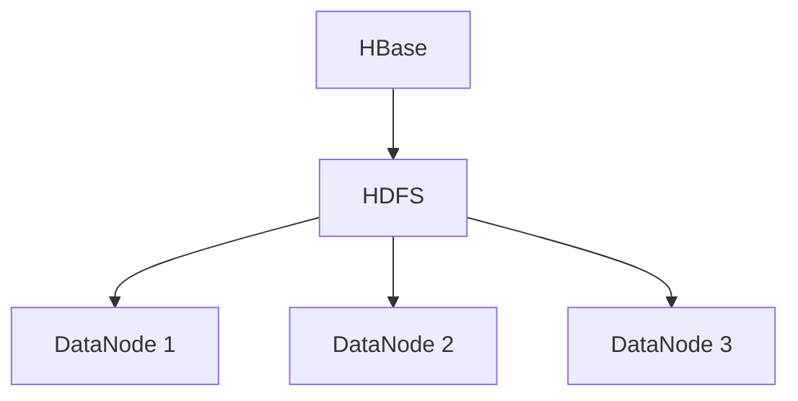

## 介绍

HBase 是一个分布式的、面向列的数据库，构建在 Hadoop 文件系统（HDFS）之上。它与 Hadoop 生态系统紧密集成，能够处理海量数据并提供实时读写能力。HBase 的设计目标是提供高可靠性、高性能和可扩展性，特别适合需要快速随机访问大规模数据集的场景。

Hadoop 是一个用于分布式存储和处理大规模数据集的框架，其核心组件包括 HDFS（Hadoop Distributed File System）和 MapReduce。HBase 利用 HDFS 作为其底层存储，同时与 Hadoop 的其他组件（如 Hive、Spark 等）无缝集成，形成一个强大的大数据处理生态系统。

## HBase 与Hadoop的集成方式

### 1. HBase 使用 HDFS 作为存储层

HBase 的数据存储在 HDFS 上，HDFS 提供了高容错性和高吞吐量的数据存储能力。HBase 将数据划分为多个区域（Regions），每个区域存储在不同的 RegionServer 上，而这些数据最终会以文件的形式存储在 HDFS 上。



### 2. HBase 与 MapReduce 集成

HBase 可以与 Hadoop 的 MapReduce 框架集成，用于批量处理存储在 HBase 中的数据。通过 HBase 提供的 `TableMapReduceUtil` 工具类，开发者可以轻松地将 HBase 表作为 MapReduce 任务的输入或输出。

以下是一个简单的 MapReduce 任务示例，该任务从 HBase 表中读取数据并计算每个键的出现次数：

```java
import org.apache.hadoop.conf.Configuration;
import org.apache.hadoop.hbase.HBaseConfiguration;
import org.apache.hadoop.hbase.client.Result;
import org.apache.hadoop.hbase.client.Scan;
import org.apache.hadoop.hbase.io.ImmutableBytesWritable;
import org.apache.hadoop.hbase.mapreduce.TableMapReduceUtil;
import org.apache.hadoop.hbase.mapreduce.TableMapper;
import org.apache.hadoop.hbase.util.Bytes;
import org.apache.hadoop.io.IntWritable;
import org.apache.hadoop.io.Text;
import org.apache.hadoop.mapreduce.Job;
import org.apache.hadoop.mapreduce.Reducer;
import org.apache.hadoop.mapreduce.lib.output.FileOutputFormat;

import java.io.IOException;

public class HBaseMapReduceExample {

    public static class MyMapper extends TableMapper<Text, IntWritable> {
        private final static IntWritable one = new IntWritable(1);
        private Text word = new Text();

        public void map(ImmutableBytesWritable key, Result value, Context context) throws IOException, InterruptedException {
            String val = Bytes.toString(value.getValue(Bytes.toBytes("cf"), Bytes.toBytes("col1")));
            word.set(val);
            context.write(word, one);
        }
    }

    public static class MyReducer extends Reducer<Text, IntWritable, Text, IntWritable> {
        private IntWritable result = new IntWritable();

        public void reduce(Text key, Iterable<IntWritable> values, Context context) throws IOException, InterruptedException {
            int sum = 0;
            for (IntWritable val : values) {
                sum += val.get();
            }
            result.set(sum);
            context.write(key, result);
        }
    }

    public static void main(String[] args) throws Exception {
        Configuration config = HBaseConfiguration.create();
        Job job = Job.getInstance(config, "HBase MapReduce Example");
        job.setJarByClass(HBaseMapReduceExample.class);

        Scan scan = new Scan();
        scan.setCaching(500);
        scan.setCacheBlocks(false);

        TableMapReduceUtil.initTableMapperJob(
                "my_table",      // 输入表名
                scan,            // Scan 对象
                MyMapper.class,  // Mapper 类
                Text.class,      // Mapper 输出键类型
                IntWritable.class, // Mapper 输出值类型
                job
        );

        job.setReducerClass(MyReducer.class);
        job.setOutputKeyClass(Text.class);
        job.setOutputValueClass(IntWritable.class);

        FileOutputFormat.setOutputPath(job, new Path("output"));

        System.exit(job.waitForCompletion(true) ? 0 : 1);
    }
}
```

:::note
在这个示例中，`TableMapReduceUtil.initTableMapperJob` 方法用于初始化一个从 HBase 表中读取数据的 MapReduce 任务。`MyMapper` 类负责从 HBase 表中提取数据并生成键值对，而 `MyReducer` 类则负责对这些键值对进行聚合。
:::

### 3. HBase 与 Hive 集成

Hive 是一个基于 Hadoop 的数据仓库工具，允许用户使用 SQL 查询语言（HiveQL）来查询和分析存储在 HDFS 上的数据。HBase 可以与 Hive 集成，使得用户能够通过 HiveQL 查询 HBase 表中的数据。

以下是一个简单的 Hive 表与 HBase 表集成的示例：

```sql
CREATE EXTERNAL TABLE hbase_table (
    key STRING,
    value STRING
)
STORED BY 'org.apache.hadoop.hive.hbase.HBaseStorageHandler'
WITH SERDEPROPERTIES ("hbase.columns.mapping" = ":key,cf:col1")
TBLPROPERTIES ("hbase.table.name" = "my_table");
```

:::tip
通过这种方式，Hive 表可以直接映射到 HBase 表，用户可以使用 HiveQL 查询 HBase 表中的数据，而无需编写复杂的 Java 代码。
:::

## 实际应用场景

### 1. 实时数据分析

HBase 与 Hadoop 集成的一个典型应用场景是实时数据分析。例如，一个电商网站可以使用 HBase 存储用户的实时行为数据（如点击、购买等），然后通过 MapReduce 或 Spark 对这些数据进行分析，生成实时推荐结果。

### 2. 日志存储与查询

HBase 非常适合存储和查询大规模的日志数据。例如，一个大型网站可以将用户的访问日志存储在 HBase 中，然后通过 Hive 或 Spark SQL 对这些日志进行查询和分析，以生成用户行为报告。

## 总结

HBase 与 Hadoop 的集成为大数据处理提供了强大的工具。通过 HDFS 作为存储层，HBase 能够处理海量数据；通过与 MapReduce 和 Hive 的集成，HBase 能够支持复杂的数据分析和查询任务。对于初学者来说，掌握 HBase 与 Hadoop 的集成是进入大数据领域的重要一步。

## 附加资源与练习

- **练习 1**：尝试在本地 Hadoop 集群上部署 HBase，并创建一个简单的表，插入一些数据。
- **练习 2**：编写一个 MapReduce 任务，从 HBase 表中读取数据并计算某个字段的统计值。
- **附加资源**：
  - [HBase 官方文档](https://hbase.apache.org/book.html)
  - [Hadoop 官方文档](https://hadoop.apache.org/docs/current/)
  - [Hive 官方文档](https://cwiki.apache.org/confluence/display/Hive/Home)
