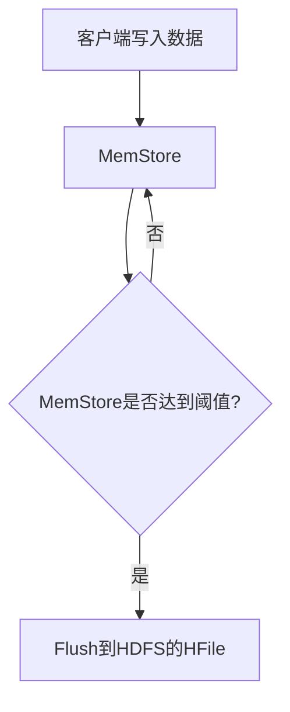
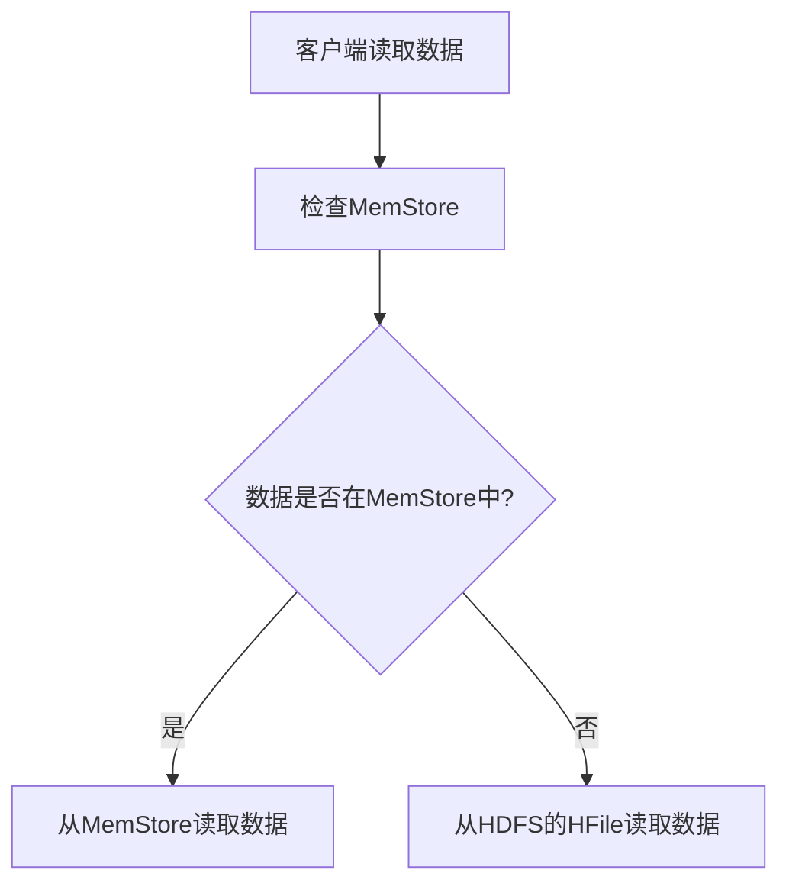

# HBase 与HDFS交互

## 介绍

HBase是一个分布式的、面向列的数据库，它构建在Hadoop分布式文件系统（HDFS）之上。HBase利用HDFS的高吞吐量和容错性来存储和管理大规模数据。理解HBase与HDFS的交互对于掌握HBase的工作原理至关重要。

在HBase中，数据被存储在HDFS上的文件中，这些文件被称为HFile。HBase的RegionServer负责将数据写入HDFS，并在需要时从HDFS读取数据。HDFS为HBase提供了可靠的数据存储和高效的读写能力。

## HBase 与HDFS的关系

HBase与HDFS的关系可以概括为以下几点：

1. **数据存储**：HBase将数据存储在HDFS上的HFile中。HFile是HBase的底层存储格式，它是一种基于键值对的存储格式。
2. **数据读写**：HBase的RegionServer负责将数据写入HDFS，并在需要时从HDFS读取数据。HDFS提供了高吞吐量的数据读写能力。
3. **数据复制**：HDFS的副本机制确保了HBase数据的高可用性和容错性。HBase依赖于HDFS的副本机制来防止数据丢失。

## HBase 与HDFS的交互过程

### 数据写入过程

当客户端向HBase写入数据时，数据首先被写入HBase的MemStore（内存存储）。当MemStore达到一定大小时，数据会被刷新到HDFS上的HFile中。这个过程被称为**Flush**。



### 数据读取过程

当客户端从HBase读取数据时，HBase会首先检查MemStore中是否有最新的数据。如果没有，HBase会从HDFS上的HFile中读取数据。



## 实际案例

假设我们有一个电商网站，需要存储用户的购物记录。我们可以使用HBase来存储这些记录，并利用HDFS的高吞吐量和容错性来确保数据的安全性和可靠性。

### 示例代码

以下是一个简单的Java代码示例，展示了如何使用HBase API将数据写入HBase并从HBase读取数据。

```java
import org.apache.hadoop.hbase.HBaseConfiguration;
import org.apache.hadoop.hbase.TableName;
import org.apache.hadoop.hbase.client.Connection;
import org.apache.hadoop.hbase.client.ConnectionFactory;
import org.apache.hadoop.hbase.client.Put;
import org.apache.hadoop.hbase.client.Get;
import org.apache.hadoop.hbase.client.Table;
import org.apache.hadoop.hbase.util.Bytes;

public class HBaseExample {
    public static void main(String[] args) throws Exception {
        // 配置HBase连接
        org.apache.hadoop.conf.Configuration config = HBaseConfiguration.create();
        Connection connection = ConnectionFactory.createConnection(config);
        Table table = connection.getTable(TableName.valueOf("user_shopping_records"));

        // 写入数据
        Put put = new Put(Bytes.toBytes("user1"));
        put.addColumn(Bytes.toBytes("cf"), Bytes.toBytes("product"), Bytes.toBytes("laptop"));
        table.put(put);

        // 读取数据
        Get get = new Get(Bytes.toBytes("user1"));
        org.apache.hadoop.hbase.client.Result result = table.get(get);
        byte[] value = result.getValue(Bytes.toBytes("cf"), Bytes.toBytes("product"));
        System.out.println("Product: " + Bytes.toString(value));

        // 关闭连接
        table.close();
        connection.close();
    }
}
```

### 输出

```
Product: laptop
```

## 总结

HBase与HDFS的交互是HBase能够高效存储和管理大规模数据的关键。通过理解HBase如何利用HDFS进行数据存储和读写，我们可以更好地掌握HBase的工作原理，并在实际应用中充分利用HBase和HDFS的优势。

## 附加资源

- [HBase官方文档](https://hbase.apache.org/)
- [HDFS官方文档](https://hadoop.apache.org/docs/stable/hadoop-project-dist/hadoop-hdfs/HdfsUserGuide.html)
- [HBase与HDFS集成指南](https://hbase.apache.org/book.html#hbase.hdfs)

## 练习

1. 尝试在本地环境中配置HBase和HDFS，并运行上述代码示例。
2. 修改代码示例，使其能够存储和读取多个用户的购物记录。
3. 研究HBase的RegionServer如何与HDFS交互，并尝试优化数据写入和读取的性能。
