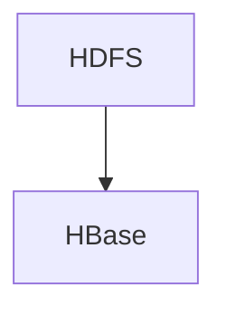
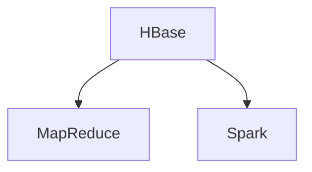
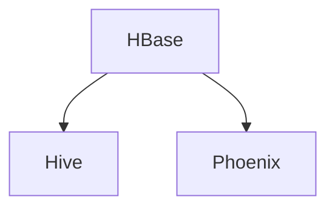

# HBase 生态应用架构

HBase是一个分布式的、面向列的NoSQL数据库，广泛应用于大数据领域。它能够处理海量数据，并提供高吞吐量和低延迟的读写操作。为了更好地利用HBase的强大功能，我们通常需要将其与其他大数据工具集成，构建一个完整的生态系统。本文将详细介绍HBase生态系统的应用架构，并通过实际案例展示其应用场景。

## 1. HBase生态系统概述

HBase生态系统由多个组件组成，这些组件共同协作，以实现高效的数据存储、处理和分析。常见的组件包括：

- **HDFS**：HBase的底层存储系统，负责数据的分布式存储。
- **ZooKeeper**：用于协调HBase集群中的各个节点，确保数据的一致性和高可用性。
- **MapReduce**：用于批量处理HBase中的数据。
- **Spark**：用于实时数据处理和分析。
- **Hive**：用于在HBase上执行SQL查询。
- **Phoenix**：提供SQL接口，简化HBase的查询操作。

## 2. HBase生态应用架构

HBase生态系统的应用架构通常包括以下几个层次：

### 2.1 数据存储层

数据存储层是HBase生态系统的核心，主要由HDFS和HBase组成。HDFS负责存储海量数据，而HBase则提供高效的数据读写操作。



### 2.2 数据处理层

数据处理层包括MapReduce和Spark等工具，用于对HBase中的数据进行批量处理和实时分析。



### 2.3 数据查询层

数据查询层包括Hive和Phoenix等工具，用于在HBase上执行SQL查询，简化数据访问操作。



## 3. 实际案例：电商网站的用户行为分析

假设我们有一个电商网站，需要分析用户的购买行为。我们可以使用HBase生态系统来构建一个高效的数据处理系统。

### 3.1 数据存储

首先，我们将用户的购买记录存储在HBase中。每条记录包括用户ID、商品ID、购买时间等信息。

```java
// 创建HBase表
HTableDescriptor tableDescriptor = new HTableDescriptor(TableName.valueOf("user_purchases"));
tableDescriptor.addFamily(new HColumnDescriptor("cf"));
admin.createTable(tableDescriptor);

// 插入数据
Put put = new Put(Bytes.toBytes("user1"));
put.addColumn(Bytes.toBytes("cf"), Bytes.toBytes("product_id"), Bytes.toBytes("123"));
put.addColumn(Bytes.toBytes("cf"), Bytes.toBytes("purchase_time"), Bytes.toBytes("2023-10-01 12:00:00"));
table.put(put);
```

### 3.2 数据处理

接下来，我们使用Spark对HBase中的数据进行实时分析，计算每个用户的购买次数。

```scala
val hbaseContext = new HBaseContext(sparkContext, config)
val rdd = hbaseContext.hbaseRDD(TableName.valueOf("user_purchases"), new Scan())
val userPurchaseCounts = rdd.map { case (_, result) =>
  val userId = Bytes.toString(result.getRow)
  (userId, 1)
}.reduceByKey(_ + _)

userPurchaseCounts.collect().foreach(println)
```

### 3.3 数据查询

最后，我们使用Phoenix在HBase上执行SQL查询，获取购买次数最多的用户。

```sql
SELECT user_id, COUNT(*) AS purchase_count
FROM user_purchases
GROUP BY user_id
ORDER BY purchase_count DESC
LIMIT 10;
```

## 4. 总结

HBase生态系统提供了一个强大的工具集，用于构建高效的数据处理系统。通过将HBase与HDFS、MapReduce、Spark、Hive和Phoenix等工具集成，我们可以实现数据的存储、处理和分析。本文通过一个电商网站的用户行为分析案例，展示了HBase生态系统的实际应用场景。

## 5. 附加资源

- [HBase官方文档](https://hbase.apache.org/)
- [Spark官方文档](https://spark.apache.org/)
- [Phoenix官方文档](https://phoenix.apache.org/)

## 6. 练习

1. 尝试在本地搭建一个HBase集群，并存储一些测试数据。
2. 使用Spark对HBase中的数据进行实时分析，计算某个指标（如用户活跃度）。
3. 使用Phoenix在HBase上执行SQL查询，获取分析结果。

通过以上练习，您将更深入地理解HBase生态系统的应用架构，并掌握其在实际项目中的应用方法。