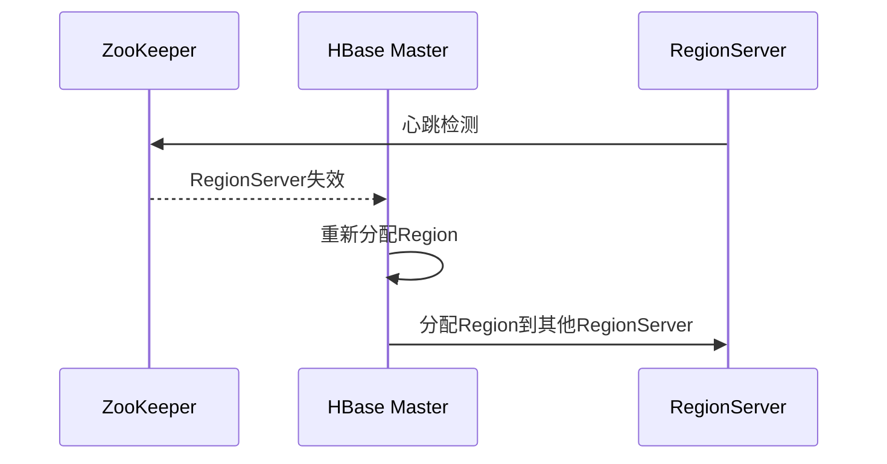

# HBase 与ZooKeeper交互

HBase是一个分布式的、面向列的数据库，通常用于处理大规模数据集。ZooKeeper是一个分布式的协调服务，用于管理分布式系统中的配置信息、命名服务、分布式同步和组服务。HBase依赖于ZooKeeper来实现其分布式协调功能。本文将详细介绍HBase与ZooKeeper的交互方式，以及ZooKeeper在HBase生态系统中的关键作用。

## 介绍

在HBase中，ZooKeeper扮演着至关重要的角色。它负责管理HBase集群的元数据、协调分布式锁、监控RegionServer的状态以及处理集群的故障恢复。HBase通过ZooKeeper来实现高可用性和一致性。

### ZooKeeper在HBase中的主要功能

1. **元数据存储**：ZooKeeper存储HBase的元数据，包括表的元数据、RegionServer的状态信息等。
2. **分布式锁**：ZooKeeper提供分布式锁机制，确保在HBase集群中只有一个Master节点处于活动状态。
3. **状态监控**：ZooKeeper监控RegionServer的状态，当某个RegionServer失效时，ZooKeeper会通知HBase Master进行故障恢复。
4. **配置管理**：ZooKeeper存储HBase的配置信息，确保集群中的所有节点使用相同的配置。

## HBase 与ZooKeeper的交互

HBase与ZooKeeper的交互主要通过ZooKeeper的API实现。HBase客户端和服务器端都会与ZooKeeper进行通信，以获取集群的状态信息、元数据等。

### 代码示例

以下是一个简单的Java代码示例，展示了HBase如何通过ZooKeeper获取集群的状态信息。

```java
import org.apache.hadoop.hbase.HBaseConfiguration;
import org.apache.hadoop.hbase.client.Connection;
import org.apache.hadoop.hbase.client.ConnectionFactory;
import org.apache.hadoop.hbase.zookeeper.ZKUtil;
import org.apache.zookeeper.ZooKeeper;

public class HBaseZooKeeperExample {
    public static void main(String[] args) throws Exception {
        // 创建HBase配置
        org.apache.hadoop.conf.Configuration config = HBaseConfiguration.create();
        
        // 创建HBase连接
        Connection connection = ConnectionFactory.createConnection(config);
        
        // 获取ZooKeeper实例
        ZooKeeper zk = ZKUtil.getZooKeeper(connection.getConfiguration());
        
        // 获取ZooKeeper中的HBase元数据
        byte[] data = zk.getData("/hbase/master", false, null);
        
        // 打印元数据
        System.out.println("HBase Master元数据: " + new String(data));
        
        // 关闭连接
        connection.close();
    }
}
```

**输出示例：**

```
HBase Master元数据: master:60000
```

### 逐步讲解

1. **创建HBase配置**：首先，我们使用`HBaseConfiguration.create()`方法创建HBase的配置对象。
2. **创建HBase连接**：通过`ConnectionFactory.createConnection(config)`方法创建HBase连接。
3. **获取ZooKeeper实例**：使用`ZKUtil.getZooKeeper()`方法获取ZooKeeper实例。
4. **获取元数据**：通过ZooKeeper的`getData()`方法获取HBase Master的元数据。
5. **打印元数据**：将获取到的元数据转换为字符串并打印出来。
6. **关闭连接**：最后，关闭HBase连接以释放资源。

## 实际案例

假设我们有一个HBase集群，其中包含多个RegionServer和一个Master节点。当某个RegionServer失效时，ZooKeeper会检测到该RegionServer的状态变化，并通知HBase Master。HBase Master会重新分配该RegionServer负责的Region到其他健康的RegionServer上，从而确保集群的高可用性。

### 故障恢复流程



## 总结

ZooKeeper在HBase生态系统中扮演着至关重要的角色，它负责管理HBase集群的元数据、协调分布式锁、监控RegionServer的状态以及处理集群的故障恢复。通过本文的介绍和代码示例，你应该对HBase与ZooKeeper的交互有了更深入的理解。

## 附加资源与练习

- **官方文档**：阅读[HBase官方文档](https://hbase.apache.org/)和[ZooKeeper官方文档](https://zookeeper.apache.org/)以获取更多详细信息。
- **练习**：尝试在自己的HBase集群中模拟RegionServer失效的场景，观察ZooKeeper如何通知HBase Master进行故障恢复。

:::tip
如果你对分布式系统感兴趣，建议深入学习ZooKeeper的工作原理，这将有助于你更好地理解HBase的分布式架构。
:::