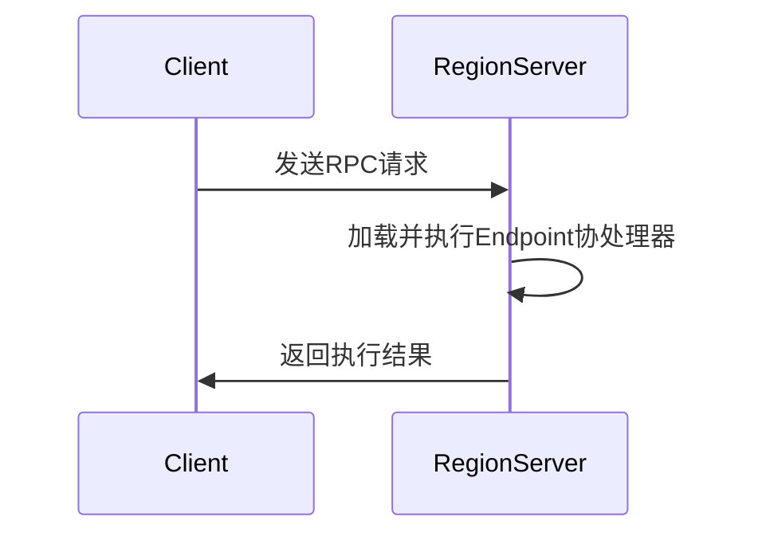

# HBase Endpoint协处理器

HBase是一个分布式的、面向列的数据库，广泛用于处理大规模数据集。为了扩展HBase的功能，HBase提供了协处理器（Coprocessor）机制。其中，**Endpoint协处理器**是一种允许在RegionServer上执行自定义逻辑的机制。本文将详细介绍HBase Endpoint协处理器的概念、工作原理以及实际应用。

## 什么是HBase Endpoint协处理器？

HBase Endpoint协处理器是一种在RegionServer上执行的用户自定义逻辑。它允许你在HBase的RegionServer上运行自定义的RPC（远程过程调用）服务。通过Endpoint协处理器，你可以在数据存储的位置（即RegionServer）上执行计算，从而减少数据传输的开销，并提高查询性能。

:::note
Endpoint协处理器通常用于执行聚合操作（如求和、计数等）或复杂的计算任务。
:::

## Endpoint协处理器的工作原理

Endpoint协处理器的工作流程可以分为以下几个步骤：

1. **客户端请求**：客户端向HBase发送一个RPC请求，请求执行某个Endpoint协处理器。
2. **RegionServer执行**：请求被发送到存储数据的RegionServer，RegionServer会加载并执行相应的Endpoint协处理器。
3. **结果返回**：RegionServer将执行结果返回给客户端。



## 如何实现一个Endpoint协处理器？

要实现一个Endpoint协处理器，你需要完成以下几个步骤：

1. **定义接口**：首先，你需要定义一个接口，该接口将作为客户端和RegionServer之间的通信协议。
2. **实现接口**：接下来，你需要实现这个接口，定义具体的逻辑。
3. **注册协处理器**：最后，你需要将协处理器注册到HBase表中。

### 示例：实现一个简单的求和Endpoint协处理器

假设我们有一个存储用户交易数据的HBase表，我们希望计算某个用户的总交易金额。我们可以通过Endpoint协处理器来实现这个功能。

#### 1. 定义接口

```java
public interface SumEndpoint extends CoprocessorProtocol {
    long sum(byte[] family, byte[] qualifier) throws IOException;
}
```

#### 2. 实现接口

```java
public class SumEndpointImpl extends BaseEndpointCoprocessor implements SumEndpoint {
    @Override
    public long sum(byte[] family, byte[] qualifier) throws IOException {
        long sum = 0;
        RegionCoprocessorEnvironment env = (RegionCoprocessorEnvironment) getEnvironment();
        InternalScanner scanner = env.getRegion().getScanner(new Scan());
        List<Cell> results = new ArrayList<>();
        boolean hasMore;
        do {
            hasMore = scanner.next(results);
            for (Cell cell : results) {
                if (Bytes.equals(CellUtil.cloneFamily(cell), family) && Bytes.equals(CellUtil.cloneQualifier(cell), qualifier)) {
                    sum += Bytes.toLong(CellUtil.cloneValue(cell));
                }
            }
            results.clear();
        } while (hasMore);
        return sum;
    }
}
```

#### 3. 注册协处理器

```java
HTableDescriptor tableDescriptor = new HTableDescriptor(TableName.valueOf("transactions"));
tableDescriptor.addCoprocessor(SumEndpointImpl.class.getName());
admin.createTable(tableDescriptor);
```

#### 4. 客户端调用

```java
Configuration config = HBaseConfiguration.create();
try (Connection connection = ConnectionFactory.createConnection(config);
     Table table = connection.getTable(TableName.valueOf("transactions"))) {
    SumEndpoint endpoint = table.coprocessorProxy(SumEndpoint.class, Bytes.toBytes("user1"));
    long totalAmount = endpoint.sum(Bytes.toBytes("cf"), Bytes.toBytes("amount"));
    System.out.println("Total amount: " + totalAmount);
}
```

## 实际应用场景

Endpoint协处理器在许多实际场景中都非常有用，特别是在需要执行聚合操作或复杂计算的场景中。以下是一些常见的应用场景：

1. **数据聚合**：如本文示例所示，Endpoint协处理器可以用于计算某个用户的总交易金额、平均交易金额等。
2. **复杂计算**：在某些情况下，你可能需要在数据存储的位置执行复杂的计算任务，以减少数据传输的开销。
3. **自定义索引**：你可以使用Endpoint协处理器来实现自定义的索引机制，从而提高查询性能。

## 总结

HBase Endpoint协处理器是一种强大的工具，允许你在RegionServer上执行自定义的RPC服务。通过Endpoint协处理器，你可以在数据存储的位置执行计算，从而减少数据传输的开销，并提高查询性能。本文介绍了Endpoint协处理器的基本概念、工作原理，并通过一个简单的示例展示了如何实现和使用Endpoint协处理器。

## 附加资源与练习

- **官方文档**：阅读HBase官方文档中关于协处理器的部分，了解更多高级用法。
- **练习**：尝试实现一个Endpoint协处理器，计算某个用户的最大交易金额。
- **扩展阅读**：了解HBase Observer协处理器，它与Endpoint协处理器有何不同？

:::tip
在实际项目中，使用Endpoint协处理器时，务必考虑其性能影响，确保协处理器的逻辑不会对RegionServer的性能产生负面影响。
:::