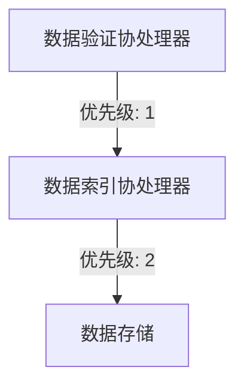

# HBase 协处理器优先级

HBase协处理器（Coprocessor）是一种强大的扩展机制，允许用户在HBase的RegionServer或Master上执行自定义逻辑。协处理器可以用于数据预处理、数据验证、索引维护等场景。然而，当多个协处理器同时存在时，如何控制它们的执行顺序就变得至关重要。本文将详细介绍HBase协处理器的优先级机制，并通过实际案例展示其应用。

## 什么是协处理器优先级？

在HBase中，协处理器的优先级决定了它们在执行时的顺序。优先级较高的协处理器会先于优先级较低的协处理器执行。优先级通常是一个整数值，数值越小，优先级越高。通过合理设置优先级，可以确保关键逻辑优先执行，从而避免潜在的数据一致性问题或性能瓶颈。

## 如何设置协处理器优先级？

在HBase中，协处理器的优先级可以通过配置文件或API进行设置。以下是一个通过API设置优先级的示例：

```java
Configuration conf = HBaseConfiguration.create();
conf.set("hbase.coprocessor.region.classes", "com.example.MyCoprocessor");
conf.setInt("hbase.coprocessor.region.priority", 1);
```

在这个示例中，`hbase.coprocessor.region.priority` 参数用于设置协处理器的优先级。优先级为1的协处理器将优先于优先级为2的协处理器执行。

## 优先级的作用

优先级的主要作用是确保协处理器按照预期的顺序执行。例如，假设我们有两个协处理器：一个用于数据验证，另一个用于数据索引。如果数据验证协处理器的优先级高于数据索引协处理器，那么数据验证将在数据索引之前执行，从而确保只有有效的数据才会被索引。



## 实际案例

假设我们有一个HBase表，用于存储用户信息。我们希望在插入数据时，先验证数据的有效性，然后再更新用户索引。以下是实现这一逻辑的协处理器示例：

```java
public class UserValidationCoprocessor extends BaseRegionObserver {
    @Override
    public void prePut(ObserverContext<RegionCoprocessorEnvironment> c, Put put, WALEdit edit, Durability durability) throws IOException {
        // 数据验证逻辑
        if (!isValid(put)) {
            throw new IOException("Invalid user data");
        }
    }

    private boolean isValid(Put put) {
        // 实现数据验证逻辑
        return true;
    }
}

public class UserIndexCoprocessor extends BaseRegionObserver {
    @Override
    public void postPut(ObserverContext<RegionCoprocessorEnvironment> c, Put put, WALEdit edit, Durability durability) throws IOException {
        // 更新用户索引逻辑
        updateUserIndex(put);
    }

    private void updateUserIndex(Put put) {
        // 实现索引更新逻辑
    }
}
```

在配置文件中，我们可以为这两个协处理器设置优先级：

```properties
hbase.coprocessor.region.classes=com.example.UserValidationCoprocessor,com.example.UserIndexCoprocessor
hbase.coprocessor.region.priority=1,2
```

通过这种方式，`UserValidationCoprocessor` 将在 `UserIndexCoprocessor` 之前执行，确保只有有效的数据才会被索引。

## 总结

HBase协处理器的优先级机制为开发者提供了一种灵活的方式来控制协处理器的执行顺序。通过合理设置优先级，可以确保关键逻辑优先执行，从而提高系统的可靠性和性能。在实际应用中，优先级的设置需要根据具体业务需求进行调整，以达到最佳效果。

## 附加资源

- [HBase官方文档](https://hbase.apache.org/)
- [HBase协处理器指南](https://hbase.apache.org/book.html#coprocessors)
- [HBase协处理器示例代码](https://github.com/apache/hbase/tree/master/hbase-examples)

## 练习

1. 尝试在本地HBase环境中配置两个协处理器，并设置不同的优先级，观察它们的执行顺序。
2. 修改上述示例中的优先级，看看是否会影响数据验证和索引更新的顺序。
3. 思考在实际业务场景中，哪些情况下需要调整协处理器的优先级，并尝试实现这些场景。

:::tip
在设置协处理器优先级时，建议先进行充分的测试，以确保优先级设置符合预期，避免因优先级设置不当导致的数据一致性问题。
:::