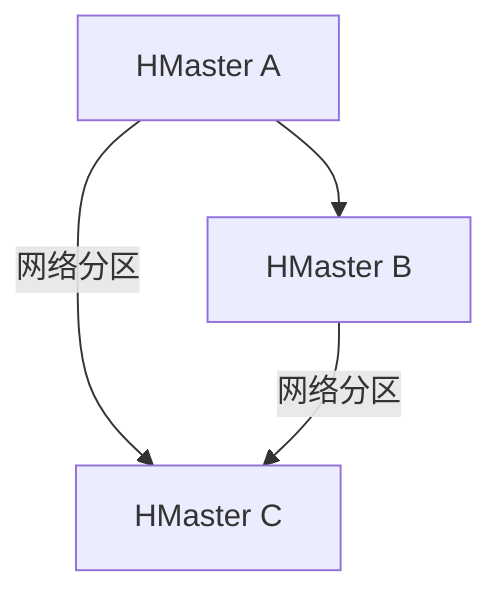

# HBase 脑裂问题

## 介绍

在分布式系统中，**脑裂问题（Split-Brain Problem）** 是指由于网络分区或节点故障，导致集群中的节点无法相互通信，进而形成多个独立的子集群。每个子集群可能会认为自己是唯一的活动集群，从而导致数据不一致和系统混乱。HBase作为一个分布式数据库，也可能面临脑裂问题。

脑裂问题在HBase中通常发生在HMaster或RegionServer之间，尤其是在ZooKeeper无法正确协调集群状态时。理解脑裂问题的原因和解决方案对于确保HBase集群的高可用性和数据一致性至关重要。

## 脑裂问题的原因

脑裂问题通常由以下原因引起：

1. **网络分区**：集群中的节点由于网络故障无法相互通信，导致部分节点形成独立的子集群。
2. **ZooKeeper故障**：ZooKeeper是HBase集群的协调者，如果ZooKeeper出现故障，可能导致HBase节点无法正确同步状态。
3. **HMaster或RegionServer故障**：HMaster或RegionServer的故障可能导致集群状态不一致，进而引发脑裂问题。

## 脑裂问题的影响

脑裂问题可能导致以下后果：

1. **数据不一致**：不同的子集群可能会同时写入相同的数据，导致数据冲突和不一致。
2. **服务中断**：客户端可能无法正确连接到集群，导致服务中断。
3. **资源浪费**：多个子集群可能会同时执行相同的任务，导致资源浪费。

## 检测脑裂问题

检测脑裂问题通常需要监控以下指标：

1. **ZooKeeper状态**：检查ZooKeeper的健康状态，确保其正常运行。
2. **HMaster和RegionServer日志**：查看HMaster和RegionServer的日志，寻找异常信息。
3. **网络连接**：监控集群节点之间的网络连接，确保网络没有分区。

## 解决脑裂问题

解决脑裂问题通常需要以下步骤：

1. **恢复网络连接**：确保集群节点之间的网络连接恢复正常。
2. **重启ZooKeeper**：如果ZooKeeper出现故障，尝试重启ZooKeeper服务。
3. **重启HMaster和RegionServer**：在确保网络和ZooKeeper正常后，重启HMaster和RegionServer以恢复集群状态。

## 实际案例

假设我们有一个由三个HMaster节点组成的HBase集群，由于网络故障，节点A和节点B无法与节点C通信。此时，节点A和节点B可能会形成一个子集群，而节点C可能会形成另一个子集群。两个子集群可能会同时尝试写入相同的数据，导致数据不一致。

在这种情况下，我们需要首先恢复网络连接，然后重启ZooKeeper和HMaster节点，以确保集群状态一致。

## 总结

脑裂问题是分布式系统中一个常见且严重的问题，可能导致数据不一致和服务中断。通过理解脑裂问题的原因、影响以及检测和解决方法，我们可以更好地管理和维护HBase集群，确保其高可用性和数据一致性。

## 附加资源

- [HBase官方文档](https://hbase.apache.org/)
- [ZooKeeper官方文档](https://zookeeper.apache.org/)
- [分布式系统脑裂问题详解](https://en.wikipedia.org/wiki/Split-brain_(computing))

## 练习

1. 尝试在一个小型HBase集群中模拟网络分区，观察脑裂问题的发生。
2. 使用ZooKeeper命令行工具检查ZooKeeper的健康状态。
3. 编写一个脚本，自动检测HBase集群中的脑裂问题并尝试解决。