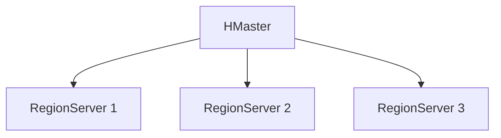
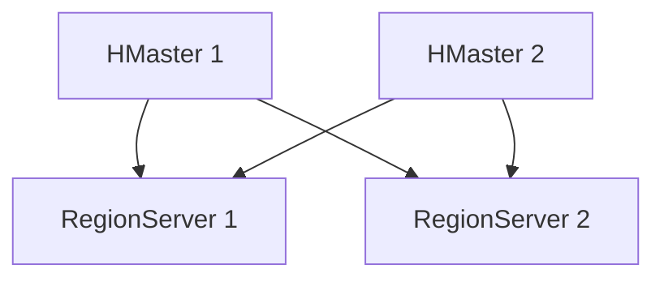
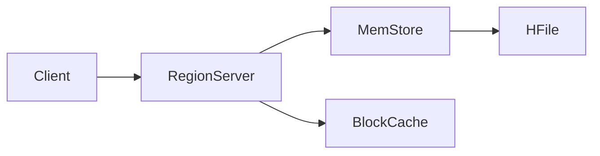

## 介绍

HBase是一个开源的、分布式的、面向列的数据库，基于Google的Bigtable设计。它是Hadoop生态系统的一部分，主要用于处理大规模数据集。随着大数据技术的快速发展，HBase的架构也在不断演进，以满足更高的性能、可扩展性和可靠性需求。本文将带你了解HBase架构的演进路线，帮助你更好地理解其设计理念和优化方向。

## HBase 架构的初始版本

HBase的最初版本是基于HDFS（Hadoop分布式文件系统）构建的，采用了Master-Slave架构。在这个架构中，HBase集群由一个主节点（HMaster）和多个从节点（RegionServer）组成。

- **HMaster**：负责管理表的元数据、Region的分配和负载均衡。
- **RegionServer**：负责存储实际的数据，处理客户端的读写请求。



:::note
在初始版本中，HMaster是单点故障（SPOF），如果HMaster宕机，整个集群将无法正常工作。
:::

## HBase 架构的改进：高可用性

为了解决HMaster的单点故障问题，HBase引入了高可用性（HA）机制。通过引入多个HMaster节点，HBase实现了主节点的冗余。当主节点发生故障时，备用HMaster会自动接管，确保集群的持续运行。



:::tip
高可用性机制显著提高了HBase的可靠性，使其更适合生产环境。
:::

## HBase 架构的优化：读写性能

随着数据量的增长，HBase的读写性能成为了一个关键问题。为了优化性能，HBase引入了以下改进：

1. **MemStore和HFile**：HBase将数据首先写入内存中的MemStore，当MemStore达到一定大小时，数据会被刷新到磁盘上的HFile中。这种机制减少了磁盘I/O操作，提高了写入性能。

2. **BlockCache**：HBase引入了BlockCache机制，用于缓存从HFile中读取的数据块，从而减少磁盘读取次数，提高读取性能。



:::caution
虽然MemStore和BlockCache提高了性能，但也增加了内存的使用量，需要根据实际情况进行调优。
:::

## HBase 架构的扩展：协处理器

为了支持更复杂的计算需求，HBase引入了协处理器（Coprocessor）机制。协处理器允许用户在RegionServer上执行自定义的逻辑，从而减少数据传输的开销，提高计算效率。

```java
// 示例：自定义协处理器
public class MyCoprocessor extends BaseRegionObserver {
    @Override
    public void prePut(ObserverContext<RegionCoprocessorEnvironment> e, Put put, WALEdit edit, Durability durability) throws IOException {
        // 自定义逻辑
        System.out.println("PrePut: " + put);
    }
}
```

:::warning
协处理器虽然强大，但也增加了RegionServer的负载，需要谨慎使用。
:::

## HBase 架构的现代化：与云原生集成

随着云计算的普及，HBase也开始与云原生技术集成。例如，HBase现在支持在Kubernetes上运行，并且可以与对象存储（如S3）集成，从而实现更灵活的存储和计算分离。

```mermaid
graph TD
    A[HBase on Kubernetes] --> B[RegionServer]
    A --> C[Object Storage (S3)]
```

:::tip
云原生集成使HBase更加灵活，能够更好地适应现代分布式系统的需求。
:::

## 实际案例：HBase在电商平台的应用

某电商平台使用HBase存储用户行为数据。通过HBase的高可用性和协处理器机制，该平台能够实时分析用户行为，提供个性化推荐服务。同时，HBase的云原生集成使得平台能够根据流量动态扩展资源，确保系统的高性能和稳定性。

## 总结

HBase的架构经历了从最初的Master-Slave架构到高可用性、性能优化、协处理器支持，再到与云原生技术的集成。这些演进使得HBase能够更好地应对大规模数据处理的需求，成为现代分布式数据库中的重要一员。

## 附加资源与练习

- **资源**：
  - [HBase官方文档](https://hbase.apache.org/)
  - 《HBase权威指南》书籍
- **练习**：
  - 尝试在本地搭建一个HBase集群，并测试其高可用性机制。
  - 编写一个简单的协处理器，观察其在RegionServer上的执行效果。

通过本文的学习，你应该对HBase架构的演进路线有了初步的了解。希望这些知识能够帮助你在实际项目中更好地应用HBase。