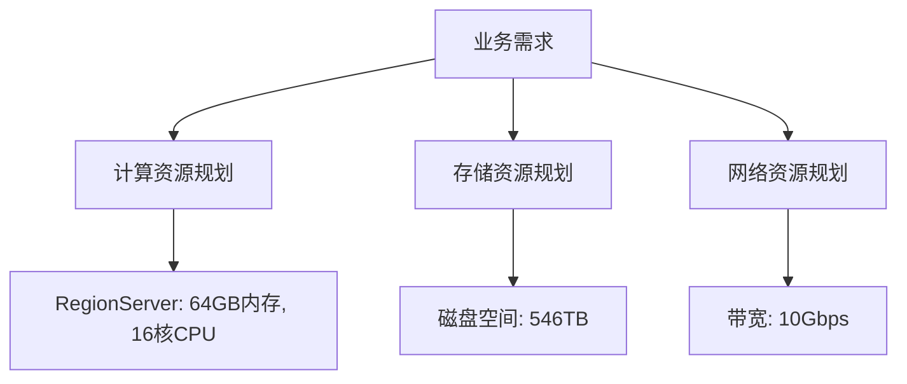

# HBase 资源规划方法

HBase是一个分布式的、面向列的数据库，通常用于处理大规模数据。为了确保HBase集群的高性能和稳定性，合理的资源规划至关重要。本文将详细介绍HBase资源规划的核心概念、方法和实际应用场景，帮助初学者掌握这一关键技能。

## 什么是HBase资源规划？

HBase资源规划是指根据业务需求和数据规模，合理分配和管理HBase集群的计算、存储和网络资源。资源规划的目标是确保系统能够高效运行，同时避免资源浪费或瓶颈。

资源规划的核心包括：
- **计算资源**：如CPU和内存。
- **存储资源**：如磁盘空间和HDFS存储。
- **网络资源**：如带宽和延迟。

:::tip
良好的资源规划不仅能提升系统性能，还能降低运维成本。
:::

---

## HBase 资源规划的核心步骤

### 1. 评估业务需求
在规划资源之前，首先需要明确业务需求，包括：
- 数据量（如每天的数据写入量）。
- 查询模式（如读多写少或写多读少）。
- 延迟要求（如实时查询或批量处理）。

例如，假设你的业务每天需要写入1TB数据，并且需要支持低延迟的实时查询。那么你需要规划足够的存储空间和计算资源来满足这些需求。

### 2. 计算资源规划
HBase的计算资源主要包括CPU和内存。以下是一些关键点：
- **RegionServer的内存**：HBase的性能高度依赖内存。每个RegionServer需要足够的内存来缓存数据（BlockCache）和存储元数据（MemStore）。
- **CPU核心数**：HBase的读写操作需要CPU支持。通常建议每个RegionServer至少配置8核CPU。

:::caution
如果内存不足，HBase可能会频繁触发GC（垃圾回收），导致性能下降。
:::

### 3. 存储资源规划
HBase的存储资源主要包括磁盘空间和HDFS存储。以下是一些关键点：
- **磁盘空间**：根据数据量和副本数（通常为3）计算所需的磁盘空间。例如，1TB数据需要至少3TB的磁盘空间。
- **HDFS存储**：确保HDFS集群有足够的存储空间，并合理配置HDFS的块大小（默认128MB）。

```bash
# 示例：计算所需磁盘空间
数据量 = 1TB
副本数 = 3
所需磁盘空间 = 数据量 * 副本数 = 1TB * 3 = 3TB
```

### 4. 网络资源规划
HBase的网络资源规划主要关注带宽和延迟。以下是一些关键点：
- **带宽**：确保RegionServer和HDFS之间的带宽足够，避免网络成为瓶颈。
- **延迟**：对于实时查询场景，低延迟的网络至关重要。

:::note
如果HBase集群跨越多个数据中心，网络延迟可能会显著增加，影响性能。
:::

---

## 实际案例：电商平台的HBase资源规划

假设你正在为一个电商平台设计HBase集群，以下是资源规划的步骤：

1. **业务需求**：
   - 每天写入500GB用户行为数据。
   - 支持实时查询用户行为记录。
   - 数据保留周期为1年。

2. **计算资源**：
   - 每个RegionServer配置64GB内存和16核CPU。
   - 预计需要10个RegionServer。

3. **存储资源**：
   - 每天写入500GB数据，1年数据量为：500GB * 365 ≈ 182TB。
   - 考虑3副本，所需磁盘空间为：182TB * 3 = 546TB。

4. **网络资源**：
   - 确保RegionServer和HDFS之间的带宽为10Gbps。
   - 使用低延迟的网络设备。



---

## 总结

HBase资源规划是确保集群性能和稳定性的关键步骤。通过评估业务需求、合理分配计算、存储和网络资源，你可以构建一个高效且可靠的HBase集群。以下是本文的核心要点：
- 明确业务需求是资源规划的基础。
- 计算资源（CPU和内存）直接影响HBase的性能。
- 存储资源（磁盘空间和HDFS）需要根据数据量和副本数规划。
- 网络资源（带宽和延迟）对实时查询场景尤为重要。

---

## 附加资源与练习

### 附加资源
- [HBase官方文档](https://hbase.apache.org/)
- 《HBase权威指南》：深入讲解HBase的架构和最佳实践。

### 练习
1. 假设你的业务每天写入200GB数据，数据保留周期为6个月，请计算所需的磁盘空间。
2. 设计一个支持高并发读写的HBase集群，列出所需的计算、存储和网络资源。

通过实践和深入学习，你将能够更好地掌握HBase资源规划的方法。