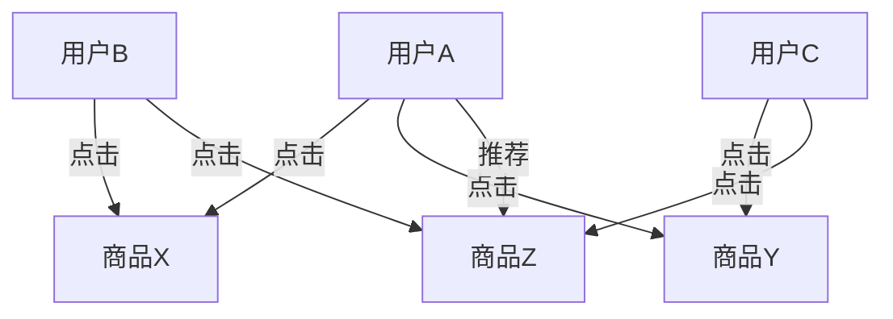

# HBase 实时推荐系统

## 介绍

推荐系统是现代互联网应用中不可或缺的一部分，它通过分析用户行为和偏好，为用户提供个性化的内容推荐。HBase作为一个分布式、可扩展的NoSQL数据库，非常适合用于构建实时推荐系统。本文将带你从基础概念入手，逐步了解如何使用HBase构建一个实时推荐系统。

## 什么是HBase？

HBase是一个分布式的、面向列的数据库，它构建在Hadoop文件系统（HDFS）之上，能够处理海量数据。HBase的主要特点包括高吞吐量、低延迟、强一致性以及水平扩展能力。这些特性使得HBase成为构建实时推荐系统的理想选择。

## 实时推荐系统的基本架构

一个典型的实时推荐系统通常包括以下几个组件：

1. **数据收集层**：负责收集用户行为数据，如点击、浏览、购买等。
2. **数据处理层**：对收集到的数据进行实时处理和分析。
3. **存储层**：存储用户行为数据、用户画像、物品信息等。
4. **推荐算法层**：根据用户行为和物品信息，生成推荐结果。
5. **服务层**：将推荐结果实时推送给用户。

在本文中，我们将重点关注如何使用HBase作为存储层，支持实时推荐系统的构建。

## HBase 在推荐系统中的应用

### 数据模型设计

在HBase中，数据是以表的形式存储的，每个表由行键（Row Key）、列族（Column Family）和列限定符（Column Qualifier）组成。为了支持实时推荐系统，我们需要设计一个合理的数据模型。

假设我们有一个电商网站，用户的行为数据包括用户ID、商品ID、行为类型（如点击、购买）和时间戳。我们可以将这些数据存储在HBase中，设计如下：

- **表名**：`user_behavior`
- **行键**：`user_id + timestamp`
- **列族**：`cf`
- **列限定符**：`product_id`, `action_type`

### 数据写入

当用户产生行为时，我们需要将这些行为数据实时写入HBase。以下是一个简单的Java代码示例，展示如何将用户行为数据写入HBase：

```java
import org.apache.hadoop.hbase.TableName;
import org.apache.hadoop.hbase.client.Connection;
import org.apache.hadoop.hbase.client.ConnectionFactory;
import org.apache.hadoop.hbase.client.Put;
import org.apache.hadoop.hbase.client.Table;
import org.apache.hadoop.hbase.util.Bytes;

public class HBaseWriter {
    public static void main(String[] args) throws Exception {
        Connection connection = ConnectionFactory.createConnection();
        Table table = connection.getTable(TableName.valueOf("user_behavior"));

        String userId = "user123";
        long timestamp = System.currentTimeMillis();
        String productId = "product456";
        String actionType = "click";

        Put put = new Put(Bytes.toBytes(userId + "_" + timestamp));
        put.addColumn(Bytes.toBytes("cf"), Bytes.toBytes("product_id"), Bytes.toBytes(productId));
        put.addColumn(Bytes.toBytes("cf"), Bytes.toBytes("action_type"), Bytes.toBytes(actionType));

        table.put(put);
        table.close();
        connection.close();
    }
}
```

### 数据读取

为了生成推荐结果，我们需要从HBase中读取用户的行为数据。以下是一个简单的Java代码示例，展示如何从HBase中读取用户行为数据：

```java
import org.apache.hadoop.hbase.TableName;
import org.apache.hadoop.hbase.client.Connection;
import org.apache.hadoop.hbase.client.ConnectionFactory;
import org.apache.hadoop.hbase.client.Get;
import org.apache.hadoop.hbase.client.Result;
import org.apache.hadoop.hbase.client.Table;
import org.apache.hadoop.hbase.util.Bytes;

public class HBaseReader {
    public static void main(String[] args) throws Exception {
        Connection connection = ConnectionFactory.createConnection();
        Table table = connection.getTable(TableName.valueOf("user_behavior"));

        String userId = "user123";
        long timestamp = System.currentTimeMillis();

        Get get = new Get(Bytes.toBytes(userId + "_" + timestamp));
        Result result = table.get(get);

        String productId = Bytes.toString(result.getValue(Bytes.toBytes("cf"), Bytes.toBytes("product_id")));
        String actionType = Bytes.toString(result.getValue(Bytes.toBytes("cf"), Bytes.toBytes("action_type")));

        System.out.println("Product ID: " + productId);
        System.out.println("Action Type: " + actionType);

        table.close();
        connection.close();
    }
}
```

### 推荐算法

推荐算法是推荐系统的核心部分。常见的推荐算法包括协同过滤、基于内容的推荐、矩阵分解等。在本文中，我们以协同过滤为例，展示如何基于HBase中的用户行为数据生成推荐结果。

假设我们使用基于用户的协同过滤算法，计算用户之间的相似度，并推荐相似用户喜欢的商品。以下是一个简单的伪代码示例：

```python
def recommend(user_id):
    user_behavior = get_user_behavior_from_hbase(user_id)
    similar_users = find_similar_users(user_behavior)
    recommended_products = get_top_products_from_similar_users(similar_users)
    return recommended_products
```

## 实际案例

假设我们有一个电商网站，用户A最近点击了商品X和商品Y。通过分析用户A的行为数据，我们发现用户B和用户C与用户A的行为相似，用户B和用户C还点击了商品Z。因此，我们可以将商品Z推荐给用户A。



## 总结

通过本文的学习，你应该已经了解了如何使用HBase构建一个实时推荐系统。我们从HBase的基本概念入手，逐步讲解了数据模型设计、数据写入、数据读取以及推荐算法的实现。HBase的高吞吐量和低延迟特性使其成为构建实时推荐系统的理想选择。

## 附加资源与练习

- **附加资源**：
  - [HBase官方文档](https://hbase.apache.org/)
  - 《HBase权威指南》书籍
  - [推荐系统经典论文](https://www.cs.umd.edu/~samir/498/Amazon-Recommendations.pdf)

- **练习**：
  1. 尝试在本地搭建HBase环境，并实现本文中的代码示例。
  2. 修改推荐算法，尝试使用基于内容的推荐或矩阵分解算法。
  3. 设计一个更复杂的数据模型，支持更多的用户行为类型（如收藏、评论等）。

:::tip
在实践过程中，如果遇到问题，可以参考HBase官方文档或社区论坛，获取更多帮助。
:::